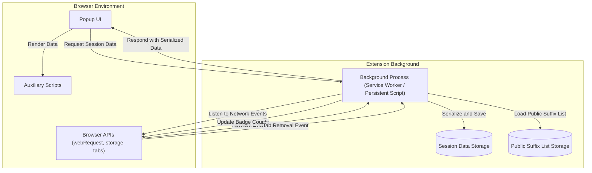

# System Architecture Overview

Discover how uBO Scope orchestrates its components—the background process, browser APIs, popup UI, and auxiliary scripts—to provide a seamless, real-time view of network connections initiated by your active browser tab. This page offers a visual and narrative explanation of the system’s communication flow and session lifecycle, empowering you to understand how data is captured, processed, and displayed.

---

## Understanding the System at a Glance

At its core, uBO Scope is designed to observe and report every remote connection a webpage attempts, categorizing them as allowed, stealth-blocked, or blocked. To achieve this transparency, multiple components collaborate:

- **Background Process:** The backbone that listens to network events using browser APIs.
- **Browser APIs:** The conduit for capturing and relaying network request data.
- **Popup UI:** The interactive user interface displaying live summaries and detailed statistics.
- **Auxiliary Scripts:** Helper logic that processes and formats data for storage and display.

This page provides a structured overview of how these elements communicate and work together continuously to track your browsing session's network connections.

---

## How It Works: The Session Lifecycle and Communication Flow

Each browsing session involves continuous tracking of network requests per active tab. Here’s what happens behind the scenes:

- When a tab initiates network requests, the **background process** uses `webRequest` listeners to capture events for each connection attempt—successes, errors, and redirects.
- These events are aggregated and stored in a session-based data store, organized by tab and domain.
- The **popup UI**, activated by the user clicking the extension icon, requests the relevant session data from the background.
- The data is then deserialized and rendered into human-readable statistics, showing the count and categories of accessed domains.
- Auxiliary scripts handle the serialization, storage, and parsing of complex data structures underpinning the system.

This continuous cycle ensures that users receive up-to-date connection information while browsing.

---

## Visualizing the Architecture

This diagram captures the interplay between components:

- The **Background Process** acts as a central hub, listening for network requests and managing session data.
- The **Browser APIs** provide the data stream and environment hooks necessary for monitoring.
- The **Popup UI** queries the background for the latest data and uses auxiliary scripts to render it.

---

## Key Components in Detail

### Background Process
The heart of data capture, this service listens for network request outcomes (`success`, `redirect`, `error`) via browser `webRequest` events.

- Maintains a session map of tab IDs to detailed connection data.
- Aggregates paths, domains, and results into categorized sets: allowed, stealth-blocked, and blocked.
- Updates the browser toolbar badge count reflecting active connection numbers.
- Persists session information using browser storage APIs to maintain state across extension lifecycle events.

### Browser APIs
The extension relies on standardized APIs:

- **webRequest API:** Tracks network requests, their outcomes, and URLs.
- **storage API:** Handles both local and session data storage.
- **tabs API:** Monitors tab lifecycle events such as removal.

These APIs provide consistent, cross-browser capabilities essential to uBO Scope.

### Popup UI
A dynamic interface that retrieves current tab data from the background process and presents it as:

- A clear summary of connected domains.
- Lists categorized by connection outcome.
- Support for Unicode domain names, enhancing readability.

Behind the scenes, this UI runs scripts that deserialize session data and update HTML elements accordingly.

### Auxiliary Scripts
Small but critical helpers that:

- Serialize and deserialize complex session objects efficiently.
- Handle domain parsing, including applying the public suffix list to accurately distinguish effective domains.
- Normalize and format connection counts for display.

---

## Practical User Flow Example

1. **Loading a Webpage:** You navigate to a new tab. The background process begins tracking all network requests initiated by this tab.

2. **Request Monitoring:** As resources load, the webRequest API fires events for each request. The background collects data, categorizing connections by outcome.

3. **Display Trigger:** You click the extension icon, opening the popup UI.

4. **Data Retrieval:** The popup sends a message to the background requesting network connection data related to the active tab.

5. **Data Presentation:** Background responds with serialized data, popup deserializes it, and auxiliary scripts populate the UI with domain connection summaries.

6. **User Insight:** You immediately see which domains are contacted, whether any connections were blocked stealthily, and the total count, guiding informed privacy decisions.

---

## Tips for Effective Use and Troubleshooting

- **Refreshing Data:** Because the data updates asynchronously, if you open the popup but see NO DATA, wait a few moments or reload the tab to trigger fresh network recording.
- **Tab Lifecycle:** Closing or switching tabs resets the data for that session accordingly; the background process cleans up stored session details.
- **Performance Considerations:** The use of event batching and serialization ensures minimal performance impact on browser responsiveness.

---

## Summary
This System Architecture Overview clarifies how uBO Scope components collaborate to provide you with transparent, real-time insights into your tab's web connections. Leveraging browser APIs and well-engineered background processing, the extension delivers precise connection statistics visible through an intuitive popup UI.

Explore related documentation for deeper dives into core terminology, feature details, and practical usage:

- [Core Terminology & Concepts](/overview/architecture-and-core-concepts/core-terminology-and-concepts)
- [Feature Overview & Quickstart](/overview/architecture-and-core-concepts/feature-overview)
- [Understanding the Popup: Viewing Domain Connections](/guides/getting-started-ubo-scope/using-the-popup)

---

For insight into starting procedures, installation, and troubleshooting, refer to the Getting Started tab and the FAQ sections.

---