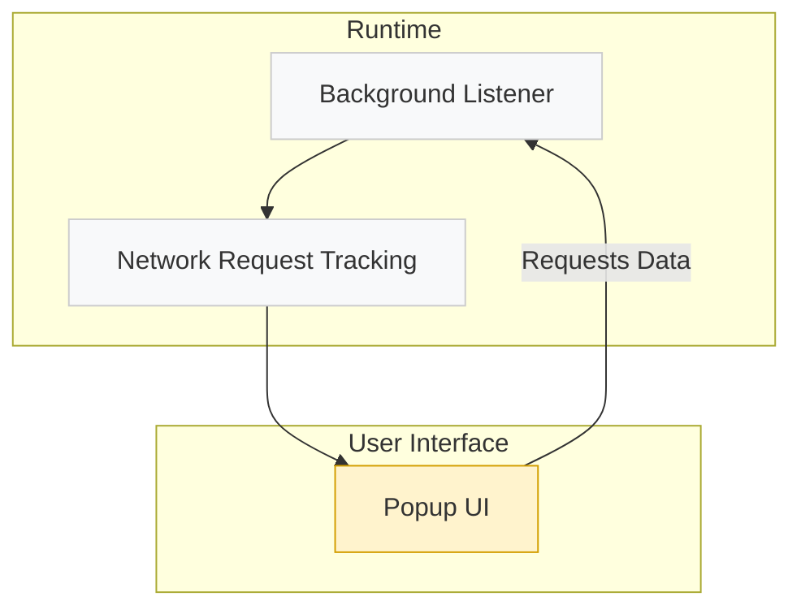

# System Architecture Overview

## Understanding the Core Components of uBO Scope

uBO Scope is designed to provide transparency into all network connections initiated by your browser, regardless of the content blockers in use. This page gives you a concise yet comprehensive view of how the main components within the extension interact to capture, analyze, and display network activity — enabling you to understand exactly what happens behind the scenes when you browse.

---

### High-Level Architecture and Workflow

At a glance, uBO Scope operates through a smooth collaboration between three primary components:

- **Background Listener:** The constantly running engine that monitors network traffic.
- **Network Request Tracking:** The subsystem responsible for accumulating and categorizing connection data.
- **Popup UI:** The user-facing interface where captured data is surfaced and interpreted.

These components seamlessly work together to ensure that relevant data is captured in real-time and presented clearly when you open the extension popup.

---

## Component Details and User Value

### 1. Background Listener

The core of uBO Scope’s data collection lies in the background listener. Operating continuously in the browser’s background process, it taps into the browser's `webRequest` API to hear about every network connection event happening in your active tabs.

- **What it does:** It captures events such as requests, redirects, successful responses, and errors.
- **What you gain:** Unfiltered, accurate insight into all connection attempts — regardless of whether content blockers interfere or not.

This persistent listener ensures no connection goes unnoticed.

### 2. Network Request Tracking

Once the background listener captures an event, the network request tracking subsystem immediately processes the details to categorize outcomes.

- **Categories include:**
  - *Allowed:* Connections that successfully completed.
  - *Stealth:* Requests redirected in a way that hides them.
  - *Blocked:* Requests that encountered errors or blocking.

This mechanism maintains a dynamic and session-aware map of all connection domains encountered on a per-tab basis.

- **User Benefit:** When the popup UI requests data, it receives precise, categorized, and contextual metrics about your browsing connections.

### 3. Popup UI

The popup user interface is your direct window into what uBO Scope has measured.

- **How it works:** When activated, it requests current tab data from the background process and renders:
  - The tab’s main domain and hostname
  - Count and lists of connected domains, split into allowed, stealth, and blocked categories

- **Why this matters:** It translates raw network data into actionable intelligence you can easily understand and use.

The UI’s clean layout and domain breakdown let you quickly assess how many and which third-party servers your browser is connecting to.

---

## User Flow: From Network Events to Insight

1. **Browsing triggers network requests:** As you load webpages and interact with content, the browser fires network requests.
2. **Background Listener intercepts these events:** Captures request data before the responses finish.
3. **Network Request Tracking processes events:** Records outcomes and aggregates domain information for your active tab.
4. **User opens Popup UI:** The popup requests the latest tab’s network summary.
5. **Popup UI renders detailed info:** Shows counts and domain lists grouped by connection outcome.

This flow ensures users receive up-to-date, comprehensive connection intelligence with minimal latency.

---

## Practical Tips to Maximize Your Experience

- **Keep the popup closed to avoid performance impact:** The background listener continues running independently, so data collection is continuous.
- **Open the popup to get fresh data:** The UI queries live data dynamically when viewed, ensuring you see current network statuses.
- **Understand domain groupings:** The extension groups connections by domain, helping you spot distinct third-party services.
- **Watch the badge count:** It indicates the number of unique allowed third-party domains for the active tab, giving you a quick privacy snapshot.

---

## Troubleshooting Common Scenarios

<AccordionGroup title="Common Troubleshooting Questions">
<Accordion title="Why does the badge count not update immediately?">
The extension batches network events and processes them in roughly 1-second intervals to optimize performance. This design may cause a slight delay before the badge updates.
</Accordion>
<Accordion title="What if the popup shows 'NO DATA'?">
This usually means no network activity has been recorded for the active tab, possibly due to the tab being inactive or a temporary data reset.
Try refreshing the page or switching tabs.
</Accordion>
<Accordion title="Why aren’t certain connections showing?">
Connections made outside the `webRequest` API scope (e.g., some WebSocket connections) cannot be tracked. uBO Scope reports based on what the browser's API exposes.
</Accordion>
</AccordionGroup>

---

## Summary

uBO Scope’s system architecture elegantly combines a background listener for continuous network monitoring, a tracking engine that organizes connection outcomes, and a popup UI that presents this data clearly to you. This synergy provides you with uncompromised visibility into your network activity during browsing — making privacy and connection transparency effortless.

For a hands-on understanding of how to interpret this data, visit the [Understanding the Popup Interface](../getting-started/first-run-usage-validation/understanding-the-popup-ui) documentation.

---

<Info>
For more context on the overall aims and value of uBO Scope, please review the [What is uBO Scope?](../introduction-and-value/what-is-ubo-scope) and [Core Benefits & Use Cases](../introduction-and-value/core-benefits) documentation.
</Info>

---

## Additional Resources
- [Background Script Source](https://github.com/gorhill/uBO-Scope/blob/main/js/background.js)
- [Popup UI Source](https://github.com/gorhill/uBO-Scope/blob/main/js/popup.js)
- [Manifest Files per Browser](../getting-started/introduction-installation/supported-browsers-prerequisites#supported-browsers)

---

Unlock a clearer view of what happens when your browser connects to the internet — powered by a system built for reliability, transparency, and immediate insight.

