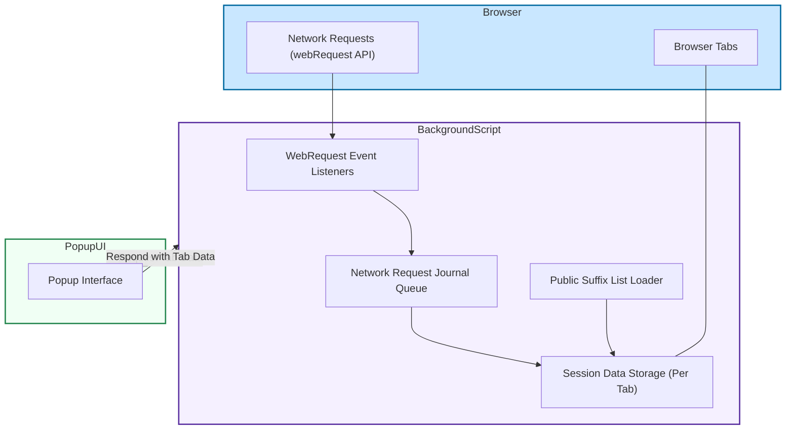

# How uBO Scope Works (Architecture)

## Unlocking the Journey of Network Requests

Understanding how uBO Scope functions behind the scenes transforms how you interpret the data it presents. This page visualizes the extension's data flow and architectural design — from capturing raw network requests via background scripts, through managing session data, all the way to the engaging and informative popup interface you interact with.

By exploring this architecture, you'll grasp how each part collaborates to give an accurate, comprehensive view of your browser’s connections and the impacts of content blockers.

---

## Overview of the Data Flow

At its core, uBO Scope watches network activity in the browser, notes whether connections were successful, blocked, or redirected stealthily, and then presents this information in a clear format. This happens via three main layers:

- **Background Scripts**: The workhorse that listens to every network request your browser makes and records their outcomes.
- **Session Data Management**: The memory of uBO Scope, holding details about each browsing tab’s network interactions.
- **Popup User Interface (UI)**: The friendly face showing you the summarized connection results at a glance.

Each piece plays a distinct role ensuring you receive trustworthy insights without interrupting your browsing.

---

## How uBO Scope Observes Network Requests

Network requests triggered by webpages travel through the browser and are exposed via the WebExtension API's `webRequest` listeners — which uBO Scope taps into tirelessly. The background script (`background.js`) registers listeners for key events:

- **Before Redirect**: To catch requests that change course before completion.
- **Error Occurred**: To detect and log failed connection attempts.
- **Response Started**: To acknowledge successful network communication.

When any of these events fires, the background script queues the network request details. It delays batch-processing to efficiently update the session data without overwhelming resources.

<u>Why is this important?</u> Because it provides a real-time yet performant way to capture the state of every request, regardless of whether your content blocker allows, blocks, or stealthily redirects it.

---

## Session Data: Keeping Track of Tabs and Outcomes

To help you understand the big picture, uBO Scope maintains a structured data store of tab-specific network outcomes. This session data is stored temporarily and continuously updated as network activity occurs.

- **Per-Tab Details**: Every browser tab gets an associated data object tracking domains and hostnames categorized as `allowed`, `stealth-blocked`, or `blocked`.
- **Use of Public Suffix List**: To accurately group hostnames by domain, uBO Scope loads and leverages the public suffix list (domains like `example.co.uk` are correctly recognized).

As new network events arrive, the background script updates these data structures accordingly — tallying counts and managing domains for each tab session. This ensures that when you open the popup UI, the stats correspond exactly to what happened in the tab you're viewing.

---

## Presenting Data in the Popup UI

The user-facing popup (`popup.html` and `popup.js`) connects to the background script by messaging it to retrieve the latest session data for the active tab. Here is what happens:

1. The active tab is identified.
2. A request is sent to the background script asking for that tab’s recorded network details.
3. On receiving the serialized data, the popup deserializes it and presents:
   - The total number of distinct domains connected.
   - Detailed lists of domains categorized by connection outcome: **not blocked (allowed)**, **stealth-blocked**, and **blocked**.

This segmentation gives you immediate clarity on which third-party connections your current webpage is allowing or preventing.

---

## Architectural Diagram of uBO Scope

To visualize the relationships between components, here is a Mermaid.js flowchart illustrating the major architectural elements and their interactions:

---

## Best Practices and Tips for Users

- **Monitor Badge Counts:** The colored badge on the browser toolbar provides a quick snapshot indicating the number of distinct third-party domains allowed. A lower count usually means fewer external connections.

- **Use the Popup for Details:** When you want to dive deeper, open the popup to explore which specific domains are allowed, stealth-blocked, or blocked.

- **Understand Context:** Not all third-party connections are harmful or unwanted. Some legitimate services like CDNs are essential and appear in the allowed list.

- **Refresh with New Tabs:** Starting a fresh tab resets accumulated data to reflect current network activities accurately.

- **Be Mindful of Timing:** The background script batches network requests to optimize performance; small delays in badge updates or popup data refreshes are normal.

---

## Troubleshooting Common Issues

<AccordionGroup title="Troubleshooting Common Issues">
<Accordion title="Popup Shows No Data or 'NO DATA'">
- Ensure the active tab has loaded network requests.
- Reload the tab or open a new tab to trigger fresh data collection.
- Confirm the extension has permissions to monitor the site.
</Accordion>

<Accordion title="Badge Count Does Not Update">
- Network request processing batches every second; wait a moment.
- Check if the extension is enabled and has necessary permissions.
- Restart the browser if updates seem stuck.
</Accordion>

<Accordion title="Unexpected Domains Appearing as Allowed">
- Some domains serve essential resources like fonts or scripts.
- Verify your content blocker settings if you want stricter filtering.
</Accordion>
</AccordionGroup>

---

## Next Steps

To expand your understanding and use of uBO Scope, consider exploring:

- [What is uBO Scope?](./what-is-ubo-scope) for foundational understanding.
- [Who Should Use uBO Scope?](./target-audience-use-cases) to see if it aligns with your needs.
- [Feature Overview](./feature-overview) to discover practical capabilities.
- [Getting Started Guides](../../getting-started) to install and configure the extension.

These resources will solidify your grasp of how uBO Scope complements your privacy arsenal.

---