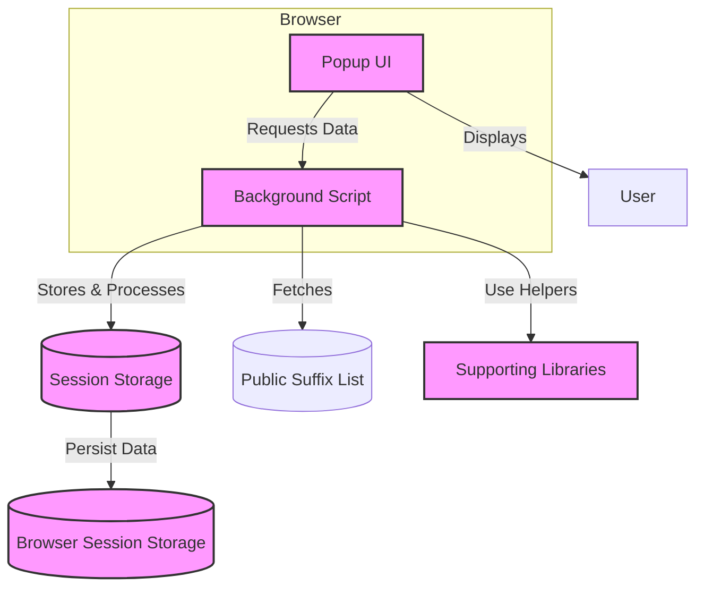

# System Architecture

## Introducing the Core Components of uBO Scope

Understanding how uBO Scope operates under the hood empowers you to maximize its value for monitoring and analyzing network requests. This page uncovers the essential architecture underpinning uBO Scope, illustrating how its main components—the popup UI, background script, and supporting libraries—work together seamlessly to deliver live insights into browser tab network activity.

### Why This Matters to You
When you activate uBO Scope, it silently observes network requests across your browser tabs, categorizing connections that are allowed, blocked, or stealth-blocked by content blockers or other mechanisms. This architecture enables the extension to provide accurate, tab-specific data, helping you identify the actual third-party servers your browser interacts with in real time.

## The Components at a Glance

- **Popup Interface**: The visible panel users interact with when clicking on the extension icon.
- **Background Script**: The extension's persistent process that listens to all network events.
- **Supporting Libraries**: Utilities for domain parsing, serialization, and browser API abstraction.

These elements collaborate to collect, process, and display detailed connection outcomes per browser tab.

## How It All Works Together: A Simple Architecture Diagram

### Detailed Workflow

1. **Network Monitoring in Background Script**: Running continuously, the background script subscribes to the browser's `webRequest` API. It listens to network events such as redirects, errors, and successful responses across all active tabs.

2. **Capturing and Categorizing Outcomes**: As requests occur, the script identifies the hostname and domain of each connection attempt. It categorizes outcomes as 'allowed', 'stealth-blocked' (redirected), or 'blocked'. These results are organized per tab in an in-memory session data structure.

3. **Session Persistence**: To maintain continuity, session data is serialized and saved in the browser's session storage, ensuring that tab-specific connection information persists throughout the browsing session.

4. **Public Suffix List Utilization**: A public suffix library is loaded and kept up-to-date in session storage, allowing accurate determination of root domains from hostnames. This is crucial for meaningful aggregation and reporting.

5. **Popup UI Fetches Tab Data**: When you open uBO Scope’s popup, it sends a message to the background script requesting the latest network connection information for the active tab.

6. **Rendering Connection Outcomes**: The popup script deserializes the received data and dynamically displays the categorized list of domains, providing you with a clear breakdown of network interactions, including counts for each outcome category.

## Practical Example

Imagine you are browsing a webpage that loads resources from several third-party servers:

- uBO Scope’s background script records each request outcome as you navigate.
- When you click the extension icon, the popup queries the background for the active tab’s details.
- The popup lists the distinct domains that were allowed, stealth-blocked, or blocked during your visit.

This live feedback loop helps you gauge how effectively your content blockers work and understand your real network exposure.

## Best Practices & Tips

- **Keep Your Browser Updated**: uBO Scope relies on the `webRequest` API and session storage features supported by modern browsers.
- **Understand Outcome Categories**:
  - *Allowed*: Connections successfully completed.
  - *Stealth-blocked*: Requests redirected silently by blockers.
  - *Blocked*: Requests that failed due to blocking.
- **Use the Badge Count** as a quick indicator of the number of distinct third-party domains contacted.
- **Leverage the Architecture Understanding** to report issues or contribute to extension improvements with greater context.

## Troubleshooting Common Scenarios

<AccordionGroup title="Troubleshooting System Architecture">
<Accordion title="Popup Shows ‘No Data’">
Possible causes include the background script not having data for the current tab, which can happen if the tab was just opened or if the extension lacks permissions. Try reloading the tab or verifying permissions.
</Accordion>
<Accordion title="Badge Count Not Updating">
Background process batches request outcomes and updates the badge asynchronously. If you see stale counts, wait a few seconds or reload the tab to refresh data.
</Accordion>
<Accordion title="Session Data Lost After Browser Restart">
Session storage is ephemeral and clears with browser restarts. This is by design; persistent tracking across sessions is not supported currently.
</Accordion>
</AccordionGroup>

## Summary

uBO Scope’s system architecture orchestrates its core components—the popup UI, background script, session storage, and utility libraries—to deliver real-time and tab-specific visibility into network requests. This design ensures accurate monitoring, meaningful aggregation, and user-friendly presentation of network connection outcomes, empowering you with transparent insights into web activity.

---

For further exploration, visit the [What is uBO Scope?](../product-introduction/what-is-ubo-scope) page or learn how to get started with [Getting Started](../../getting-started/installation-setup/prerequisites-requirements).

---

_Source: [uBO-Scope GitHub Repository](https://github.com/gorhill/uBO-Scope/tree/main)_

---

<Source url="https://github.com/gorhill/uBO-Scope" paths={[{"path": "js/background.js", "range": "1-191"},{"path": "js/popup.js", "range": "1-105"}]} />