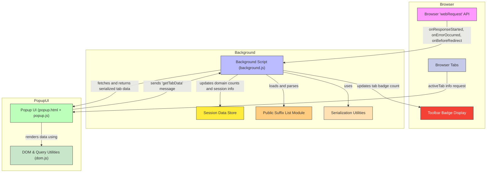

# System Architecture of uBO Scope

Understanding how uBO Scope operates behind the scenes clarifies how it provides real-time, accurate visibility into your browser's network connections. This page walks you through the core components — the background script, popup UI, browser APIs, and key supporting libraries — and illustrates how they interact to deliver up-to-the-moment connection data.

---

## How It Works: Real-Time Network Monitoring and Reporting

At the heart of uBO Scope is the browser’s ability to monitor network requests through its `webRequest` API. The extension's background script listens to all network events for active tabs — tracking successes, redirects, and errors — and categorizes these by their outcome and associated domains. This data is continuously processed, stored in-session, and made available on demand to the user interface.

The popup UI queries this processed data whenever opened, presenting a summarized breakdown of allowed, stealth-blocked, and blocked connections by distinct domain. Below we map this system flow, highlighting the seamless coordination that powers uBO Scope’s insightful reporting:

### Key Components and Interactions

- **Background Script (`background.js`)**: The engine that captures every network event, maintains session state, updates domain tracking for each tab, and manages data persistence.
- **Popup UI (`popup.html` + `popup.js`)**: The user-facing panel that requests summarized connection data for the current tab and renders it with friendly domain names and counts.
- **Browser WebRequest API**: Provides the raw stream of network requests, informing uBO Scope about connections starting, redirecting, succeeding, or failing.
- **Supporting Libraries:**
  - `publicsuffixlist.js` enables precise domain parsing to correctly group hostnames.
  - `punycode.es6.js` converts domain names from Punycode to Unicode for readability.
  - Serialization helpers manage storage and retrieval of session data.

### Data Flow Summary

---

## Detailed Component Roles

### Background Script

- **Network Request Listener:** Listens for key network events (`onResponseStarted`, `onErrorOccurred`, `onBeforeRedirect`) within tabs.
- **Outcome Categorization:** For each request, it identifies whether the connection was allowed, stealth-blocked (redirected without detection), or blocked.
- **Session Management:** Maintains a `tabIdToDetailsMap` that records network outcomes per tab, grouping them by hostname and domain.
- **Badge Updates:** Updates the toolbar icon badge to reflect the count of distinct allowed third-party domains per tab.
- **Domain Parsing:** Uses a public suffix list to accurately map hostnames to domains.
- **Data Serialization:** Stores session data persistently during the browser session for efficient retrieval.

### Popup UI

- **Data Retrieval:** On opening, sends a message requesting the latest summarized data for the active tab.
- **Data Rendering:** Converts domain names from Punycode to Unicode for clarity and displays them under categories: 'not blocked', 'stealth-blocked', and 'blocked'.
- **User Interface:** Shows domain counts and organizes domains for quick insights.

### Browser APIs & Supporting Libraries

- Utilize native browser APIs for tab queries and web request monitoring.
- Include libraries such as `punycode` for user-friendly domain presentation and `publicsuffixlist` for robust domain extraction.

---

## User Flow: From Network Request to UI Presentation

1. User visits a website; browser begins network requests.
2. Background script captures request events and categorizes the outcome.
3. Domain and hostname data is stored and updated for the tab session.
4. Toolbar badge dynamically shows how many distinct allowed domains are connected.
5. When the user clicks the extension icon, the popup requests current tab data.
6. Popup UI displays a categorized list of connected domains with counts.

---

## Practical Tips for Understanding the Architecture

- **Why the Background Script?** It runs persistently (as a service worker/module) to process all network requests in the browser context, unaffected by tab switching.
- **Separation of Concerns:** The background handles data collection/storage; the popup fetches and visualizes data on demand.
- **Efficient Data Handling:** Network events are queued and processed together to reduce overhead.
- **Clear Presentation:** Using converted Unicode domain names removes confusion from encoded Punycode entries.

---

## Troubleshooting Common Issues

<AccordionGroup title="Troubleshooting Network Monitoring and UI Issues">
<Accordion title="Popup Shows 'NO DATA' or Empty Lists">
Make sure you have an active tab loaded with network requests. If no network connections have been made, the popup will display no data.
</Accordion>
<Accordion title="Badge Count Not Updating">
Verify that the background script is loaded and able to listen to webRequest events. Extensions must have required permissions (`webRequest`, `activeTab`).
</Accordion>
<Accordion title="Domain Names Appear as Encoded Strings">
The extension uses `punycode` to convert encoded names; if this fails, certain domain names may display incorrectly. Reload the page or restart the browser.
</Accordion>
</AccordionGroup>

---

For more about using uBO Scope, interpreting badge data, and understanding domain categorizations, see the related [Product Introduction](../product-introduction/what-is-ubo-scope) and guides under the Getting Started section.

---

*Documentation source code and implementation details are available in the uBO Scope [GitHub repository](https://github.com/gorhill/uBO-Scope).*

<Source url="https://github.com/gorhill/uBO-Scope" paths={[{"path": "js/background.js", "range": "1-200"},{"path": "js/popup.js", "range": "1-80"}]} />
