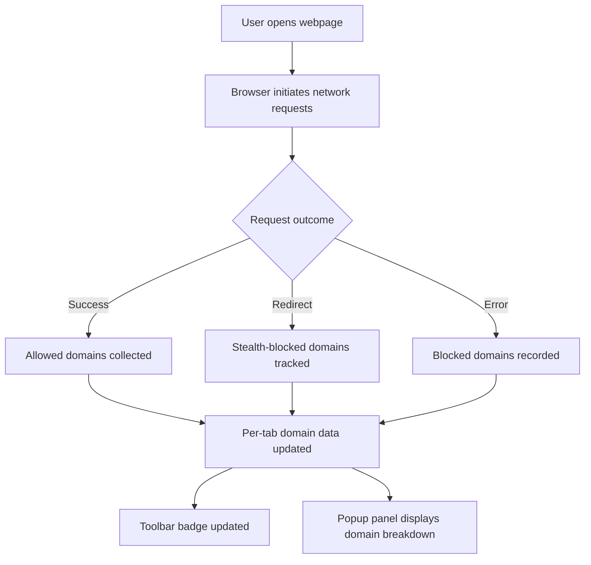

# Feature Overview

Discover the core capabilities of **uBO Scope**, designed to give you clear, real-time insight into your browser's remote server connections without relying on specific content blockers. This guide walks you through the key features that empower you to monitor, analyze, and understand third-party network activity effortlessly.

---

## Real-Time Domain Connection Reporting

uBO Scope continuously monitors network requests initiated by web pages and reports on all remote domains involved. This dynamic insight allows you to see exactly which domains your browser connects to as you navigate the web.

- **Instant Feedback:** Receive immediate updates on third-party domains contacted during browsing sessions.
- **Complete Transparency:** View unrestricted details regardless of your content blocker’s settings.

### Why it Matters
Many users want to understand which external services a webpage communicates with, either for privacy, security, or debugging purposes. uBO Scope delivers this visibility by using your browser's native capabilities to listen to outgoing request details.

---

## Per-Tab Domain Breakdown

Every browser tab maintains its own detailed record of domains connected to, categorized by the outcome of those connections:

- **Allowed Domains:** Fully permitted connections letting resources through.
- **Stealth-Blocked Domains:** Connections intercepted stealthily, preventing detection by webpages.
- **Blocked Domains:** Connections outright blocked by your setup.

This fine-grained breakdown enables you to pinpoint network activity on a tab-by-tab basis, helping isolate suspicious or unexpected third-party interactions.

> **Example:** While viewing a news article, you can see which ad servers were blocked, which content delivery networks the page used, and which trackers were stealth-blocked.

---

## Toolbar Badge Counts

The extension icon's toolbar badge always displays the **number of distinct allowed third-party domains** for the current tab, providing you a quick glance measure:

- **Lower Numbers Indicate Higher Privacy:** Fewer third-party connections usually mean less tracking.
- **Reflects Actual Network Requests:** Badge counts account for unique domains successfully contacted, not just total requests.

This real-time count helps you quickly gauge the privacy or complexity level of the page you’re visiting without opening the popup.

---

## Independence From Specific Content Blockers

Unlike tools that rely solely on the filtering rules of a particular ad or content blocker, uBO Scope listens directly to the browser’s network events via the `webRequest` API.

- **Works Alongside Any Content Blocker:** It reports all connection attempts regardless of whether they were blocked, stealth-blocked, or allowed, even if multiple blockers or DNS-based blocking solutions are in place.
- **Accurate Representation:** Because it does not depend on content blocker internals, uBO Scope provides a reliable overview free from quirks or detection evasion tricks.

---

## Practical Workflow

1. **Install uBO Scope** in your browser (Chromium, Firefox, Safari).
2. **Browse any webpage.** The extension tracks and analyzes outgoing network requests in the background.
3. **Click the toolbar icon** to open the popup and inspect:
   - The main hostname and its domain.
   - Allowed, stealth-blocked, and blocked third-party domains with counts.
4. **Use the badge** for quick privacy estimation on-the-fly.

---

## Tips for Getting the Most Out of uBO Scope

- Use the popup to quickly identify unfamiliar domains or suspicious connections.
- Compare badge counts across sites to understand relative third-party load.
- For filter list maintainers, the detailed domain tracking can help validate rules.


## Related Resources

For detailed user guidance and deeper understanding, consider visiting:

- [What is uBO Scope?](https://github.com/gorhill/uBO-Scope/blob/main/docs/overview/introduction-and-concepts/what-is-ubo-scope.md) — Understand the core purpose and value.
- [Core Concepts & Terminology](https://github.com/gorhill/uBO-Scope/blob/main/docs/overview/introduction-and-concepts/core-concepts-and-terminology.md) — Learn how domains and outcomes are defined.
- [System Architecture](https://github.com/gorhill/uBO-Scope/blob/main/docs/overview/architecture-and-features/system-architecture.md) — See how components work together behind the scenes.

---

Explore the extension’s full potential by exploring the [Getting Started](https://github.com/gorhill/uBO-Scope/blob/main/docs/getting-started/installation-setup/README.md) and [Core Workflows](https://github.com/gorhill/uBO-Scope/blob/main/docs/guides/core-workflows/README.md) sections.

---

### Code Snippet Example: Interpreting Network Request Outcomes

```js
// Simplified example from uBO Scope's background processing
function recordOutcome(tabId, request) {
    const hostname = extractHostname(request.url);
    switch(request.event) {
        case 'success':
            addDomainToAllowed(tabId, hostname);
            break;
        case 'redirect':
            addDomainToStealthBlocked(tabId, hostname);
            break;
        case 'error':
            addDomainToBlocked(tabId, hostname);
            break;
    }
}
```

This illustrates how uBO Scope categorizes connection attempts, which directly feeds into the data users see in the popup.

---

### Visual Summary of Feature Flow



This flow captures the essence of how uBO Scope monitors and reports network activity seamlessly.

---

Start leveraging these features today to gain unprecedented clarity on your web traffic and enhance your browsing privacy and security.