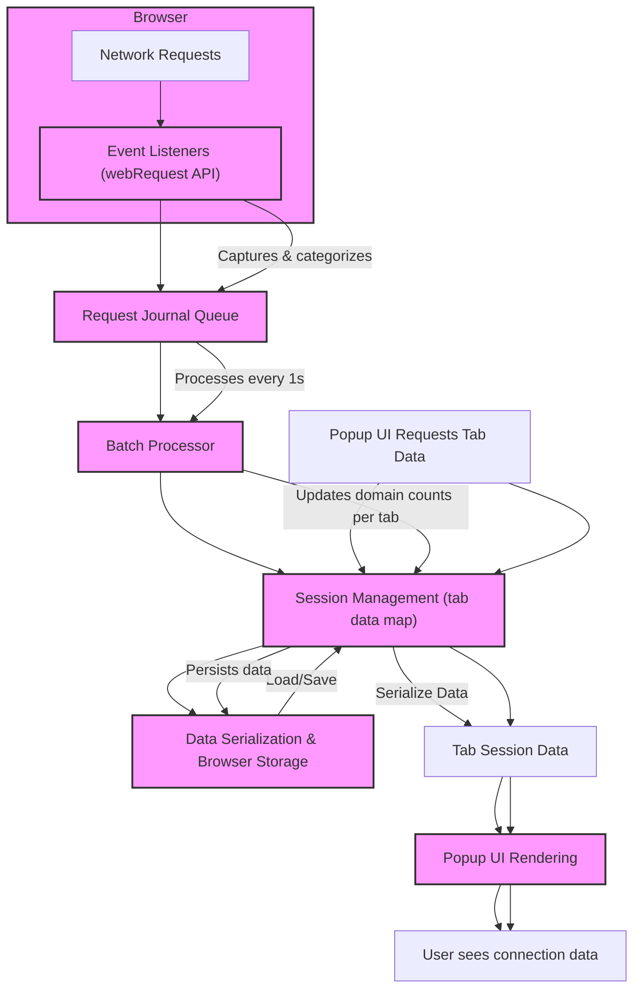

# Core Components & Data Flow

uBO Scope is a specialized browser extension purpose-built to expose every attempted connection a webpage makes to remote servers, providing transparency beyond typical content blocker reports. This page offers a detailed breakdown of the extension’s primary components and illustrates how they collaborate to capture, process, and present network activity, culminating in the dynamic user interface seen in the popup.

---

## Understanding uBO Scope’s Core Architecture

At the heart of uBO Scope lies a seamless flow of data from raw network events to insightful, user-friendly presentation. This journey is powered by four fundamental components:

- **Network Event Listeners:** Capture detailed real-time web requests, including successes, errors, and redirects.
- **Session Management:** Maintain organized state and history for individual browser tabs.
- **Data Serialization & Deserialization:** Efficiently store and restore session information.
- **UI Rendering:** Present connection outcomes clearly and interactively through the popup interface.

Each component serves a critical role in transforming complex network traffic into actionable insights.

---

## 1. Event Listeners: Capturing Network Activity

uBO Scope leverages the browser's `webRequest` API to monitor all network requests initiated by web pages within its permission scope (HTTP, HTTPS, WS, WSS, depending on browser support).

### How It Works:

- **Types of Events Tracked:**
  - **`onBeforeRedirect`**: Tracks when a request is redirected to a new URL.
  - **`onErrorOccurred`**: Detects failed requests like blocked or unreachable endpoints.
  - **`onResponseStarted`**: Marks the start of successful responses.

- **Batching Journals:** To optimize performance, captured requests are queued into a journal (`networkRequestJournal`) rather than processed instantly. Every second (configurable), the batch is processed together, updating the session data and UI accordingly.

- **Outcomes Recorded:** Each request’s result is categorized as one of:
  - **Allowed:** Request succeeded.
  - **Blocked:** Request failed or was blocked.
  - **Stealth-blocked:** Requests that were redirected or stealthily blocked.

<Tip>
Batch processing network requests in batches prevents UI lag and resource hogging during intense browsing sessions.
</Tip>

---

## 2. Session Management: Organizing Tab Data

uBO Scope tracks network request outcomes separately per browser tab, enabling precise analysis of each tab’s third-party connections.

### Session Data Structure:

- Each tab corresponds to a **`tabDetails`** entity that includes:
  - The main domain and hostname of the tab.
  - Three distinct sets tracking domains and hostnames:
    - **Allowed:** Successfully connected domains.
    - **Stealth:** Domains involved in redirection or stealth blocks.
    - **Blocked:** Domains from which requests were blocked.

- Session data is managed centrally within a Map keyed by `tabId`, allowing efficient lookup and update.

- **Reset & Update Logic:** When a main frame request (`main_frame`) occurs in a tab, its session data resets to reflect the new page context.

- Additional helper functions parse and normalize URLs to determine domain and hostname, leveraging the Public Suffix List (PSL) for accuracy.

<Note>
The Public Suffix List is used to differentiate between actual website domains and subdomains correctly, critical for meaningful reporting.
</Note>

---

## 3. Data Serialization: Saving & Loading State

To offer continuity across browser sessions and reduce unnecessary overhead, uBO Scope serializes its session data.

### Mechanism:

- **Serialization and Deserialization:** Utilizes lightweight custom serialization (`s14e-serializer.js`) for compact binary-like string formats.

- **Storage APIs:** Session data and the public suffix list cache are read from and written to browser storage:
  - Persistent storage (`storage.local`) enables retention between browser restarts.
  - Session storage (`storage.session`) holds transient data within session lifetimes.

- The extension initializes by loading relevant stored data asynchronously, ensuring accuracy before processing network events.

<Tip>
This serialization strategy balances performance with persistence, crucial for an always-on monitoring extension.
</Tip>

---

## 4. UI Rendering: Visualizing Connection Data

All processed and stored data culminate in the popup interface, offering users an intuitive snapshot of the current tab’s remote connections.

### Popup Interface Highlights:

- **Domain Counts:** Displays the total number of distinct third-party domains connected.

- **Outcome Sections:** Categorizes domains into three groups:
  - **Not Blocked (Allowed):** Domains from which connections succeeded.
  - **Stealth-Blocked:** Domains involved in redirected or stealth-blocked requests.
  - **Blocked:** Domains where network requests were actively blocked.

- **Detailed Domain Counts:** Each domain item shows the count of individual requests made.

### Rendering Flow:

- The popup script (`popup.js`) sends a message to the background script requesting tab data.
- Once received, the data is deserialized and rendered carefully, decoding domain names (including punycode) for human-friendly display.
- The UI dynamically updates, removing loading states and adjusting layout responsively.

<Warning>
Exact counts and domain lists only reflect network events observable through the browser's `webRequest` API. Requests bypassing this API won’t appear.
</Warning>

---

## Putting It All Together: Data Flow Overview

This section summarizes the integration and flow between components in a user-focused storyline:

- The browser triggers network requests during web navigation.
- Event listeners capture these requests, tagging each with an outcome (allowed, blocked, stealth).
- Requests are queued and batch-processed to update session data for the corresponding tab.
- Session data serializes, persists, and remains ready for retrieval.
- When the user opens the popup, the UI requests current tab session data.
- The UI presents a clear, categorized breakdown of connection outcomes, empowering the user to see what third-party domains their browser reached.

---

## Practical Tips & Common Pitfalls

- **Patience with Badge Updates:** Because network events are batch-processed every second, the toolbar badge and popup data may update with slight delays.

- **Browser Limitations:** Some browsers restrict `webRequest` API access or filter out certain requests; this may cause missing connections.

- **Domain Resolution Accuracy:** The embedded Public Suffix List and punycode conversion ensure domains appear correctly, but very new or rare domains might temporarily be misclassified until update.

- **Multi-Tab Behavior:** Each tab tracks its own connection data independently. Closing a tab clears its session data to avoid stale information.

- **Popup Scope:** The popup reflects only the active tab’s data at the moment of opening.

<Check>
Users should expect that uBO Scope reveals connections irrespective of their content blockers, providing a unique transparency layer onto real network activity.
</Check>

---

## Summary

This page dissected the core components and data flow underpinning uBO Scope, emphasizing the extension’s meticulous monitoring of network requests, session-state management across tabs, efficient serialization for performance and persistence, and user-facing presentation in the popup. This understanding prepares users to better interpret the connection data and trust the extension’s insights.

---

## Next Steps

To deepen your understanding and usage of uBO Scope, explore:

- [System Architecture](../architecture-and-operation/system-architecture) for a broader view of the extension's design.
- [What is uBO Scope?](../introduction-and-value/product-overview) for context on why these components matter.
- [Understanding the Toolbar Badge](../introduction-and-value/badge-count-meaning) to interpret connection counts effectively.

---

## References

- [GitHub Repository](https://github.com/gorhill/uBO-Scope)
- WebRequest API: https://developer.mozilla.org/en-US/docs/Mozilla/Add-ons/WebExtensions/API/webRequest
- Public Suffix List: https://publicsuffix.org/

---

