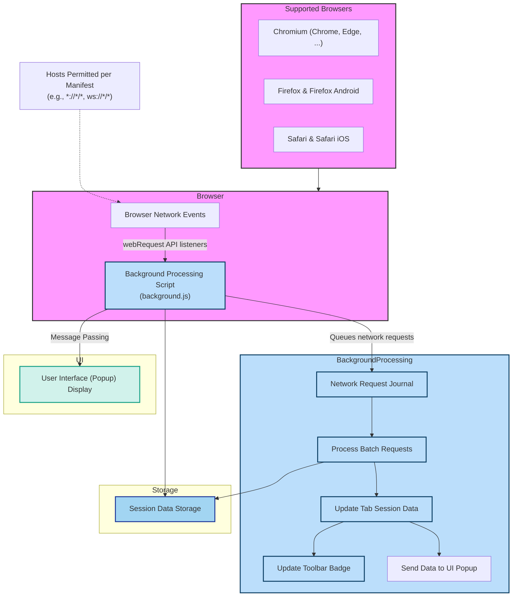

# System Architecture of uBO Scope

## Visualize and Understand uBO Scope’s Core Architecture

The System Architecture page lays out the fundamental flow of how uBO Scope processes and presents network activity data. Through a detailed mermaid diagram, it reveals the journey of browser network events from initial interception through behind-the-scenes processing scripts to the user-facing interface. This visualization highlights critical integration points like the use of the browser's `webRequest` API and demonstrates uBO Scope’s robust cross-browser compatibility.

---

## Overview: How uBO Scope Works Behind the Scenes

uBO Scope functions as a browser extension that listens to network activity, capturing every attempt a webpage makes to connect with remote servers. Instead of simply counting blocked or allowed requests, it records the actual outcome of each network request — whether it succeeded, was stealth-blocked, or redirected — providing transparency often obscured by standard content blockers.

The System Architecture page uncovers this core mechanism, showing you how uBO Scope uses the browser's native `webRequest` API to tap into network requests across supported browsers like Chromium, Firefox, and Safari. These intercepted events flow through dedicated background scripts that analyze and categorize network connections, maintaining a session-based data model that feeds the user interface popup instantly and accurately.

---

## Key Elements of the Architecture

### 1. Browser Network Events
- Utilizes the webRequest API listeners:
  - `onBeforeRedirect`
  - `onErrorOccurred`
  - `onResponseStarted`

These listeners capture live network activity matching host permissions defined in the extension manifest. This mechanism ensures comprehensive tracking of HTTP/HTTPS and WebSocket connections.

### 2. Background Processing Script (background.js)
- Central script that:
  - Queues network event data.
  - Periodically processes batches of network requests.
  - Updates tab-specific details about allowed, stealth-blocked, and blocked domains.
  - Maintains session persistence and badge updates.

This isolation enables efficient handling of network data without impacting browser performance.

### 3. Session Data Storage
- Session-scoped storage maintains the state of network request outcomes per tab.
- Uses serialization techniques to save and restore state between sessions.

### 4. User Interface Popup
- Displays organized summaries of domains connected under different outcome categories:
  - Allowed (not blocked)
  - Stealth-blocked (redirected requests)
  - Blocked (errors)

Realtime updates are synced via message passing from background scripts.

### 5. Cross-Browser Support
- Manifest and background script configurations accommodate differences among Chromium, Firefox, and Safari.
- The extension gracefully adjusts URL schemes and API usage accordingly, ensuring consistent data reporting and UI experience.

---

## How the Architecture Benefits You

Understanding this architectural flow empowers you to:

- **Gain Confidence in Data Accuracy:** Knowing uBO Scope leverages official browser APIs ensures it captures authentic network events not influenced by content blocking layers.
- **Leverage Session Persistence:** Results aren't lost on tab navigation or reloads due to reliable session management.
- **Enjoy Responsive UI Updates:** Near-real-time badge and popup updates facilitate seamless monitoring of current webpage connections.
- **Benefit from Universal Browser Coverage:** Use the same insights whether you prefer Chrome, Firefox, Safari, or other compatible browsers.

---

## Mermaid Diagram: Visualizing uBO Scope's System Architecture

---

## Best Practices and Tips

- **Understand Network Outcomes:** The division into allowed, stealth, and blocked connections reveals the true state of network requests beyond common blocker counts.
- **Watch the Toolbar Badge:** It instantly reflects the count of distinct connected third-party domains for the active tab.
- **Leverage Cross-Tab Persistence:** Data is stored per tab session, giving accurate insight even after navigation.
- **Know Your Browser Limits:** The architecture relies entirely on the browser's webRequest API; if a browser restricts this API, uBO Scope's ability to report may be limited.

---

## Troubleshooting Common Issues

<AccordionGroup title="Common Architecture-Related Troubleshooting">
<Accordion title="Popup Shows No Data or 'NO DATA'">
- Ensure the tab is active and has network activity.
- Verify permissions are correct per browser platform.
- Confirm that the background script is running without errors.
</Accordion>
<Accordion title="Toolbar Badge Not Updating">
- Badge updates only after network requests are processed in batches (timed intervals).
- Sometimes switching tabs or reloading the page triggers update.
- Confirm that network requests actually occur on the active tab.
</Accordion>
<Accordion title="Extension Not Capturing Certain Requests">
- Some network requests made outside the reach of webRequest API cannot be intercepted.
- Verify the browser supports the webRequest events for all protocols involved.
</Accordion>
</AccordionGroup>

---

## Next Steps

- **Explore the Core Components & Data Flow:** Deepen your understanding of how individual parts interact.
- **Review Browser Support & Installation:** Ensure your browser environment is fully compatible with uBO Scope.
- **Try It Out:** Install the extension and observe real-time network event visualization.

For related architecture concepts, visit the [Core Components & Data Flow](../core-components) and [Supported Browsers & Installation](../browser-support) documentation.

---

## References
- [GitHub Repository](https://github.com/gorhill/uBO-Scope)
- [Background Script Source](../js/background.js)
- [Extension Manifest - Cross Browser Support](../platform)
- [Popup UI](../popup.html)

---

By understanding the System Architecture, you gain a clear picture of how uBO Scope reliably captures and reports network connection outcomes, empowering you with unparalleled insight into your browsing privacy and activity.

---