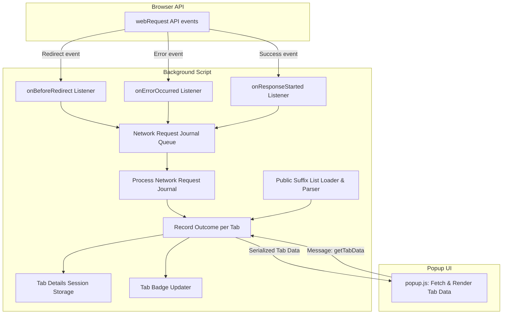

# Core Components and Data Flow

Explore the heart of uBO Scope's functionality through the key code components and the flow of data that underpins its operation. This page guides you through how network requests are intercepted and classified, how tab-specific data is collected and stored, and how the extension’s background logic collaborates with the popup interface to deliver real-time insights.

---

## Understanding the Landscape: Capturing Network Activity

At its core, uBO Scope relies on the browser's `webRequest` API listeners to intercept every network request made by webpages within your browser. These are observed in the extension's **background script**, found in `js/background.js`, which serves as the engine that records, categorizes, and persists connection data linked to specific browser tabs.

### Interception and Categorization

Every network request is captured through registered listeners for three principal events:

- **`onBeforeRedirect`** (captures redirects)
- **`onErrorOccurred`** (captures failed requests)
- **`onResponseStarted`** (captures successful responses)

Each intercepted event is queued briefly to batch process the data for efficiency.

### Outcome Classification

The background script classifies each request outcome into three distinct categories:

- **Allowed:** Requests that successfully fetched resources.
- **Blocked:** Requests that failed due to errors or being blocked.
- **Stealth-blocked:** Redirects that effectively block requests stealthily.

This classification helps you understand not just _whether_ a request was blocked but also the nuanced behavior of stealth blocking.

---

## Managing Tab-Specific Data: Organization and Persistence

Since users navigate across many tabs, uBO Scope manages connection data **per tab** to provide targeted insights.

### Tab Details Object

Each tab's data is stored in a structured object containing:

- `domain`: The registered domain of the main frame (top-level page).
- `hostname`: The precise hostname of the main frame.
- Outcome-specific maps (`allowed`, `blocked`, `stealth`), each tracking both domains and hostnames with associated counts.

Internally, these are JavaScript `Map` objects used for efficient counting and lookup.

### Data Lifecycle

- **Initialization and Reset:** When the main frame of a tab loads, its previous connection data is reset to clear stale state.
- **Data Update:** Network outcomes add to their respective maps, accumulating counts per domain and hostname.
- **Persistence:** Tab data is serialized and saved to session storage to survive certain browser state changes.
- **Cleanup:** When a tab is closed, its data is removed from memory and storage to avoid leaks.

---

## Background and Popup Integration: Real-Time Data Visualization

The popup (UI) script (`js/popup.js`) acts as the presentation layer, retrieving and rendering summarized tab data upon user interaction.

### Data Fetching

When you open the popup, it:

1. Queries the active tab's ID.
2. Sends a message asking the background script for the tab’s recorded data.
3. Waits for the serialized data response.
4. Deserializes and presents the detailed breakdown.

### Rendering Insights

The popup visually displays:

- The main page’s hostname and domain.
- Counts of connected third-party domains categorized by outcome (allowed, stealth-blocked, blocked).

This immediate feedback loop empowers you to assess network exposures and content blocking behavior per active tab.

---

## Domain Logic and Public Suffix Parsing: Precision in Domain Analysis

Accurately interpreting domain and hostname relationships is critical to meaningful reporting.

### Role of `publicsuffixlist.js`

This module parses Mozilla Foundation’s Public Suffix List to differentiate between:

- **Registered domains:** The main site domain, e.g., `example.com`.
- **Public suffixes:** Top-level domains or complex suffixes, e.g., `.co.uk`.

By leveraging this, uBO Scope can group and count connections correctly at the domain level, avoiding spurious splits caused by subdomains.

### Hostname Extraction

The background script utilizes JavaScript's `URL` API to safely parse the hostname from raw URLs, then applies the public suffix logic to find the registered domain.

---

## Data Flow Diagram

---

## Practical Tips and Best Practices

- The **badge count** on the toolbar icon represents the number of distinct third-party domains **allowed** (successfully connected). This helps quickly gauge third-party exposure.
- The extension **tracks domains and hostnames separately** for detailed granularity, aiding in spotting specific subdomain behaviors.
- Because of batched processing of requests, expect a very short delay (~1 second) before the popup reflects new network activity.
- Closing tabs clears their stored data immediately, freeing memory and preventing stale data.

---

## Troubleshooting Common Issues

<AccordionGroup title="Common Troubleshooting Scenarios">
<Accordion title="No Data Displayed in Popup">
Check if the active tab has a loaded webpage with network requests. If the page is blank or loading slowly, the popup may be empty. Reload the page to generate network traffic.
</Accordion>

<Accordion title="Badge Count Not Updating">
Make sure your browser supports the `webRequest` API and that no other extensions block these events. Network request events might be delayed; waiting a few seconds and refreshing the page may help.
</Accordion>

<Accordion title="Mismatch in Allowed vs. Blocked Counts">
Remember the badge counts unique allowed domains only. Blocked and stealth-blocked counts are detailed in the popup but not summed on the badge.
</Accordion>
</AccordionGroup>

---

## Next Steps

Now that you understand the key code components and data flow:

- Explore [System Architecture Overview](/overview/architecture-and-overview/system-architecture) for a higher-level view.
- Visit [Understanding the Badge and Popup Interface](/guides/getting-started/understanding-badge-and-ui) to deepen UI knowledge.
- Proceed to [Analyzing Network Connections on a Webpage](/guides/workflows-and-real-world-usage/analyzing-network-connections) for practical usage examples.

---

## References

- Source code repository: [https://github.com/gorhill/uBO-Scope](https://github.com/gorhill/uBO-Scope)
- Background script: `js/background.js`
- Popup script: `js/popup.js`
- Public suffix parsing library: `js/lib/publicsuffixlist.js`

---

Remember, uBO Scope’s architecture is purpose-built to give you reliable, tab-specific transparency into every network connection your browser makes — aiding privacy awareness and filter list maintenance with clarity and precision.

