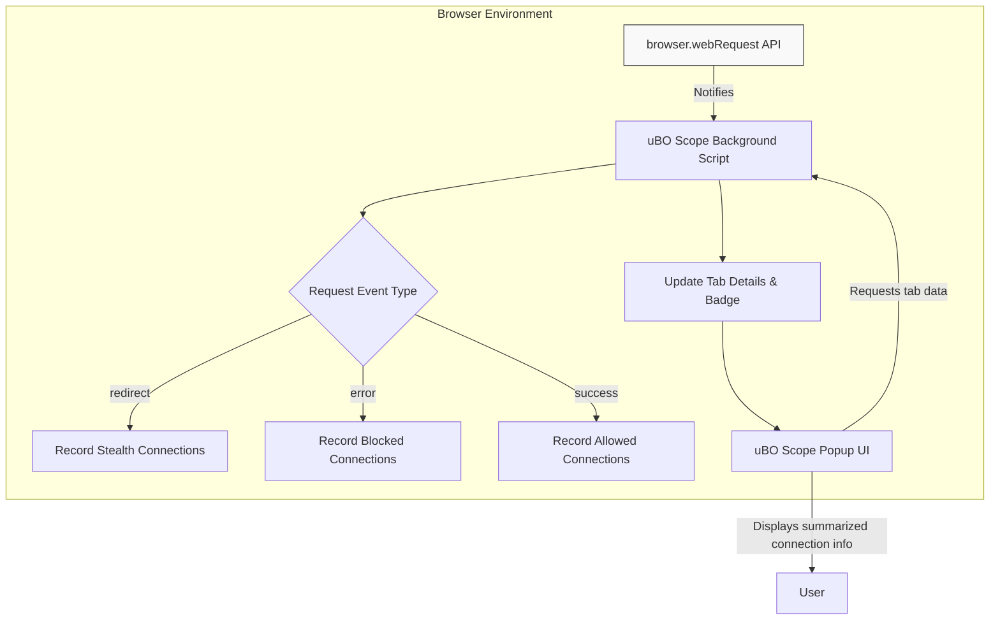

# Integration with Browsers and Other Tools

Explore how uBO Scope integrates smoothly with major web browsers through standardized APIs, maintaining independence from specific content blockers or DNS filtering techniques. This page clarifies where uBO Scope fits within broader privacy workflows and audit systems, equipping you to make the most of its data in combination with other tools.

---

## Why Browser Integration Matters

uBO Scope functions by leveraging native browser APIs, primarily the `webRequest` API, to monitor all network requests made by webpages. Because it relies solely on these standardized interfaces, it works consistently across supported browsers such as Chromium-based browsers, Firefox, and Safari. This design ensures:

- **Broad compatibility:** No need for browser-specific hacks—uBO Scope adapts naturally to each browser’s extension API.
- **Stable data collection:** Monitors network requests in real time regardless of other content blockers or DNS-based filtering.
- **Minimal impact:** Since it doesn't depend on or interfere with other blockers, it can coexist cleanly alongside your preferred privacy tools.

### Supported Browsers and Manifest Details

uBO Scope packages its integration in browser-specific manifests adhering to Manifest Version 3 (MV3), ensuring modern and secure extensions:

- **Chromium-based browsers:** Use a `service_worker` background script with permissions for `webRequest` and access to all URLs (`http`, `https`, `ws`, `wss`).
- **Firefox:** Uses a background module script with similar permissions and includes browser-specific settings such as minimum version restrictions.
- **Safari:** Employs browser-specific manifest settings supporting minimum Safari version 18.5.

All manifests declare host permissions for monitoring network connections, enabling uBO Scope to observe every page’s requests.

<Accordion title="Example: Host Permissions in Chromium Manifest"> 
```json
"host_permissions": [
    "https://*/*",
    "http://*/*",
    "wss://*/*",
    "ws://*/*"
]
```
</Accordion>

---

## How uBO Scope Gathers Its Data

### Utilizing the webRequest API

At the core of its integration, uBO Scope listens to browser network activity events:

- `onBeforeRedirect`
- `onErrorOccurred`
- `onResponseStarted`

These listeners capture the network request lifecycle events, enabling uBO Scope to classify connections as allowed, blocked, or stealth-blocked independently from the filtering mechanism.

### Independent of Content Blockers or DNS

Because uBO Scope only observes network requests via browser APIs, it remains agnostic about how the requests were blocked or allowed:

- It reports connections allowed by any content blocker, whether uBlock Origin or another extension.
- It correctly counts blocked requests even when blocking occurs at DNS level or through stealth techniques, as long as the browser’s `webRequest` API reports them.
- This independence allows for a reliable count of actual third-party remote servers contacted, valuable for privacy audits.

<Tip>
If a browser extension or mechanism prevents the request from reaching the browser’s network layer entirely (e.g., via DNS blocking external to browser's network stack), uBO Scope might not see those requests.
</Tip>

---

## Positioning Within Privacy and Audit Workflows

### Complementary to Content Blockers

uBO Scope acts as a transparency tool, complementing but not replacing content blockers:

- **Transparency:** Shows the true landscape of network connections, independent from what blockers report.
- **Verification:** Helps you verify if your content blocker genuinely limits the number of remote third-party connections.
- **Education:** Debunks misleading assumptions, such as correlating block count with blocking effectiveness.

### Fits into Broader Privacy Auditing

- You can use data from uBO Scope alongside browser developer tools to get deeper insights into requests.
- It can be integrated in filter list maintenance workflows as a validation tool.
- Useful when other privacy audit tools are limited or unavailable on a platform.

---

## Visualizing uBO Scope’s Integration Flow



This diagram highlights how uBO Scope taps into each network request event within the browser, updating its internal tab-level data, and exposes this information to users via the popup interface.

---

## Best Practices for Using uBO Scope with Other Tools

- **Run alongside your existing content blocker:** uBO Scope simply reports connections without blocking, so running it in parallel poses no conflict.
- **Use in privacy audits:** Combine uBO Scope’s connection reports with network inspectors or filter list analyzers.
- **Understand limitations:** Recognize that requests entirely blocked outside the browser’s network API won’t be visible.

---

## Troubleshooting Integration Issues

<AccordionGroup title="Common Issues and Solutions">
<Accordion title="No Badge or Data Showing">
- Ensure that the extension is enabled after installation.
- Verify that your browser supports Manifest V3 and the `webRequest` API is accessible.
- Check for any conflicting extensions that might disable webRequest listeners.
</Accordion>
<Accordion title="Inaccurate Network Counts">
- Confirm that the browser’s network layer isn’t bypassed by external DNS blocking.
- Remember: requests blocked *before* they reach the browser won’t be counted.
</Accordion>
<Accordion title="Data Not Updating in Real-time">
- Allow up to one second for batched network requests processing.
- Refresh the popup view or switch browser tabs.
</Accordion>
</AccordionGroup>

---

## Next Steps

To start using uBO Scope effectively with your browser:

- Review [Prerequisites & Supported Browsers](/getting-started/essentials-setup/prerequisites-system-compatibility) to confirm compatibility.
- Follow [Installation: Step-by-Step for Each Browser](/getting-started/essentials-setup/installation-methods) for your environment.
- Explore [Understanding the Badge and Popup Interface](/guides/getting-started/understanding-badge-and-ui) to see how integration surfaces data.


---

For a deeper technical understanding, consult the [System Architecture Overview](/overview/architecture-and-overview/system-architecture) and [Core Components and Data Flow](/overview/architecture-and-overview/data-flow-and-components) documentation.


---


