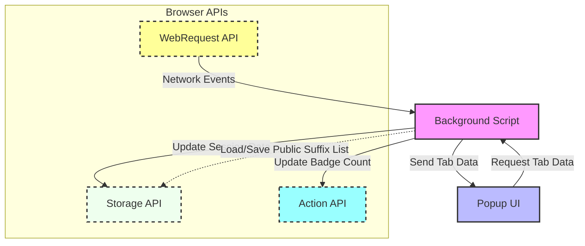

# System Architecture Overview

Understand how uBO Scope orchestrates its core components to monitor, log, and present connection data seamlessly within your browser. This high-level guide visualizes the extension's internal structure, detailing the interactions between the background script, popup UI, and browser APIs — the pillars that collect, process, and display real-time network connection insights for every active tab.

---

## Why This Matters to You

Imagine needing transparent, trustworthy visibility into every third-party server a webpage connects to — without guesswork or fancy jargon. uBO Scope achieves this by working quietly behind the scenes, intercepting network events and packaging them into actionable data you can rely on, all while making that data instantly accessible through a clean popup interface. 

By grasping the system architecture, you gain confidence in how uBO Scope functions and how each part contributes to your goal of a clearer web privacy picture.

---

## Core Components and Their Roles

### Background Script: The Heartbeat of Data Collection

- **Network Event Listener:** Leveraging browser WebRequest APIs, the background script listens to every network request your browser initiates.
- **Request Outcome Recorder:** It classifies outcomes into 'allowed', 'blocked', or 'stealth-blocked', tracking these per tab and aggregating domain and hostname data.
- **Session Management:** Maintains live session data across tabs — ensuring accuracy and continuity even as tabs open or close.
- **Badge Updater:** Updates the toolbar badge count to instantly communicate the number of distinct third-party domains connected per tab.

### Popup UI: Your Window Into Network Connections

- **Data Requestor:** When you open the popup, it requests the latest connection data for the current tab from the background script.
- **Renderer:** Presents domain connection counts categorized by outcome, helping you quickly interpret your browsing privacy landscape.
- **User Experience Manager:** Dynamically updates the UI for clarity and immediate feedback without overwhelming you.

### Browser APIs: The Connective Tissue

- **WebRequest API:** Tracks all network requests on the browser level, including redirects and errors.
- **Storage API:** Saves session and Public Suffix List data to ensure persistence and quick lookup.
- **Action API:** Manages the popup launching and badge display on the browser toolbar.

---

## Data Flow Illustrated

---

## Walkthrough: How uBO Scope Works Internally

1. **Network requests occur in your browser tabs.** Using the WebRequest API, the background script captures each request event — success, redirect, or error.
2. **Background script categorizes these requests** into allowed, blocked, or stealth-blocked domains, enriched with domain name parsing against the Public Suffix List for accurate grouping.
3. **Session state is updated incrementally,** ensuring the toolbar badge count is current and precise.
4. **When you open the popup UI,** it queries the background script for latest tab-specific connection data.
5. **Popup renders the categorized domain counts,** giving you a clear, actionable snapshot.

---

## Practical Tips for Users

- **Trust the badge count:** It reflects distinct third-party remote servers connected by a tab, not just raw block counts.
- **Use the popup interface for deeper insight:** See which domains are allowed, stealth-blocked, or blocked.
- **Closing tabs clears session data:** So your badge and popup remain accurate only for active browsing sessions.

## Common Pitfalls to Avoid

- Do not expect network requests outside of browser WebRequest API scope (e.g., non-browser system calls) to appear.
- Avoid relying on block counts alone to assess privacy risk; focus on distinct third-party connections.

---

## Next Steps

To deepen your knowledge and effectively use uBO Scope, explore these documentation pages:

- [What is uBO Scope?](/overview/introduction-and-purpose/what-is-ubo-scope) – Understand the product's goals and user benefits.
- [Key Features and Value Proposition](/overview/introduction-and-purpose/key-features-and-value) – Learn about core capabilities.
- [Core Components and Data Flow](/overview/architecture-and-overview/data-flow-and-components) – Dive into lower-level workflows.
- [Target Audience and Use Cases](/overview/introduction-and-purpose/audience-and-use-cases) – Determine if uBO Scope fits your needs.

Start using the extension to instantly visualize remote server connections per tab and gain a clearer, actionable picture of your browsing privacy.

---

## Additional References

- Official repository: [uBO-Scope GitHub](https://github.com/gorhill/uBO-Scope)
- Browser Manifest files:
  - [Chromium Manifest](platform/chromium/manifest.json)
  - [Firefox Manifest](platform/firefox/manifest.json)
  - [Safari Manifest](platform/safari/manifest.json)

