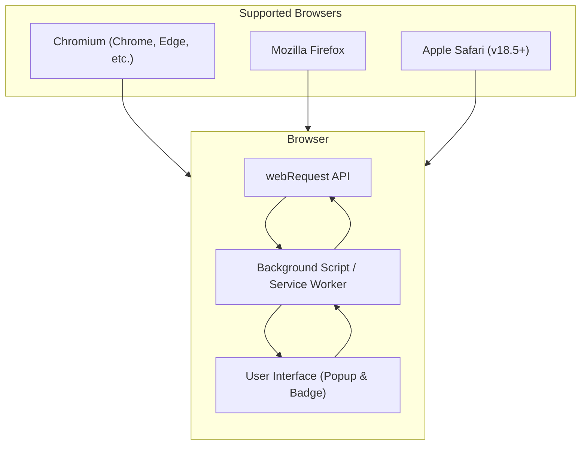

# Supported Browsers & Integration Points

uBO Scope embraces a universal approach, delivering consistent and transparent insights into network requests across multiple browsers and platforms. This page outlines the browsers officially supported by uBO Scope and illustrates how it integrates deeply with browser APIs and the user interface to deliver its measurement capabilities.

---

## Cross-Browser Support

uBO Scope supports the following modern browsers with seamless feature parity:

- **Chromium-based browsers** (e.g., Google Chrome, Microsoft Edge)
- **Mozilla Firefox**
- **Apple Safari** (version 18.5 and above)

This broad compatibility ensures users can benefit from uBO Scope's insights regardless of their preferred browsing environment.

### Why This Matters

By supporting these browsers, uBO Scope guarantees:

- **Consistent user experience** with the same visual interface and behavior.
- **Reliable network request monitoring** leveraging each browser's native APIs.
- **Wide adoption potential** for users and filter list maintainers on diverse platforms.


## Integration with Browser APIs

At the heart of uBO Scope’s functionality lies its integration with the browser's `webRequest` API. This API allows the extension to observe network requests made by webpages in real time, regardless of any active content blockers or DNS-level filtering.

### How uBO Scope Uses the webRequest API

- **Event Listeners:** uBO Scope registers listeners for key network events:
  - `onBeforeRedirect`
  - `onErrorOccurred`
  - `onResponseStarted`

- **Request Data Capture:** These listeners capture details about every relevant network request, including URL, type, frame information, and outcomes such as successful responses, errors, or redirects.

- **Outcome Categorization:** Requests are classified as allowed (successful), stealth-blocked (redirected stealthily), or blocked (errors).

- **Session Data Management:** Each browser tab maintains a detailed session of domain connection data, updated dynamically as requests occur.

---

## UI Integration & Data Presentation

uBO Scope extends beyond data capture by presenting clear, actionable information to users through the browser's toolbar interface.

### Toolbar Badge

- Displays a **badge count of distinct third-party domains** connected by the active tab.
- Updated in near real-time, reflecting the latest network activity.
- Helps users quickly assess privacy exposure at a glance.

### Popup Interface

- Provides a detailed breakdown of connected domains grouped by outcome: 
  - Not blocked (allowed connections)
  - Stealth-blocked connections
  - Explicitly blocked connections
- Shows precise counts per domain, helping identify third-party connections in detail.

All UI components load asynchronously but are designed to reflect up-to-date network state without impacting browser responsiveness or web page behavior.

---

## Universal Approach Across Platforms

uBO Scope’s architecture and integration strategy ensure it behaves identically across supported browsers:

- Background scripts or service workers power consistent network monitoring.
- Browser-specific manifest files declare appropriate permissions and entry points to guarantee compatibility.
- The public suffix list and domain parsing logic underpin reliable domain aggregation regardless of browser.
- Communication between background processes and the UI popup uses standardized message passing.

This design philosophy ensures that whether you use Chromium, Firefox, or Safari, your experience and data remain uniform and dependable.

---

## Practical Example: How Requests Flow & Are Processed

Here is a concise stepwise depiction of how uBO Scope captures and summarizes connection data:

<Steps>
<Step title="User Navigates to a Webpage">
Browser starts loading the page, triggering network requests.
</Step>
<Step title="webRequest Listeners Capture Requests">
uBO Scope’s listeners record each request event—redirects, errors, and responses.
</Step>
<Step title="Tab Session Data Is Updated">
For each tab, domain connection outcomes (allowed, stealth, blocked) are tallied and stored dynamically.
</Step>
<Step title="Toolbar Badge Reflects Current Count">
Badge updates to show the number of distinct connected third-party domains.
</Step>
<Step title="Popup Displays Detailed Breakdown">
User clicks the icon to see the categorized list of connected domains.
</Step>
</Steps>


---

## Browser Manifest Highlights

Each supported browser declares the required permissions and background processing specifics tailored for its platform:

- **Permissions Used:** `webRequest`, `storage`, `activeTab`
- **Host Permissions:** HTTP, HTTPS, and WebSocket schemes (where supported)
- **Background Process:** 
  - Chromium: module-based service_worker
  - Firefox & Safari: module-based background script
- **Minimum Browser Versions:** 
  - Chromium: 122.0+
  - Firefox: 128.0+
  - Safari: 18.5+

These settings ensure that uBO Scope can reliably monitor network requests and interact with the browser user interface safely and efficiently.

---

## Tips and Best Practices

- **Keep your browser updated** to the latest supported version to ensure full compatibility with uBO Scope's capabilities.
- **Grant all necessary permissions** during installation to avoid incomplete data reporting.
- If you encounter missing or incomplete network data, verify that the browser's `webRequest` API is fully functional and that no conflicting extensions are interfering.
- Use the detailed popup view to investigate suspicious or unexpected third-party network connections.

---

## Troubleshooting Common Issues

<AccordionGroup title="Common Troubleshooting Topics">
<Accordion title="Browser Version Not Supported">
Ensure your browser version meets or exceeds the stated minimum for uBO Scope. Older browsers may lack required APIs.
</Accordion>
<Accordion title="Network Requests Not Appearing">
Check that uBO Scope has the `webRequest` permission. Also, verify no other extension or setting blocks access to network request data.
</Accordion>
<Accordion title="Badge Count Not Updating">
Reload the tab or restart the browser. If the problem persists, check for storage permission issues or background script errors.
</Accordion>
</AccordionGroup>

---

## Further Reading

To deepen your understanding of uBO Scope’s functionality and usage, consider reviewing:

- [How uBO Scope Works (Architecture Diagram)](/overview/architecture-and-system-overview/system-architecture-diagram)
- [Understanding Connection Counting](/overview/core-concepts-and-features/connection-counting-explained)
- [Monitoring Network Connections]( /guides/getting-started/monitoring-network-connections)

---

## Summary

uBO Scope provides robust, cross-platform transparency into web network connections by integrating seamlessly with the browser's native `webRequest` API and user interface. Supported on Chromium, Firefox, and Safari, it delivers consistent insights and a cohesive user experience to efficiently monitor and interpret third-party network activity.

<Info>
For source code, browser-specific manifests, and further technical details, visit the official GitHub repository: https://github.com/gorhill/uBO-Scope
</Info>

---


### Mermaid Diagram: Integration Overview



---

# Code Example: WebRequest Listener Registration (from background.js)

```javascript
browser.webRequest.onBeforeRedirect.addListener(details => {
    queueNetworkRequest(details, 'redirect');
}, { urls: manifest.host_permissions });

browser.webRequest.onErrorOccurred.addListener(details => {
    queueNetworkRequest(details, 'error');
}, { urls: manifest.host_permissions });

browser.webRequest.onResponseStarted.addListener(details => {
    queueNetworkRequest(details, 'success');
}, { urls: manifest.host_permissions });
```

This snippet shows how uBO Scope actively listens for network request events, categorizing outcomes to build its connection data.

---

# How This Page Fits Into the Documentation

This page complements the architecture diagrams and core concepts by detailing practical browser compatibility and integration points. It informs users about what browsers are supported and how uBO Scope interacts internally with browser APIs and the UI.

Users looking to install or troubleshoot the extension will find this information essential for understanding platform requirements and capabilities.

---

For a seamless start, visit the Getting Started guides and explore the detailed connection counting and UI explanations provided in the adjacent documentation.

---