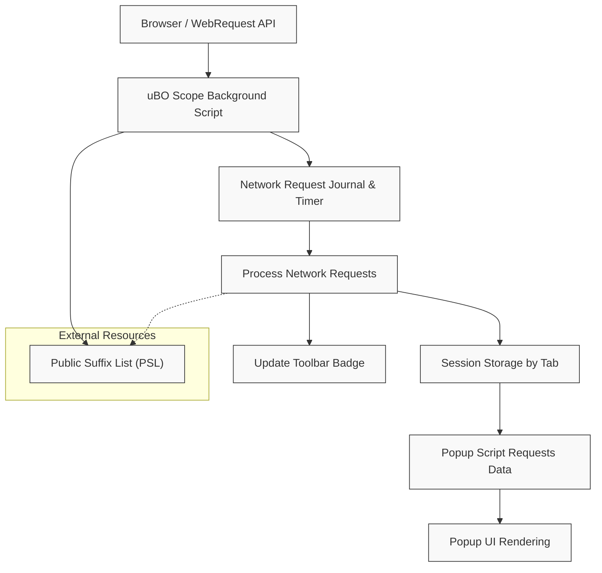

# How uBO Scope Works (Architecture Diagram)

Discover how uBO Scope flows from network event capture to data rendering through a clear architecture diagram. This page walks you through the extension’s internal flow, translating raw network events into insightful information displayed in the popup UI.

---

## Introduction

Understanding how uBO Scope processes network data empowers you to trust its reports and make informed decisions about your browsing security and privacy. This guide makes the extension’s data pipeline transparent and easy to follow.

uBO Scope monitors all network requests your browser encounters, categorizes their outcomes, stores this data efficiently per tab, and exposes the results in its popup interface.

---

## Overview of uBO Scope’s Architecture

At its core, uBO Scope consists of three main components working in harmony:

- **Background Script:** Listens and logs all network requests
- **Data Processing & Storage:** Parses, aggregates, and saves connection information in session storage
- **Popup UI:** Retrieves and visualizes the processed data for the active tab

### Why it Matters

Each of these parts contributes to delivering accurate and timely visibility into your browser’s network activity. By understanding this flow, you can better interpret the extension’s data and appreciate its accuracy regardless of other content blockers.

---

## Step-by-Step Data Flow

### 1. Network Event Capture (Background Script)

- The background script attaches event listeners to browser webRequest APIs (`onBeforeRedirect`, `onErrorOccurred`, and `onResponseStarted`).
- As webpages make network requests, these listeners capture each event related to the request—even if blocked or redirected.
- Requests are queued briefly in a journal to batch process events efficiently.

### 2. Event Queuing and Processing

- Network events accumulate in a journal array.
- A timer batches these events, triggering processing every second to reduce overhead.
- During processing:
  - Each request is analyzed to extract the hostname and domain, utilizing the integrated Public Suffix List.
  - Outcomes are classified into:
    - **Allowed:** Successful, unblocked connections
    - **Stealth:** Redirected or stealth-blocked connections
    - **Blocked:** Failed or explicitly blocked requests
- The data is aggregated into maps, counting occurrences per domain and hostname.

### 3. Session-Based Data Storage

- All aggregated connection data is stored by tab ID in session storage.
- This structured model ensures that network information is maintained only for active tabs, optimizing memory and data relevance.
- Data is serialized and deserialized efficiently to minimize resource usage.

### 4. Badge Update

- After processing, the extension updates the icon badge count for each tab to reflect how many unique third-party domains were allowed.
- This visual cue provides quick insight into third-party exposure at a glance.

### 5. Data Retrieval and Rendering (Popup UI)

- When you open the uBO Scope popup, the popup script queries the background script for the current tab's network data.
- The response is deserialized and parsed.
- The popup renders a clear, categorized list showing:
  - Domains allowed
  - Stealth-blocked domains
  - Blocked domains
- This categorization helps you distinguish how content blocking and network events occurred on your active tab.

---

## Architecture Diagram

This diagram reflects the concrete data flow starting from network event capture through to user visualization.

---

## Practical Example: Viewing Connections for a Tab

Imagine you load a popular news website:

- The background script captures each network request, noting domains of embedded ads, analytics, CDNs, and content.
- As requests succeed, are blocked, or redirected, these outcomes are counted against each domain and stored per tab.
- You open uBO Scope’s popup.
- The popup script retrieves current tab data and renders three sections:
  - **Not blocked**: Domains for resources successfully loaded
  - **Stealth-blocked**: Domains where requests were stealthily redirected or blocked
  - **Blocked**: Domains where requests were explicitly blocked by content blockers
- The badge icon indicates how many distinct domains fetched content.

This transparency lets you instantly assess third-party exposure on any website.

---

## Tips for Success

- **Understand Domains and Hostnames:** uBO Scope groups connections by domain, using Public Suffix List to accurately parse domains from hostnames, which ensures proper aggregation.
- **Refresh When Needed:** The popup fetches fresh data only when opened, so for real-time updates, reopen the popup.
- **Badge Interpretation:** Fewer distinct allowed domains (badge count) indicate better privacy with minimal third-party exposure.
- **Clearing Data:** Closing tabs removes their tracked data to keep session storage current.

---

## Troubleshooting Common Issues

- If the badge count seems inaccurate, ensure the browser supports the required `webRequest` events.
- Network requests made outside the browser’s `webRequest` API coverage won’t be tracked.
- Delays in updating popup data may occur due to batched event processing—wait a moment and try reopening.

---

## Next Steps

- Explore [Understanding Connection Counting](/overview/core-concepts-and-features/connection-counting-explained) to learn how the badge number is computed.
- Review [Key Terms in uBO Scope](/overview/core-concepts-and-features/key-terms-and-concepts) for clarity on essential jargon.
- See the [Quick Feature Overview](/overview/core-concepts-and-features/feature-summary) for a concise summary of capabilities.

---

For the highest confidence in content blocking transparency, a clear mental model of uBO Scope’s data flow offers unmatched insight into your browser's network connections.