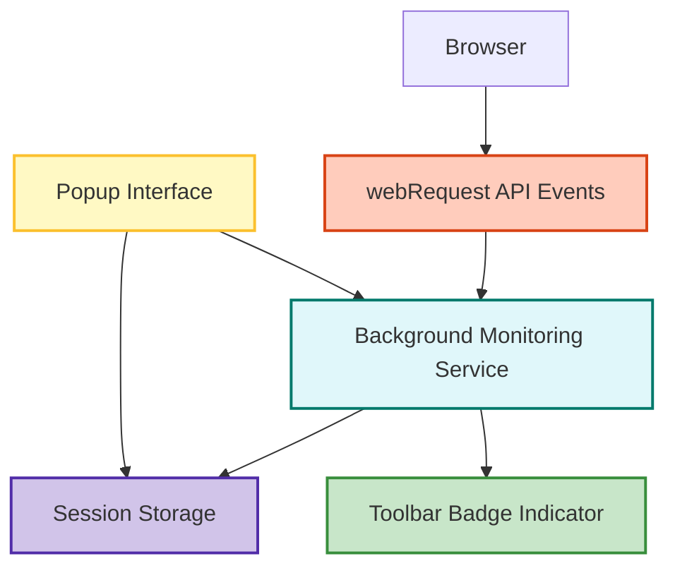

# Architecture Overview

## Introduction
The Architecture Overview page explains how **uBO Scope** orchestrates its core components to monitor, categorize, and display network connections initiated by your browser during web browsing. This page reveals the seamless interplay between background monitoring, the popup interface, and the toolbar badge indicator — all working to provide a transparent, real-time view of your browser's network activity.

Understanding this architecture empowers you to see exactly how data travel flows within the extension, enhancing your trust and ability to interpret the displayed information effectively.

---

## Core Components

### 1. Background Monitoring Service

At the heart of uBO Scope lies a **background service worker** (or background script depending on browser platform) responsible for:

- Listening to the browser's `webRequest` events,
- Recording all network requests initiated by web pages,
- Categorizing these requests by their outcome (allowed, stealth-blocked, or blocked),
- Aggregating this data per browser tab, grouping network connections by domain and hostname,
- Keeping this context updated in session storage for persistent and quick access.

This component continuously captures network request events such as redirects, errors, and successful responses from all matching URLs.

### 2. Popup Interface

The popup interface provides a user-friendly front end that you open by clicking the toolbar icon. It serves as a real-time dashboard showcasing:

- The list of domains contacted by the active tab,
- Categorization of these domains by network request outcome:
  - **Not blocked (Allowed)**
  - **Stealth-blocked** (requests that were redirected or stealthily blocked),
  - **Blocked** (requests that ended with errors or failures),
- Count badges for each domain, indicating the number of requests.

The popup fetches the current tab's network data from the background service and presents it with enhanced readability and Unicode domain support.

### 3. Toolbar Badge Indicator

The badge on the browser toolbar icon provides an **at-a-glance metric** of privacy exposure by displaying:

- The **number of distinct third-party remote domains** that had successful connections from the current active tab.

A lower badge number typically means fewer distinct third-party connections, highlighting a tighter privacy stance.

---

## Data Flow and User Interaction

The architecture can be summarized as a responsive flow of network data from capture to presentation, summarized here step-by-step:

<Steps>
<Step title="Network Request Events Captured">
The background service listens to the browser's `webRequest` API events such as onResponseStarted (success), onBeforeRedirect (redirect), and onErrorOccurred (error). These events are queued briefly to efficiently batch process incoming data.
</Step>
<Step title="Data Aggregation and Categorization">
For each tab, requests are grouped by domain and hostname. The extension determines whether requests were allowed, stealth-blocked (redirects), or outright blocked (errors). Domain counts are incremented accordingly.
</Step>
<Step title="Badge Update">
When new successful connections to third-party domains are detected, the badge count on the toolbar icon is updated to reflect the number of distinct domains connected by the current tab, instantly providing a privacy exposure metric.
</Step>
<Step title="Popup Data Retrieval and Rendering">
When the user opens the popup, it queries the background service for the active tab's network connection data. The popup then dynamically renders the categorized domains and request counts into neatly organized sections with domain names decoded into readable Unicode where applicable.
</Step>
</Steps>

---

## High-Level Architecture Diagram

---

## Practical Example: From Network Request to User View

Imagine you visit https://example.com:

- The browser initiates multiple network requests — some are to example.com, others to third-party domains like cdn.examplecdn.com or analytics.tracker.com.
- The background monitoring service intercepts each request outcome:
  - Allowing those to cdn.examplecdn.com,
  - Stealth-blocking some redirects,
  - Blocking requests to analytics.tracker.com due to errors or filters.
- The badge indicator updates to `1` showing only one distinct allowed third-party domain is connected.
- Clicking the toolbar icon opens the popup, which shows:
  - Domains contacted including examplecdn.com under "not blocked",
  - tracker.com under "blocked",
  - with counts beside each domain indicating the number of requests.

This workflow provides real-time, actionable insight into third-party connections your browser makes.

---

## Best Practices and Troubleshooting

<Tip>
**Ensure your browser supports the `webRequest` API fully.** Safari's current restrictions may limit some capabilities.
</Tip>

<Warning>
If the toolbar badge does not update, verify that the background service worker is active and the extension has all required permissions.
</Warning>

<Check>
Regularly updating your extension ensures you have the latest public suffix list to accurately identify domains.
</Check>

---

## Summary

This page demystifies how uBO Scope's components collaborate to provide precise visibility into browser network connections. It elucidates the continuous cycle from capturing network events via `webRequest`, storing and categorizing these events in the background service, to delivering clear, actionable feedback via the popup and badge.

For new users, this understanding frames how real-time monitoring translates into meaningful domain data that supports privacy awareness.

---

## Next Steps

To experience the architecture in action, proceed to:

- [Installing uBO Scope](/getting-started/setup-install/install-browser) to set up the extension,
- [Understanding the Popup and Toolbar Badge](/guides/getting-started/understanding-the-popup) for detailed UI guidance,
- [Feature Quick Overview](/overview/architecture-concepts-features/feature-quick-overview) for a broader feature set understanding.

Explore troubleshooting tips if you encounter any issues during setup or usage in the [Troubleshooting Installation & Permissions](/getting-started/troubleshooting/install-troubleshooting) page.

---

For source code and deep dives into the background monitoring logic, you may review the [background.js on GitHub](https://github.com/gorhill/uBO-Scope/blob/main/js/background.js).

---