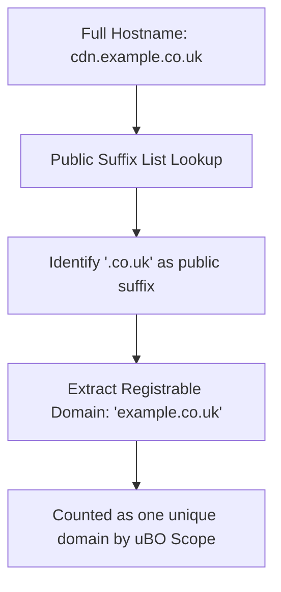

# Core Concepts & Key Terminology

Understanding the core concepts and terminology behind uBO Scope equips you with the essential vocabulary and mental models needed to interpret its reports effectively. This section clarifies foundational terms such as 'third-party remote server', 'connection attempt', 'badge count', and 'public suffix list', ensuring you know exactly what uBO Scope measures and how to use this information to make informed privacy decisions.

---

## What Is a Third-Party Remote Server?

At the heart of uBO Scope's reporting is the concept of a 'third-party remote server'. When you browse the web, your browser requests resources from servers to display the websites properly. These requests can be:

- **First-party:** Requests made to the same domain as the website you are visiting.
- **Third-party:** Requests made to domains different from the website you are visiting.

### Why Does uBO Scope Focus on Third-Party Servers?

Third-party remote servers often represent external services such as content delivery networks (CDNs), analytics providers, ad networks, or social media widgets. uBO Scope tracks these to reveal how many distinct third-party servers your browser connects to, providing clear insight into your exposure beyond the primary website.

<Check>
A lower count of distinct third-party servers generally indicates less exposure, which is preferable for privacy.
</Check>

## Connection Attempt: Success, Stealth, and Blocked

uBO Scope categorizes network connection attempts into three outcomes, which are crucial to understand its reports:

- **Allowed (Not Blocked):** Connections that successfully fetched resources from a remote server.
- **Stealth-Blocked:** Connections that were silently interrupted or redirected before completion, typically by content blockers that act stealthily to avoid detection or breakage.
- **Blocked:** Connections explicitly prevented by content blockers or network errors that stopped the request.

These distinctions help you see not just what was blocked, but also which connections were effectively hidden or altered, giving a fuller picture of what your browser communicates.

## Badge Count Explained

The badge on uBO Scope's toolbar icon represents a powerful privacy metric:

- It shows **the number of distinct third-party remote server domains that your browser connected to successfully or at least attempted access to**.
- This count excludes first-party domains and aggregations by subdomains — it is focused on unique remote entities.

<Info>
Despite seeming similar, this count is very different from a generic 'block count' badges shown by content blockers. Instead, it reflects real-world exposure to external servers, which impacts privacy more directly.
</Info>

## Public Suffix List (PSL): What and Why

To accurately determine the domain boundaries and identify distinct third-party servers, uBO Scope leverages the Public Suffix List (PSL). The PSL is a comprehensive registry of domain suffixes under which internet users can directly register names (e.g., `.com`, `.co.uk`, `.gov`, and many country code TLD variants).

### Role of the Public Suffix List in uBO Scope

- It helps uBO Scope correctly extract the **registered or registrable domain** from a hostname.
- For example, from `cdn.example.co.uk`, it recognizes `.co.uk` as a known suffix and extracts `example.co.uk` as the registrable domain.
- This precision avoids counting subdomains or internal hostnames as separate domains, which would inflate connection counts inaccurately.

<Note>
The PSL is updated regularly and stored efficiently to ensure fast domain extraction within the extension's background monitoring service.
</Note>

## Mental Model: How to Interpret uBO Scope’s Reports

1. **You visit a website.** uBO Scope begins monitoring all network requests that browser makes in that browsing context.
2. **Requests are categorized by outcome:** Allowed, Stealth-Blocked, or Blocked.
3. **Domains are resolved:** Hostnames are boiled down to their registered domains using the Public Suffix List.
4. **Distinct domains are counted:** uBO Scope keeps track of unique third-party domains per tab.
5. **Toolbar badge updates:** Shows the count of distinct allowed third-party domains, highlighting your browser's external connections.
6. **Popup panel drills down:** You can review the detailed list of domains and the number of requests for each, grouped by outcome.

---

## Practical Examples

Imagine you visit a news website that loads content from the news domain itself plus several CDNs and ad networks.

- uBO Scope identifies your main site as the first-party domain.
- It logs connections to the CDNs as **allowed third-party domains**.
- If you have content blockers active, requests to ad networks might be **blocked** or **stealth-blocked**.
- The badge number reflects only how many distinct third-party domains were contacted successfully.

This clarity allows you to quickly understand whether your content blockers are effectively limiting exposure without being misled by block counts alone.

## Common Pitfalls & Tips

<Warning>
**Don’t compare uBO Scope’s badge counts with block counts from other extensions directly.**
Block counts reflect individual blocked requests, while uBO Scope shows distinct remote domains connected to.
</Warning>

<Tip>
Understand the distinction between subdomains (e.g., `a.cdn.example.com` and `b.cdn.example.com`) and registrable domains (`example.com`). uBO Scope counts the registrable domain only once, avoiding inflated counts.
</Tip>

<Tip>
If you see unexpected third-party domains, investigate if these are legitimate services or potential privacy concerns.
</Tip>

## Summary of Key Terms

| Term                   | Definition                                                                                   |
|------------------------|----------------------------------------------------------------------------------------------|
| Third-Party Remote Server | Any server domain different from the website you're visiting.                                |
| Connection Attempt      | A network request made by the browser to a remote server, resulting in success, stealth-block, or block. |
| Allowed (Not Blocked)  | Connection that successfully fetched resources.                                              |
| Stealth-Blocked        | Connection blocked silently or redirected stealthily to avoid detection.                     |
| Blocked                | Connection explicitly blocked by content blocking mechanisms or failed.                      |
| Badge Count            | Number of distinct third-party domain connections currently active or successful.           |
| Public Suffix List (PSL) | Registry of domain suffixes to identify registrable domains from hostnames.                 |

---

For a visual overview of how domain names are parsed using the Public Suffix List, here's a simple illustration:

---

## Next Steps

With these concepts clear, you are now prepared to:

- Explore the **Architecture Overview** to see how these concepts fit into uBO Scope’s design.
- Move on to **Feature Quick Overview** to understand what the extension offers in practice.
- Begin using the tool and interpret its reports confidently, guided by the **Understanding Badge Counts & Domain Data** documentation.

---

[Back to Architecture Overview](../architecture-concepts-features/architecture-overview)

[Explore Feature Quick Overview](../architecture-concepts-features/feature-quick-overview)

[Learn About Badge Interpretation](../../getting-started/first-run-usage/interpreting-badge)

[Explore What is uBO Scope?](../introduction-core-value/what-is-ubo-scope)

---

[uBO Scope GitHub Repository]: https://github.com/gorhill/uBO-Scope

---