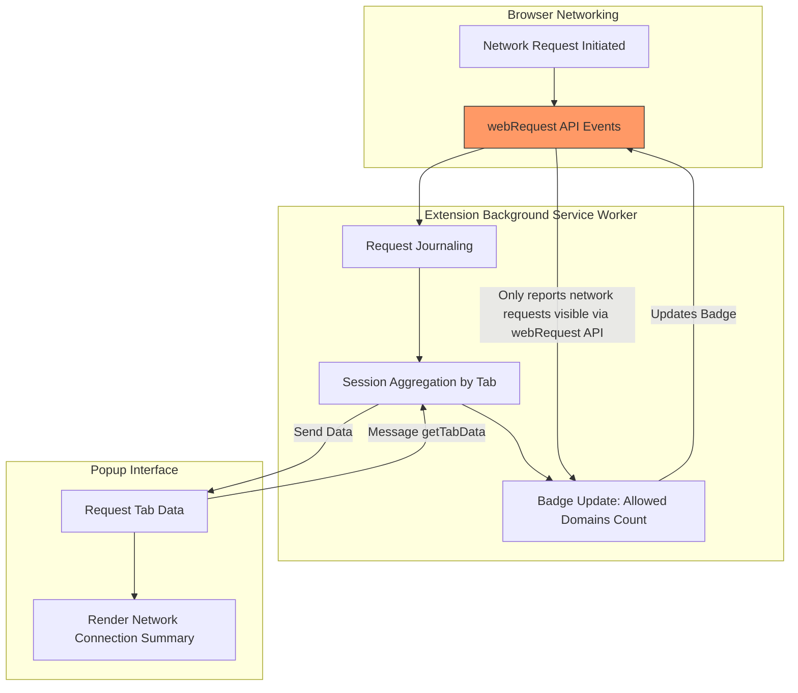

# System Architecture & Data Flow

## Overview

This page explains how uBO Scope monitors and reports network requests using the browser's `webRequest` API. It visually guides you through the journey of network events — from when the browser captures them, to how the extension processes and aggregates data by browser tab, and finally how this information is displayed to you via the popup interface.

Understanding this flow is crucial to grasp what uBO Scope can track, what it cannot, and how it ensures accurate, real-time reporting of your browsing activity.

---

## How uBO Scope Observes Network Requests

At its core, uBO Scope leverages the browser's `webRequest` API, which emits events corresponding to network requests initiated by webpages, including HTTP(S) and WebSocket connections. The extension listens to three key event types:

- **onBeforeRedirect**: When a request is redirected.
- **onErrorOccurred**: When a request fails.
- **onResponseStarted**: When a response begins arriving successfully.

Each time the browser triggers these events for requests matching specified URL patterns (e.g., all HTTP/S and WebSocket URLs), uBO Scope records the event details in a short-lived journal.

This approach ensures that every observable network activity — whether it succeeds, fails, or redirects — is captured reliably.

## Internal Tracking and Session Aggregation

Once network events are recorded, uBO Scope processes them periodically in batches. This processing involves:

- Associating network requests with the active browser tab in which they occurred.
- Extracting and normalizing hostnames and domains from request URLs.
- Categorizing request outcomes into one of three buckets:
  - **allowed** (requests that succeeded),
  - **stealth** (redirected requests),
  - **blocked** (failed requests, often due to content blocking).

These categorized details are stored in an in-memory mapping keyed by tab IDs, representing the aggregated session state per tab.

Periodically, the extension updates the badge count on the browser toolbar icon to reflect the number of distinct allowed third-party domains associated with the current tab — offering you immediate awareness of third-party exposure.

Session data is preserved using the browser's session storage API to maintain state across short-term extension lifecycles.

## User Presentation via Popup

When you open uBO Scope's popup UI, it requests the aggregated data for the active tab from the background process. The popup then organizes and presents the data into intuitive sections:

- **Not Blocked:** Domains for which connections succeeded.
- **Stealth Blocked:** Domains involved in redirects.
- **Blocked:** Domains for which connections failed.

Each domain shows how many network requests were attempted, letting you see at a glance the nature and extent of your network connections within the tab's browsing context.

## Important Guarantee: Observable Requests Only

A critical aspect of how uBO Scope works is the guarantee that:

> **Only connections visible to the browser's `webRequest` API can be reported.**

Requests that do not pass through the browser networking stack exposed by this API — for example, those made by native code, some browser internals, or network activities outside the context of monitored tabs — cannot be observed or reported by uBO Scope.

This ensures precision and accuracy in the extension’s reporting but also clarifies its scope and limitations.

---

## Mermaid Diagram: Network Request Monitoring Flow

---

## Practical Takeaways

- **Real-time Monitoring:** The extension reacts instantly to network events, organizing data per tab.
- **Tab-focused Aggregation:** Data is contextualized by tab, enabling focused analysis.
- **Accurate Outcomes:** Requests are categorized as allowed, stealth-blocked, or blocked with counts.
- **User-Friendly Interface:** The popup neatly summarizes observed connections for quick insight.
- **Limitations:** Only requests the browser exposes are monitored, ensuring reliability but not capturing external network activity.

## Tips for Effective Use

- Open the popup on any active tab to see detailed network request outcomes.
- Use the badge count as a quick gauge of third-party domain connections.
- Remember that stealth-blocked requests often indicate silent redirects or intermediate steps.
- Recognize that blocked requests may reflect effective content blocking or failed connections.

---

For deeper technical understanding, refer to the code in `js/background.js` and how session data is managed, as well as the popup rendering logic in `js/popup.js`.

### Next Steps
- Visit [What is uBO Scope?](../intro-core-value/product-overview) to understand product purpose.
- Read [Core Purpose & Use Cases](../intro-core-value/value-prop-use-cases) to explore practical scenarios.
- Explore [Features at a Glance](../architecture-concepts/feature-quicklook) for feature summaries.

---

For source code and implementation details, see the GitHub repository: [https://github.com/gorhill/uBO-Scope](https://github.com/gorhill/uBO-Scope).

---