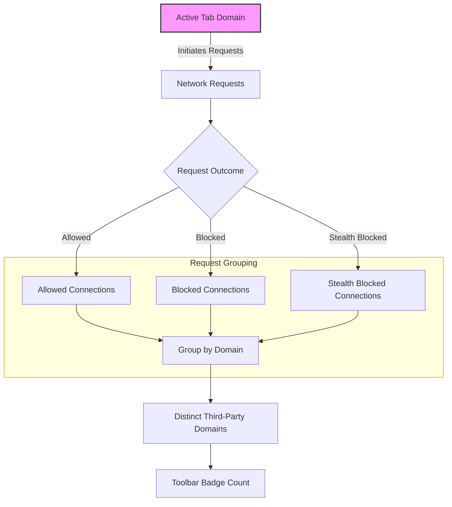

# Core Concepts and Terminology

Understanding uBO Scope’s terminology and concepts is essential to effectively grasp how it observes, categorizes, and displays network connections triggered by webpages. This page clarifies key terms and concepts used throughout the extension and documentation, enabling you to interpret the data shown by uBO Scope with confidence.

---

## Allowed, Blocked, and Stealth-Blocked Connections

uBO Scope tracks network connections initiated by a webpage and groups these connections into three distinct categories based on their outcome:

- **Allowed Connections:** These are network requests that your browser successfully made to remote servers without interference by content blockers. They represent resources actually fetched.

- **Blocked Connections:** Requests explicitly prevented by content blockers or network filters. When a request fails due to blocking rules or errors, it falls into this category.

- **Stealth-Blocked Connections:** This special category refers to requests surrogate-blocked or redirected stealthily by content blockers to avoid detection by webpages. These connections are neither fully allowed nor obviously blocked but are intercepted in a hidden manner to preserve page functionality and user privacy.

**Why are these distinctions important?**

Stealth-blocking is a common technique used by advanced content blockers to evade detection and reduce webpage breakage. uBO Scope surfaces this nuanced category so users can see not only what is openly blocked or allowed but what is sneaky blocked.

## Distinct Third-Party Servers

uBO Scope summarizes connections by counting **distinct third-party domains**—sites different from the domain of the active tab’s page. The notion of “third-party” here hinges on domain boundaries rather than IP addresses or subdomains.

- Example: If you visit `example.com` and it loads resources from `cdn.example.org` and `ads.tracker.io`, uBO Scope considers `cdn.example.org` and `ads.tracker.io` as distinct third parties.

The toolbar badge count on the extension icon reflects the number of these distinct third-party domains communicating with the page, **not** the raw total number of requests.

This serves as a clearer privacy and security metric because:

- It eliminates repetitive count inflation caused by multiple requests to the same third party.
- It points out the breadth of your network exposure rather than request volume alone.
- It aligns with the real-world privacy risk—more distinct third parties equals wider exposure.

## Domain vs Hostname

When classifying connections, uBO Scope differentiates between the full hostname and the _registrable domain_ extracted using the public suffix list.

- **Hostname:** The full DNS name part of the URL, e.g. `assets.subdomain.example.com`.
- **Domain:** The registrable domain, e.g. `example.com`.

This distinction helps with effective grouping and fair reporting:

- Connections are grouped primarily by domain to highlight organizational owners.
- Hostname occurrences are tracked to provide detailed counts.

## Outcome Reporting Based on Browser WebRequest API

uBO Scope listens to your browser’s network events, interpreting them according to the following:

- `success`: Requests that succeeded with network data fetched.
- `redirect`: Requests silently redirected, often used for stealth blocking.
- `error`: Requests that failed, often due to explicit blocking by filters or network errors.

The extension compiles these into its allowed, stealth, and blocked distributions.

## How uBO Scope Maintains Data per Tab

Each browser tab maintains separate network connection data:

- A storage map tracks allowed, stealth, and blocked domains and their counts.
- Connections are updated in real-time and persisted for the session.

This model allows you to inspect network exposures on a tab-by-tab basis, understanding exactly which third-party connections every visited page triggers.

## Summary of Terms in Context

| Term               | Meaning                                                                                     | Why It Matters                                                  |
|--------------------|---------------------------------------------------------------------------------------------|----------------------------------------------------------------|
| Allowed            | Requests fully permitted and completed by your browser.                                    | Shows resources fetched, needed for web experience.             |
| Blocked            | Requests explicitly prevented or failed due to filter rules or network errors.             | Indicates resources prevented, enhancing privacy/security.      |
| Stealth Blocked    | Requests intercepted or redirected invisibly to avoid detection by websites.               | Reveals hidden blocking activities critical for accurate mapping.|
| Distinct Third Party | Unique registrable domains different from the active tab’s domain.                        | Provides clear exposure metric, avoiding request count inflation.|
| Domain             | The main registrable domain derived from hostname using public suffix rules.               | Groups connections meaningfully by organizational ownership.    |
| Hostname           | The full DNS hostname of a connection request.                                            | Enables granular count and detail beneath domain grouping.      |

## Practical Example

Imagine you visit `https://news.example.com`:

- uBO Scope notes requests to `cdn.example.com`, `ads.thirdparty.com`, and `analytics.thirdparty.com`.
- The popup dashboard groups these by domain:

  - `example.com`: 1 allowed connection (the CDN)
  - `thirdparty.com`: 2 blocked connections (ads and analytics)

- Your toolbar badge shows **1**, indicating one distinct third-party domain allowed.

- If stealth blocking is active on some requests, those domains appear separately, helping you distinguish what is actively blocked versus stealth intercepted.

---

## Tips and Best Practices

- Regularly check the popup dashboard to monitor the distinct third parties your active tabs connect to.
- Use the category distinctions to understand the effectiveness of your content block lists.
- Understand that a **lower badge number is better** — it means fewer third-party domains reached.
- Be aware stealth blocking is sophisticated; the extension surfaces this so you are not misled into thinking all allowed connections are equal.
- Consult the **System Architecture Overview** and **Mythbusting Block Counts** docs to deepen understanding of behind-the-scenes working.

## Troubleshooting Common Terminology Confusions

<AccordionGroup title="Terminology Clarifications">
<Accordion title="Why don’t blocked requests appear in 'allowed'?">
Blocked requests are explicitly prevented and thus do not show in allowed connections. uBO Scope keeps them separate to give accurate visibility.
</Accordion>
<Accordion title="What exactly is 'stealth blocked'?">
Stealth blocking involves invisible redirects or interceptions, masking blocking from webpages. It’s distinct from obvious blocking and allows content blockers to avoid breaking pages.
</Accordion>
<Accordion title="Does the badge count total requests?">
No, the badge count reflects the number of distinct third-party domains contacted successfully. Multiple requests to the same domain count as one.
</Accordion>
<Accordion title="How does uBO Scope know domain vs hostname?">
It uses the Public Suffix List to parse hostnames and determine the registrable domain accurately.
</Accordion>
</AccordionGroup>

---

## Visual Overview of Key Concepts

This diagram illustrates that the active tab’s domain triggers network requests, each categorized by their outcome and grouped by domain, culminating in the distinct third-party count displayed on the toolbar badge.

---

## Next Steps

- Familiarize yourself with the **System Architecture Overview** to see how these concepts are implemented in real-time.
- Explore the **Mythbusting Block Counts** page to align expectations with actual privacy impact.
- Use the popup dashboard during web browsing to see terminology in action.

For installation instructions and initial setup, refer to the [Installing uBO Scope]( /getting-started/installation-and-setup/installation ) guide.

---

> By fully understanding these core terms, you empower yourself to interpret uBO Scope’s data meaningfully, enhancing your browsing privacy awareness and control.
