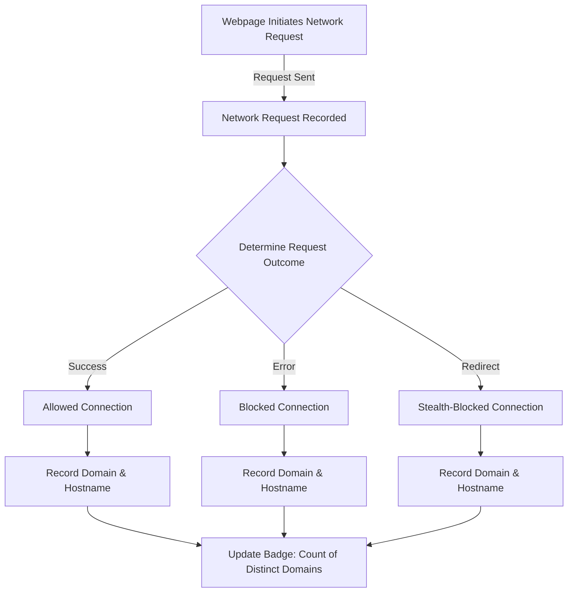

# Core Concepts & Terminology

Understanding the fundamental terms uBO Scope uses is crucial to fully grasp the data and insights presented in its user interface. This page demystifies the key concepts surrounding network connections monitored by uBO Scope, clarifying how the extension categorizes these connections and what the reported metrics truly represent.

---

## What You Will Learn

- What a **connection** means in the context of uBO Scope.
- The definition and role of a **third-party remote server**.
- The meaning behind the statuses: **allowed**, **blocked**, and **stealth-blocked**.
- How to interpret **badge count** versus **block count**, and why this distinction matters.

---

## Defining Core Terms

### Connections
A **connection** is any network request initiated by the active browser tab to a remote server. This includes requests for web page resources such as scripts, images, fonts, or other data.

uBO Scope observes all such requests regardless of whether they succeed, fail, or are blocked by any content blocking mechanism, providing an unbiased view of network activity.

### Third-Party Remote Server
A **third-party remote server** is a server hosting resources that are external to the domain you are visiting. For example, when visiting `example.com`, any request to a server outside the `example.com` domain—such as a CDN or an ad network—is considered a connection to a third-party remote server.

Tracking connections by third-party domains enables the extension to highlight potential privacy or security concerns arising from external resources loaded on a webpage.

### Allowed, Blocked, and Stealth-Blocked Connections
uBO Scope categorizes network requests into three distinct outcomes:

- **Allowed**: Requests that successfully reached their destination and received a response. These represent active data loading from remote servers.

- **Blocked**: Requests that were explicitly prevented from reaching the remote server due to content blocking rules or network-level blocks reported by the browser's APIs.

- **Stealth-Blocked**: Requests subtly intercepted or redirected by content blockers using advanced stealth techniques to prevent detection by the webpage or third parties. These requests do not appear as traditional blocked requests but are effectively prevented.

By differentiating these outcomes, uBO Scope offers precise visibility into what actually happens to every network request beyond basic block counts.

### Badge Count vs. Block Count

<u>**Badge Count**</u> (displayed on the browser toolbar icon) represents the total number of distinct third-party remote servers for which there have been network connections—including those allowed or stealth-blocked. A lower badge count generally indicates fewer third-party requests, which often aligns with better privacy or reduced tracking exposure.

<u>**Block Count**</u> refers to the number of individual network requests that have been blocked by your content blockers. This number can be misleading as a higher block count might come from a content blocker that actually allows more third-party connections overall.

<u>Why the distinction matters:</u>

- Badge count gives a more meaningful snapshot of your exposure to external domains.
- Block count alone does not indicate the actual number of remote servers contacted.
- Relying on block count can lead to incorrect assumptions about filter effectiveness.

---

## How These Concepts Appear in the User Interface

When you open uBO Scope's popup panel:

- **Domains connected:** shows the unique count of third-party remote domains connected to (badge count).
- Domains are grouped under the visual sections labeled **Not Blocked**, **Stealth-Blocked**, and **Blocked**.
- Each domain entry shows how many requests to that domain were made.

By knowing the precise definitions of each category, you can accurately assess the risk and behavior of the current webpage's network traffic.

---

## Practical Example Scenario

Imagine you visit a news website. uBO Scope reports:

- **Domains connected:** 8
- Under **Not Blocked:** 5 domains including trusted CDNs.
- Under **Stealth-Blocked:** 2 domains known for tracking.
- Under **Blocked:** 3 domains that your content blocking filters explicitly stopped.

From this, you learn that although some potentially intrusive third parties attempted connections, your content blockers actively block or stealth-block many of them, limiting your exposure while still allowing necessary resources.

---

## Best Practices & Tips

- Do not judge content blocker effectiveness solely by block counts; focus on the number of unique third-party domains connected.
- Use the distinction between stealth-blocked and blocked to understand how subtle blocking techniques protect your browsing.
- Recognize that some third-party domains (such as CDNs) are common and generally safe.
- Periodically review connected domains to spot unfamiliar or suspicious activity.

---

## Troubleshooting Common Confusions

<AccordionGroup title="Troubleshooting Terms and Metrics Confusion">
<Accordion title="Why does my badge count sometimes increase even though my block count is high?">
Your badge count reflects distinct third-party domains connected, including allowed or stealth-blocked. A high block count could mean many requests were blocked, but you might still have more unique domains connected via allowed requests, causing badge count to rise.
</Accordion>
<Accordion title="What is a stealth-blocked request, and why can't I block it outright?">
Stealth-blocked requests use subtle methods like redirects or response manipulation to avoid detection by the webpage. Traditional blocking mechanisms may not register these as errors, but uBO Scope detects their presence and categorizes them accordingly. These techniques help preserve page functionality while limiting tracking.
</Accordion>
<Accordion title="Are all third-party connections bad?">
Not necessarily. Some third-party servers provide essential services such as content delivery. However, being aware of these connections is essential for privacy-conscious users.
</Accordion>
</AccordionGroup>

---

## Summary
This page has clarified the foundational terminology essential to interpreting uBO Scope's reports:
- What constitutes a connection and a third-party server.
- The significance of allowed, blocked, and stealth-blocked statuses.
- The critical difference between badge count and block count.

Understanding these terms empowers you to take control over your browser's network activity and make informed decisions about content blocking and online privacy.

---

## Next Steps
To see these concepts in action, visit the [Quick Feature Overview](/overview/feature-usecases/feature-overview) in the documentation. For setup guidance, proceed to [Install uBO Scope on Your Browser](/getting-started/setup-installation/installation-multiplatform).

---

## References
- [What is uBO Scope? - Introduction & Core Value](/overview/introduction-value/product-intro)
- [Why Use uBO Scope? - Value Proposition](/overview/introduction-value/value-proposition)
- [How uBO Scope Works (System Architecture)](/overview/architecture-concepts/system-architecture)

---

## A Visual Flow of Connection Categorization

This flowchart illustrates how uBO Scope assigns network requests to categories based on observed outcomes, enabling comprehensive visibility within the UI.

---