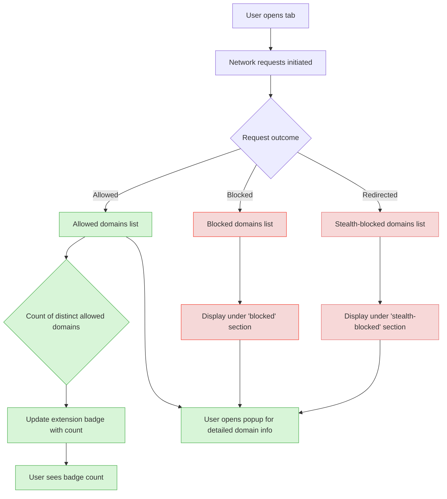

# Quick Feature Overview

## At a Glance: Core Functionality of uBO Scope

uBO Scope is a specialized browser extension designed to provide immediate and clear insights into all network connections initiated by web pages, distinguishing not just the connections themselves but their outcomes per browser tab. This page summarizes these must-know features, giving you a powerful snapshot of how uBO Scope monitors and reports third-party connections in real time.

### Key Highlights
- **Enumerates all connection outcomes per tab:** uBO Scope tracks every remote server connection attempted or completed within each browser tab, categorizing them by their network request outcome.
- **Reports distinct third-party servers:** Only unique third-party domains involved in network connections are counted and displayed, offering a focused view of external requests.
- **Clear UI distinctions:** Connections are visually categorized into 'allowed', 'blocked', and 'stealth-blocked' with straightforward labels and counts, helping you quickly understand which domains successfully interact with the site and which are blocked.
- **Browser badge integration:** The extension badge on your toolbar reflects the number of distinct allowed third-party domains per active tab, delivering at-a-glance privacy awareness.
- **Popup panel details:** The popup window expands on the badge by listing all involved domains per category along with connection counts, enabling in-depth inspection.

---

## What Is This Feature Overview?

This page specifically introduces the fundamental visibility features that uBO Scope offers users within the extension's popup UI and browser badge, focusing on the enumeration and reporting of third-party connection statuses per tab. It does not cover installation, detailed architecture, or usage guides but complements these by clarifying the immediate data points you encounter when monitoring web traffic.

uBO Scope solves the problem of opaque third-party network interactions by revealing which remote servers are contacted by a webpage, how often, and whether those connections were permitted, blocked, or stealthily blocked behind the scenes. This immediately enhances user awareness of their browser’s actual network footprint and assists filter list maintainers by providing raw data on network request outcomes.

Distinctive among content blockers and network monitors, uBO Scope focuses on domains and connection outcomes, rather than raw block counts or heuristic detections, helping users understand the true impact of content blockers and network activity in the field.

## How uBO Scope Shows Connection Outcomes

### Categories of Connection Outcomes
- **Allowed:** Network requests that succeeded and fetched resources from third-party domains.
- **Blocked:** Requests that failed due to blocking mechanisms such as content blockers or network errors.
- **Stealth-blocked:** Redirected requests that are intercepted in a way that some blocking mechanisms might not report transparently, indicating subtle filtering.

### Presentation in the Popup UI

The popup panel categorizes domains under three distinct sections, each with:
- A header label indicating the outcome type ('not blocked', 'stealth-blocked', 'blocked').
- A list of domain names showing all unique third-party servers involved.
- A count badge next to each domain indicating the number of connection attempts or accesses recorded for that domain.

### Summarized Connection Count

At the top, the total number of unique third-party domains successfully connected to (the 'allowed' category) is prominently displayed. This count directly corresponds with the number shown on the extension badge of your browser toolbar, maintaining consistent and reliable privacy indicators.

## User Experience: The Flow of Information

1. **User opens or switches to a tab.** uBO Scope actively records network requests generated by the page.
2. **Network request outcomes are processed in the background**, classifying each based on whether they're allowed, blocked, or stealth-blocked.
3. **The extension badge updates instantly**, showing the count of distinct allowed third-party domains.
4. **Opening the popup panel displays detailed lists**, segmented by outcome, allowing users to pinpoint which domains are loaded or blocked.
5. **Domain counts help identify frequent connections**, powering more informed decisions about privacy and filter effectiveness.

## Practical Tips and Best Practices

- **Focus on badge count for quick privacy checks:** A lower badge count means fewer distinct third-party servers fetched resources, an indicator of better privacy.
- **Use the popup list for diagnostics:** When troubleshooting or validating a filter list’s efficacy, check the 'blocked' and 'stealth-blocked' sections to see which domains are being intercepted.
- **Understanding stealth-blocked:** Domains listed here represent nuanced filtering; they might bypass standard blocking statistics, offering deeper insights.
- **Remember the domain scope:** uBO Scope reports distinct domains, not every single request — this helps avoid noisy counts and targets meaningful connections.

## FAQ & Troubleshooting

<AccordionGroup title="Quick Feature Overview FAQs">
<Accordion title="Why does the badge count only include allowed domains?">
The badge count focuses on distinct third-party domains from which resources were successfully fetched (allowed). This approach highlights your actual exposure to third-party content. Blocked or stealth-blocked domains don't reduce the count since no resources were fetched from them.
</Accordion>
<Accordion title="How are stealth-blocked domains different from blocked ones?">
Stealth-blocked connections are those intercepted or redirected in ways that don’t register as outright errors but indicate filtering (such as redirects prevented from completing). They provide insight into subtle blocking methods beyond explicit error blocks.
</Accordion>
<Accordion title="Is the connection data accurate regardless of other content blockers?">
Yes. uBO Scope uses the browser’s webRequest API to observe network outcomes independent of content blockers in place, capturing all remote server connection attempts and outcomes.
</Accordion>
<Accordion title="What if I see many blocked domains but a high allowed count?">
A high allowed domain count alongside many blocked ones could mean the content blocker permits numerous third-party connections, potentially exposing privacy concerns. Use the detailed popup view to investigate these allowed domains.
</Accordion>
</AccordionGroup>

## Visual Guide: Popup Panel Overview

## Next Steps

To make the most of uBO Scope’s quick feature overview:
- Explore the **"System Overview & Data Flow"** page to understand how network requests are captured and processed.
- Visit **"Key Terms and Domains Explained"** to clarify domain classification and connection types.
- Dive into the **"Analyzing Third-Party Connections"** guide to use this data effectively for privacy and filtering insights.

Interested in seeing the feature live? Open the extension popup while browsing any website and watch uBO Scope reveal your tab’s network footprint instantly.

---

For code-level details, visit the official [GitHub repository](https://github.com/gorhill/uBO-Scope).