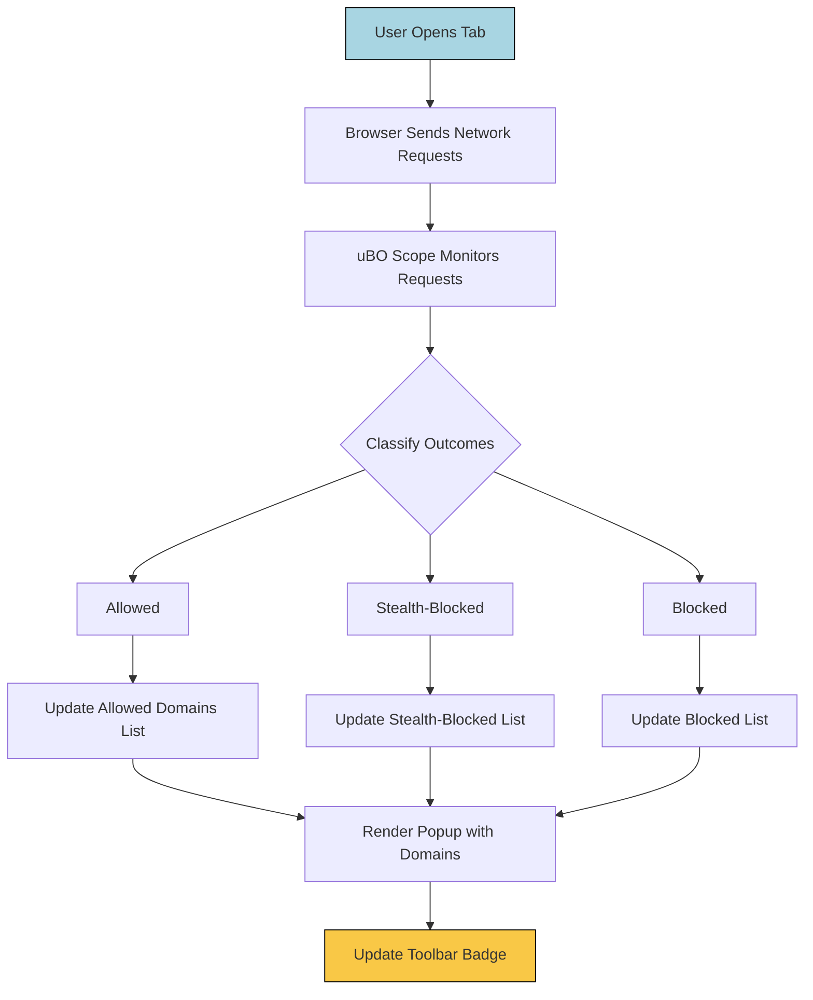

# Quick Feature Overview

Discover the essential capabilities of uBO Scope — a powerful and lightweight browser extension designed to monitor and categorize your network requests in real time. This overview introduces you to how uBO Scope tracks web connections, summarizes outcomes, and presents actionable insights via its badge count and popup interface.

---

## What You Can Do with uBO Scope

uBO Scope shines by revealing all third-party network connections initiated by your browser, unmasking allowed, blocked, and stealth-blocked domains. By offering a clear, at-a-glance understanding of your browsing network behavior, it empowers users to make informed decisions about privacy and content filtering.

### Core Capabilities

- **Monitor Network Requests From Any Tab:** uBO Scope listens to your browser's network activities across HTTP, HTTPS, WebSocket connections, and more, capturing all outgoing remote server requests initiated by web pages in real time.

- **Categorize Connection Outcomes:** It classifies each remote server connection into three distinct groups:
  - **Allowed:** Connections that successfully reached their target.
  - **Blocked:** Connections prevented by filters or errors.
  - **Stealth-Blocked:** Connections that were silently redirected or blocked in a way that avoids detection.

- **Summarize Third-Party Domains:** Initially provides a count of distinct third-party domains engaged during browsing sessions, highlighting the diversity and volume of external servers your tab communicates with.

- **Detailed Per-Tab Data Presentation:** Through the popup interface, users can explore domain-level connection counts segmented by outcome categories for any active browser tab.

- **Unicode-Compatible Domain Display:** Utilizes punycode decoding to show internationalized domain names clearly for easier recognition.

- **Dynamic Badge Updates:** The extension dynamically updates the toolbar icon badge to reflect the number of distinct third-party domains allowed per tab, giving you real-time privacy insights without opening the interface.

---

## How This Benefits You

Understanding your network connections helps you:

- Detect unexpected or suspicious connections that could threaten privacy or indicate unwanted tracking.
- Assess the effectiveness of your content blocking setup by verifying which connections are actually blocked or allowed.
- Make educated decisions on tuning your filters or blocker settings.

---

## User Interaction Flow

1. **Active Tab Monitoring** — When you open the uBO Scope popup for the current tab, it automatically fetches connection data specific to that tab.

2. **Display of Summary and Details** — The popup page presents:
    - The total count of connected domains (third-party) in a prominent summary.
    - Separate sections listing allowed, stealth-blocked, and blocked domains with counts.

3. **Real-time Updates** — The badge on the toolbar updates live to show how many distinct allowed third-party domains the tab communicates with.

4. **Readable Domain Names** — Domains appear decoded to Unicode for better legibility, including those containing international characters.

---

## Sample DOM Structure of Popup

The interface uses a clear HTML structure, shown conceptually below:

```html
<h2 id="tabHostname"><span></span><span>NO DATA</span></h2>

<section id="summary">
  domains connected: <span>?</span>
</section>

<section class="outcome allowed">
  <h3>not blocked</h3>
  <div class="domains"></div>
</section>

<section class="outcome stealth">
  <h3>stealth-blocked</h3>
  <div class="domains"></div>
</section>

<section class="outcome blocked">
  <h3>blocked</h3>
  <div class="domains"></div>
</section>

<template id="domainRow">
  <div class="row"><span class="domain">_</span><span class="count badge">_</span></div>
</template>
```

Each section dynamically receives domain rows and counts based on network request outcomes.

---

## Practical Example: Interpreting Data

Imagine loading a news website while uBO Scope is active:

- The popup shows "domains connected: 12" indicating 12 distinct third-party domains.
- The "not blocked" section lists domains from CDNs and essential services.
- The "stealth-blocked" section reveals a few trackers silently blocked or redirected.
- The "blocked" section confirms domains blocked explicitly by your filters.

This insight helps you determine if your content filtering is working effectively or if unexpected connections occur.

---

## Tips for Effective Use

- **Focus on distinct domains, not individual requests:** The badge count reflects unique third-party domains, highlighting the breadth of your exposure.
- **Remember stealth-blocked connections can indicate silent filtering:** Check these if you suspect invisible tracking attempts.
- **Use alongside your content blocker settings:** Adjust or create rules based on insights from uBO Scope for tailored blocking.
- **Regularly review domains:** Spot new or suspicious domains appearing that could degrade privacy.

---

## Next Steps

Now that you understand uBO Scope's core features, dive into related documentation to get the most out of the extension:

- [What is uBO Scope?](https://your-docs-domain.com/overview/introduction-and-value/what-is-ubo-scope) — Understand product purpose and value.
- [Who Should Use uBO Scope?](https://your-docs-domain.com/overview/introduction-and-value/who-should-use) — Identify use cases and target audience.
- [Core Benefits and Use Cases](https://your-docs-domain.com/overview/introduction-and-value/core-benefits) — Real-world scenarios and advantages.

Explore guides on how to interpret the UI, monitor network activity efficiently, and optimize your setup for maximum privacy gains.

---

<u><b>Empower your browsing transparency with uBO Scope — your window into your browser's network connections.</b></u>


---

## Additional Visual Overview (Conceptual Mermaid Diagram)



This simplifies uBO Scope’s real-time data capture and user presentation process.

---