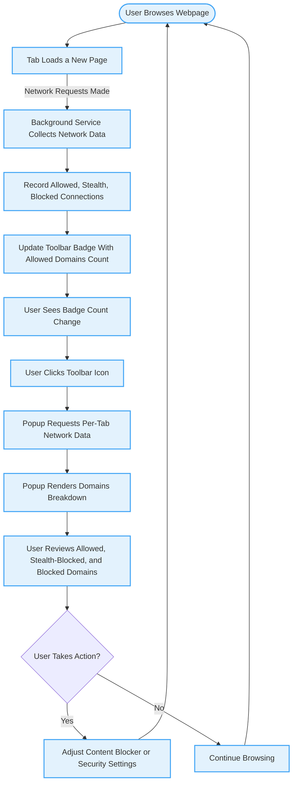

# Quick Feature Tour

Discover the key strengths of uBO Scope and see how its main features deliver clear, actionable insights into your browser's network activity. This quick walkthrough will guide you through the essential components—from the toolbar badge count to detailed per-tab connection views and domain-level breakdowns—so you can understand what this extension does at a glance and why it matters.

---

## At-a-Glance: The Toolbar Badge Count

uBO Scope's toolbar icon displays a dynamic badge count, representing the number of distinct third-party remote domains your current active tab is connected to. This concise indicator helps you instantly gauge the level of third-party network activity happening behind the scenes on any webpage.

- **What it shows:** The count of unique third-party domains from which resources were successfully loaded on the active tab.
- **Why it matters:** A lower badge count often indicates fewer third-party connections, commonly improving privacy and reducing tracking surface.
- **Real-world scenario:** When browsing your favorite news site, if the badge shows a high count, you might be unknowingly connected to numerous third-party trackers or advertisers.

<Tip>
The badge count does not consider blocked or stealth-blocked connections, only those allowed. This helps you focus on actual third-party domains your browser fetched resources from.
</Tip>

---

## Deep Dive: Per-Tab Connection Status Dashboard

Clicking the uBO Scope icon reveals a detailed popup dashboard that breaks down all remote connections made by the current tab, organized by their connection outcome. This targeted detail lets you evaluate and analyze network activity per tab with precision.

### Key Sections Inside the Popup

- **Domains connected:** Displays the total number of distinct third-party domains allowed on the tab.
- **Not blocked:** Lists all domains from which resources were successfully loaded.
- **Stealth-blocked:** Shows domains for connections that were redirected or modified stealthily by content blockers.
- **Blocked:** Reveals domains for connections that were outright prevented.

Each domain entry includes a count indicating the number of network requests attributed to that domain, providing insight into its relative presence on the page.

### Example Use Case

You're investigating a website's tracking behavior. By opening the popup, you see some domains under "blocked" and "stealth-blocked," confirming your content blocker is actively protecting you, while the "not blocked" section highlights external resources the site accessed.

<Check>
Use the popup to monitor sites where you suspect excessive third-party connections and adjust your content blocking strategy accordingly.
</Check>

---

## What You Can Do with uBO Scope

1. **Monitor real-time third-party connections per tab.** Understand exactly which external domains your browsing session touches and how connections are classified.
2. **Evaluate the effectiveness of content blockers.** The "stealth-blocked" and "blocked" sections help you see if third-party requests are being properly stopped or hidden.
3. **Identify unexpected or suspicious domains.** Quickly spot unusual third parties by domain name to investigate further.
4. **Gain transparency that content blocker badges alone don't provide.** Instead of relying on block count metrics, uBO Scope shows actual distinct domains involved.

---

## Practical Tips & Best Practices

- **Interpreting Counts:** A high number in "not blocked" signals many allowed remote connections; consider tightening your content blocking rules or using this data to research the domains.
- **Understanding Stealth-blocked:** These connections were intercepted in a way hidden from the page’s scripts; check this section to confirm your content blocker’s stealth features.
- **Refreshing Data:** The dashboard updates as you load or reload pages—open it after navigation complete to see accurate, up-to-date details.
- **Browsing Privacy:** Regularly review per-tab details while visiting unfamiliar websites to detect potential privacy risks.

<Warning>
Network requests blocked outside the browser's `webRequest` API, such as those done by other system-level tools or VPNs, will not appear in uBO Scope.
</Warning>

---

## How the Quick Feature Tour Fits Into Your Journey

This feature overview is your gateway to mastering uBO Scope. By understanding the badge count and popup dashboard, you gain the foundational knowledge necessary to use the extension effectively.

Next, deepen your understanding with these documentation pages:

- [System Architecture Overview](../architecture-concepts/system-architecture) – Explore how uBO Scope collects and processes network data behind the scenes.
- [Core Concepts and Terminology](../architecture-concepts/core-concepts-terminology) – Learn the definitions and classifications uBO Scope uses to report connections.
- [Using the Popup: Navigating the Dashboard](../../guides/getting-started/popup-navigation-basics) – Step-by-step guidance on interpreting and interacting with the popup UI.

---

## Summary

uBO Scope’s core strength lies in delivering both a quick score of third-party exposure via the toolbar badge and in-depth per-tab breakdowns through its popup. This combination empowers users to make informed decisions about their browsing privacy and content blocking configurations.

Use uBO Scope daily to stay aware of remote connections, validate content blocker performance, and maintain control over your web experience.

---

## Visual Flow: User Interaction with uBO Scope

---

## Getting Started Preview

- **Try it now:** Install uBO Scope and open any webpage to watch its badge update as third-party connections establish.
- **Explore:** Click the toolbar icon to open the popup dashboard and see detailed connection statuses per domain.
- **Next:** Follow the [Using the Popup: Navigating the Dashboard](../../guides/getting-started/popup-navigation-basics) documentation to learn how to interact with the UI effectively.

---

For more insights into uBO Scope’s full capabilities, consult the [Product Overview](/overview/intro-core-value/product-overview) and [Target Audience & Use Cases](/overview/intro-core-value/target-audience-uses).