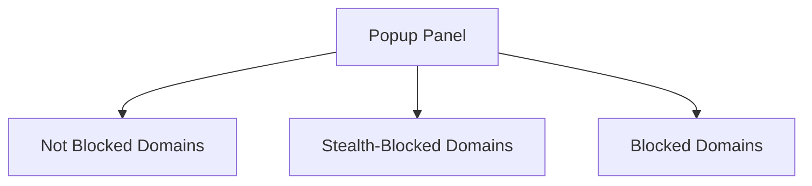

# Key Features Overview

Explore the principal features that make uBO Scope a uniquely powerful tool for understanding and managing your browser's network connections. This page guides you through the core capabilities that enable comprehensive tracking of remote server requests, real-time reporting, and insightful UI breakdowns — all designed to empower you with transparent and actionable data.

---

## 1. Real-Time Tracking of Third-Party Connections

At the heart of uBO Scope is its ability to invisibly monitor all outgoing network requests made by your browser. It records these connections regardless of the content blockers or DNS-level filters in use.

- **What it does:** Monitors every network request using the browser's `webRequest` API, categorizing each by its outcome — allowed, stealth-blocked, or blocked.
- **Why it matters:** You gain an accurate, unbiased view of which third-party servers your browser actually connects to, bypassing misleading block counts or browser UI claims.

**Example:** While browsing a news site, uBO Scope captures every distinct remote server contacted by that page, whether resources were allowed, silently blocked (stealth), or overtly blocked.

This feature is primarily implemented in [background.js](https://github.com/gorhill/uBO-Scope/blob/main/js/background.js), where network events are intercepted and categorized.

---

## 2. Toolbar Badge Reporting: Distinct Domain Counts

uBO Scope displays a numeric badge on its toolbar icon representing **the count of distinct third-party domains successfully connected during your browsing session.**

- **What it does:** Each time you load a page, the badge updates to reflect the unique third-party domains with active or allowed connections.
- **Why it matters:** Lower counts generally equate to a cleaner, less intrusive browsing experience, making it simple to track your exposure across sites.

**Tip:** The badge count is distinct from block counts; it focuses on domains *allowed* rather than blocked, providing a more meaningful privacy metric.

The badge updating logic lives within the background script (`background.js`), leveraging stored session data.

---

## 3. Independence From Specific Content Blockers

Unlike many tools that rely on internal blocker stats, uBO Scope operates independently from any particular content blocker or DNS resolver.

- **What it does:** It tracks actual browser network activities, including those affected by stealth blocking techniques that some blockers use to hide blocking from webpages.
- **Why it matters:** This independence ensures you receive a *true* picture of remote connections, regardless of your blocker or custom filters.

**Scenario:** If your content blocker stealthily cancels resource requests to avoid detection, uBO Scope still categorizes those as "stealth-blocked," alerting you to the underlying activity.

---

## 4. Clear Breakdown of Domain Outcomes in Popup UI

uBO Scope’s popup interface organizes remote domain connections into three distinct sections: **Not Blocked**, **Stealth-Blocked**, and **Blocked.** This breakdown enables immediate insight into your browsing's network behavior.

- **Not Blocked:** Domains for which network requests succeeded.
- **Stealth-Blocked:** Domains where requests were silently dropped or redirected without webpage detection.
- **Blocked:** Domains where requests failed explicitly.

Each section shows the domains and the frequency count of requests, helping you identify persistent or potentially problematic third parties.

### Visual Example of the Popup UI Sections

These UI elements are rendered dynamically in [popup.js](https://github.com/gorhill/uBO-Scope/blob/main/js/popup.js) using templated rows and Unicode domain decoding.

---

## 5. Domain Normalization Using Public Suffix List

To provide meaningful counts, uBO Scope normalizes hostnames to their effective registered domains via a built-in Public Suffix List (PSL).

- **What it does:** Maps URLs like `sub.example.co.uk` to the domain `example.co.uk`, ensuring third-party servers are counted properly at the domain level.
- **Why it matters:** Avoids skewing statistics with multiple hostname variants of the same domain.

This functionality relies on the PSL integration inside the background script, leveraging a cached PSL for performance.

---

## 6. Session Persistence and Tab Isolation

uBO Scope keeps track of network activity per browsing tab, maintaining session data for active tabs and cleaning up when tabs close.

- **What it does:** Associates network outcomes with tabs, allowing users to inspect domain connections on a per-tab basis.
- **Why it matters:** Isolates network requests per browsing context, avoiding confusion from aggregated data across multiple tabs.

This session management is handled internally with Maps and serialized storage in the background script.

---

## Practical Insights and Tips

- Use the **popup UI** to quickly understand which third-party connections are frequent and whether they are allowed or blocked.
- Watch the **badge count** as a real-time indicator during browsing — spotting spikes or drops can reveal changes in site behavior.
- Don’t rely on block counts from blockers alone; consult uBO Scope to see real-world domain connections.

---

## Where to Learn More

- [High-Level Architecture Overview](../architecture-concepts/highlevel-architecture) explains how background scripts and UI interact.
- [Core Concepts & Terminology](../architecture-concepts/key-terminology) clarifies key terms like stealth blocking.
- [Real-World Usage & Analysis Strategies](../../guides/real-world-usage-strategies/debunking-badge-myths) for best use practices.
- Source code for the key features:
  - [background.js implementation](https://github.com/gorhill/uBO-Scope/blob/main/js/background.js)
  - [popup.js UI rendering](https://github.com/gorhill/uBO-Scope/blob/main/js/popup.js)

---

Harness these core features to deepen your understanding of web connections and make informed privacy and security decisions as you browse.

---

<Callout title="Note">
This page focuses exclusively on the key functional highlights of uBO Scope’s feature set. For end-to-end workflows and practical use cases, please refer to the related Guides and Getting Started sections.
</Callout>