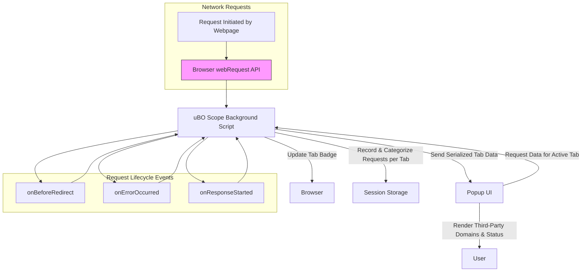

# How uBO Scope Works

Understanding how uBO Scope operates behind the scenes provides invaluable insight into its unmatched transparency in reporting remote server connections. This page outlines the extension’s high-level workflow, its integration with browser APIs, and how it categorizes network requests to deliver real-time, trustable data.

---

## What Happens When You Browse?

When you visit a webpage, your browser automatically makes numerous network requests to load content, scripts, images, stylesheets, and more. Some of these requests connect to the website's own servers, while others reach out to third-party servers for services like analytics, advertisements, content delivery networks (CDNs), or trackers.

uBO Scope observes these requests seamlessly by hooking into the browser’s `webRequest` API — a specialized interface provided by modern browsers that reports detailed information about all network activity originating from webpages.

✦ **User's Goal:** Gain clear visibility into all network connections initiated by webpages, regardless of any content blocking happening in the background.

---

## Core Workflow: Monitoring Network Requests

uBO Scope uses event listeners registered on key network request lifecycle events:

- `onBeforeRedirect`: Detect when a request is redirected to another URL.
- `onErrorOccurred`: Detect when a network request fails or is blocked.
- `onResponseStarted`: Detect when a network request has succeeded and the server started sending data.

Each detected network request triggers an update to the internal data structures that track requests by type and outcome.

Here’s a breakdown of the processing logic:

- **Domain & Hostname Resolution**: For each network request, uBO Scope extracts the hostname from the URL and derives the base domain using the Public Suffix List.
- **Request Classification**: Depending on the event type (`success`, `redirect`, `error`) and frame context, requests are categorized as:
  - **Allowed**: Successfully completed requests.
  - **Stealth-Blocked**: Redirected requests that happen transparently, often due to stealth blocking mechanisms.
  - **Blocked**: Failed requests indicative of blocking by content blockers or other network failures.

- **Tab Isolation**: Requests are tracked per browser tab to isolate data and offer detailed insights per browsing context.
- **Badge Updates**: The number of distinct allowed third-party domains connected in each tab updates the toolbar badge count.

This structured approach ensures uBO Scope can reveal the "real" network behavior of any webpage, regardless of how aggressively content blockers are configured or what DNS-level blocks are in place.

---

## Data Persistence & Session Management

uBO Scope uses browser session storage to maintain accuracy across tab reloads or browser restarts:

- **Session Data Storage**: All observed network request outcomes per tab are serialized and saved during the session.
- **Public Suffix List Loading**: The extension loads and caches the Public Suffix List used to derive domains from hostnames reliably, even handling internationalized domain names (IDNs).

This persistence avoids losing measurement data and ensures continuity in reporting until tabs are closed.

---

## Visualizing the Flow: Browser, Background, and Popup UI

To fully grasp uBO Scope’s architecture, here's a high-level Mermaid.js flowchart illustrating the interaction among the browser, the extension background script, and the popup UI.

>This diagram shows that network requests initiated by webpages flow through the browser’s `webRequest` API where the uBO Scope background script listens for relevant events. It records outcomes and updates the browser UI accordingly. When users open the popup panel, it requests collected tab-specific data from the background script, which sends detailed information for display.

---

## Why This Matters to You

- **Complete Transparency:** uBO Scope captures *all* network traffic reported by the browser’s API, regardless of content blocker behaviors or DNS-level blocking.
- **Accurate Third-Party Tracking:** The badge count and reporting prioritize distinct third-party domains connected, giving you a true count of external servers your browser communicates with.
- **Debunking Misconceptions:** By observing raw network activity, it counters misleading metrics such as block counts or ad blocker test pages.

This architecture makes uBO Scope the definitive tool for users who want to audit, analyze, or validate network activity initiated by webpages with unfiltered accuracy.

---

## Practical Tips for Users

- **Watch the Badge:** A lower badge count means fewer third-party connections; this is generally better for privacy.
- **Use with Other Content Blockers:** uBO Scope works alongside your existing blockers, reporting network results even when stealth blocking or DNS filtering is applied.
- **Explore Popup Details:** The extension's popup UI categorizes connections into `Allowed`, `Stealth-Blocked`, and `Blocked`, helping you quickly understand what the browser connected to and what was prevented.

---

## Troubleshooting Common Issues

If you notice inconsistencies or missing data:

- Ensure your browser supports the `webRequest` API and hasn't restricted it.
- Check that network requests outside typical protocols (non-HTTP/S, non-WSS) may not be reported.
- Remember that network requests made by external applications or outside the browser context are not visible to uBO Scope.

---

Understanding this operation flow equips you to leverage uBO Scope effectively for detailed network auditing and privacy analysis.

---

## Additional References

For deeper dives, explore:

- [Using the Popup Panel](/overview/feature-glance/popup-overview) — Learn to interpret the extension’s interface.
- [Core Concepts & Terminology](/overview/architecture-concepts/core-terminology) — Understand key terms behind network request categorizations.
- [Comparing Content Blockers with uBO Scope](/guides/real-world-usage-scenarios/comparing-content-blockers) — See practical use cases.

---

###### Source Code Reference
- Background script where request processing happens: [`js/background.js`](https://github.com/gorhill/uBO-Scope/blob/main/js/background.js)
- Popup rendering logic: [`js/popup.js`](https://github.com/gorhill/uBO-Scope/blob/main/js/popup.js)