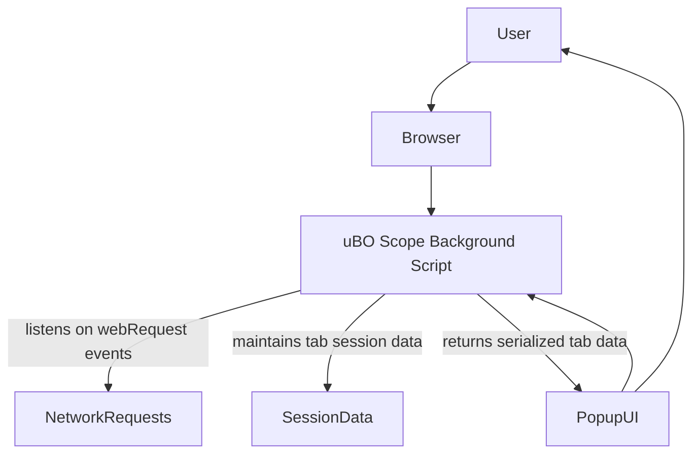

# Integration with Browsers & Blockers

## Ensuring Compatibility Across Popular Browsers

uBO Scope is engineered for seamless integration with major browsers including Chromium-based browsers (like Chrome and Edge), Mozilla Firefox, and Apple Safari. This broad compatibility ensures you can leverage uBO Scope’s powerful network connection insights regardless of your preferred browsing environment.

Each browser platform uses specific manifest files and background scripts optimized for its extension framework:

- **Chromium-based browsers** utilize a service worker (designated as the background script), leveraging the modern Manifest Version 3 architecture while requesting webRequest permissions and host access for all HTTP, HTTPS, WS, and WSS protocols.

- **Firefox** integrates similarly with a background module script, employing strict minimum version checks to guarantee that the latest webRequest APIs are supported.

- **Safari’s** Manifest targets version 3 with module-type background scripts, adapting to its unique extension architecture, ensuring consistent behavior.

This flexible design enables uBO Scope to deliver consistent, reliable behavior across all supported browsers without users needing to worry about platform-specific quirks.

## Robust Reporting Despite Other Content Blockers

One of the key distinguishing factors of uBO Scope is its ability to function accurately and effectively regardless of which content blockers or privacy tools are active within the browser. Here's how it achieves this:

- uBO Scope leverages the browser’s native `webRequest` API, which reports on all network requests initiated by webpages.

- Because it listens directly to these network events, uBO Scope can detect whether each network request was allowed, blocked, or stealth-blocked, whether blocking is performed by uBlock Origin, other third-party extensions, or even content blocking done by DNS or network-level tools.

- Unlike content blockers that may obscure their actions to avoid detection, uBO Scope remains a transparent observer, ensuring you see an accurate and complete picture of remote server connections occurring during browsing.

### How This Benefits You

- **Holistic Awareness:** Monitor all network requests as seen by the browser, regardless of blocking layers. 
- **Reliable Data:** Get trustworthy counts and domain status updates that aren’t skewed by filtering heuristics or stealth technologies.
- **Cross-Extension Trustworthiness:** Evaluate the true impact of your content blockers by comparing what uBO Scope observes against other tools.

## Permissions and Host Access Explained

uBO Scope requests permissions that allow it to monitor network traffic effectively across sites:

- **Active Tab:** Enables the extension to operate contextually with the current tab to provide real-time insights.
- **Storage:** Supports saving session data for persistent insights during browser sessions.
- **webRequest:** Grants the ability to listen to network events, necessary for tracking the fate of outgoing network connections.
- **Host Permissions:** Access to all URLs over HTTP, HTTPS, WS, and WSS allows comprehensive coverage of typical web traffic and WebSocket connections.

> This comprehensive permission set is critical for giving users unparalleled visibility into their browsing's network interactions.

## Under-the-Hood Communication Flow with Browsers

### Background Script and Service Worker

- **On Chromium and Firefox:**
  The background script runs as a service worker or module script that listens to webRequest events through the browser APIs. It tracks network requests and updates the session state.

- **Safari Adaptation:**
  Uses background scripts with manifest compatibility for Safari, listening to network requests similar to other browsers.

### Popup Panel and UI Updates

- The UI popup (`popup.html`) uses the messaging system built into browsers to query the background script for the latest data tied to the active tab.

- Messages like `getTabData` are sent, and data is serialized and deserialized efficiently to update the popup.

- Badge counts on the toolbar icon are dynamically updated to reflect the number of distinct allowed third-party domains, a key privacy metric.

## Best Practices for Users

- **Keep Browser Updated:** Ensure your browser is on a supported version for Manifest V3 and service worker support (e.g., Chrome 122+, Firefox 128+, Safari 18.5+).
- **Use Alongside Content Blockers:** Complement existing content blockers with uBO Scope for transparency without conflict.
- **Observe Network Results:** Use uBO Scope's reports to validate the effectiveness of your filtering and understand where connections are being allowed or blocked.

## Troubleshooting Compatibility Issues

<AccordionGroup title="Common Compatibility Questions">
<Accordion title="Why isn't uBO Scope showing any data?">
If you are running an unsupported browser version or have restrictive privacy settings that block the extension's access to webRequest or host permissions, uBO Scope cannot function. Verify your browser version and permissions.
</Accordion>
<Accordion title="Does uBO Scope conflict with other content blockers?">
No. uBO Scope listens passively to network requests and does not interfere or block requests itself. It works harmoniously alongside other extensions.
</Accordion>
<Accordion title="Why are some network connections missing?">
Certain network activity that bypasses browser networking APIs, such as those made by native apps or sandboxed environments, cannot be observed.
</Accordion>
</AccordionGroup>

## Summary

By integrating deeply with browser webRequest APIs and leveraging broad permissions, uBO Scope maintains high relevance across browsers and blocking technologies. This ensures users receive accurate, comprehensive visibility into third-party network connections — a foundational layer for understanding and improving online privacy.

---

For further understanding of how uBO Scope's data fits into the broader context of usage and architecture, consider these documentation pages:

- [How uBO Scope Works (Architecture Overview)](/overview/architecture-concepts/system-architecture)
- [Core Concepts & Terminology](/overview/architecture-concepts/core-concepts)
- [Understanding the Popup Panel and Connection Lists](/guides/analyzing-network-connections/understanding-popup-ui)


---

## Code Snippet: Messaging Between Popup and Background Script

```javascript
// Popup script sends a message to retrieve data for the current tab
sendMessage({ what: 'getTabData', tabId: currentTab.id }).then(response => {
  // Deserialize and render data in the popup UI
  renderPanel(deserialize(response));
});
```

This code illustrates how the popup obtains up-to-date tab connection details from the background service worker, enabling dynamic and responsive UI updates reflecting the current network state.

---

## Browser Support Summary Table

| Browser | Manifest Version | Background Script Type | Minimum Version |
|---------|------------------|-----------------------|-----------------|
| Chromium (Chrome, Edge, etc.) | 3 | Service Worker (Module) | 122.0 |
| Mozilla Firefox | 3 | Background Script (Module) | 128.0 |
| Safari | 3 | Background Script (Module) | 18.5 |

## Permissions Overview

- `activeTab`
- `storage`
- `webRequest`
- `host_permissions`: `https://*/*`, `http://*/*`, `wss://*/*`, `ws://*/*`

## Visual Workflow Diagram



This flow depicts the communication between the user’s browser, uBO Scope’s background process, the network events observed, and the popup UI displaying aggregated results.

---