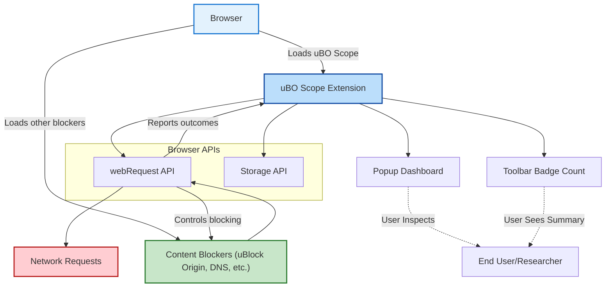

# Integration & Compatibility

Understanding how uBO Scope fits seamlessly within your broader privacy, security, or research workflow is key to unlocking its full potential. This page outlines uBO Scope's compatibility with various browsers, interaction with other content blockers including uBlock Origin and DNS-based blocking, and clarifies its operational boundaries to set realistic expectations.

---

## Why Integration Matters

When you add uBO Scope to your browsing environment, it works alongside your existing privacy tools—be that content blockers, antivirus software, or DNS filters—to provide unparalleled transparency into network traffic. Knowing how these components interplay will help you maximize both visibility and protection without conflicts or blind spots.


## Supported Browsers & Compatibility Overview

uBO Scope supports major modern browsers with precise integration tailored to each:

- **Chrome and Chromium-based browsers:** Uses Manifest V3 with service workers to track network requests and update UI dynamically.
- **Firefox:** Employs the traditional background script model, compatible with Firefox’s webRequest API.
- **Safari:** Integrates with Safari’s Web Extension API, with strict minimum version requirements (Safari 18.5 and newer).

Across browsers, uBO Scope leverages the `webRequest` API, ensuring it consistently captures network request outcomes regardless of the platform specifics.


### Browser Permissions

The extension requires the following permissions uniformly to function:

- Access to all HTTP and HTTPS requests (`http://*/*` and `https://*/*`), plus WebSocket protocols where supported.
- Permissions for activeTab, storage, and webRequest to track and store network activity.

These permissions enable uBO Scope to listen in on network traffic at a system level within the browser, independent of your content blocking configuration.


## Working Alongside Content Blockers

uBO Scope is explicitly designed as a **companion tool**, not a content blocker itself. It complements your blockers by revealing the _actual_ network behavior, including:

- Connections allowed by your existing blocker.
- Requests stealth-blocked by seemingly silent filtering methods.
- Requests explicitly blocked.

### Interaction with uBlock Origin

When used alongside uBlock Origin:

- uBO Scope visualizes the exact remote servers contacted or blocked by uBlock Origin’s filters.
- It respects and reports any blocking performed by uBlock Origin in real-time, providing granular insight.
- The badge count on uBO Scope’s icon reflects the distinct number of third-party domains connected, not just blocked.

This synergy allows users and filter list maintainers to verify the effectiveness of filter rules and better understand their blocking scope.

### Compatibility with DNS-Based Blocking

DNS-based blockers operate outside the browser, often at the network or device level. uBO Scope can still report network requests seen by the browser’s `webRequest` API, but there are some nuances:

- If a DNS blocker fully prevents a hostname resolution before the browser attempts a connection, uBO Scope may _not_ see any related network request.
- However, if DNS-based blocking triggers an error or fallback that the browser reports, uBO Scope will capture this outcome as an 'error' event and categorize the request as blocked.

This transparency helps users identify blind spots where DNS-level blocking may or may not be effective from the browser’s perspective.


## Operational Boundaries and Limitations

Understanding what uBO Scope cannot do is as vital as understanding what it can:

- **Cannot block or intercept requests:** uBO Scope is a passive observer and does not interfere in connections.
- **Limited by browser APIs:** Requests happening outside the `webRequest` API's scope (e.g., certain HTTP/3 connections or requests managed internally by proprietary APIs) are invisible.
- **Dependent on browser support:** Not all browsers equally support the necessary APIs; therefore, feature availability may vary.


## How uBO Scope Fits Into Your Workflow

Imagine you are a privacy-conscious user who wants to see exactly which third-party domains your visited websites connect to, regardless of what your primary content blocker does. You add uBO Scope to:

1. **Install the extension** from your browser’s extension store.
2. **Observe the badge count** as you browse — the count reflects distinct third-party domains reached.
3. **Open the popup dashboard** to inspect detailed connection reports, categorized by allowed, stealth-blocked, or blocked requests.
4. **Cross-reference with your blocker** (e.g., uBlock Origin or DNS blocklists) to verify and fine-tune filtering.

In research or filter list maintenance scenarios, uBO Scope empowers you to validate filter efficacy in real-time and identify unexpected resource leakage.


## Practical Tips for Best Integration

- Always keep your browser updated to take advantage of the latest API improvements.
- Use uBO Scope alongside trusted blockers for best privacy and security.
- Remember the badge count is a valuable indicator: lower counts of third-party connections often indicate better privacy.
- If unexpected connections appear, use the popup details to identify and investigate.


## Troubleshooting Compatibility Issues

<AccordionGroup title="Common Compatibility Issues & Recommendations">
<Accordion title="uBO Scope Badge Not Updating">
- Ensure browser permissions are granted fully.
- Check that your browser supports the `webRequest` API as required.
- Verify no conflicts or interference from other extensions that might suppress webRequest events.
- Try reinstalling the extension or restarting the browser.
</Accordion>
<Accordion title="Data Not Showing Consistently Across Browsers">
- Confirm the extension version supports your browser version.
- Safari requires version 18.5+ for full support.
- In Firefox, ensure no privacy settings block extension API access.
</Accordion>
<Accordion title="Integration With DNS Blockers Not Reflecting Expected Results">
- Understand that DNS blockers may prevent requests before the browser attempts connection.
- If you see no events for a domain, DNS blocking might be operating upstream.
- Check DNS blocker logs or settings to verify.
</Accordion>
</AccordionGroup>


## Example: Checking Compatibility in Chrome

```javascript
// Manifest permissions in platform/chromium/manifest.json
{
  "host_permissions": [
    "https://*/*",
    "http://*/*",
    "wss://*/*",
    "ws://*/*"
  ],
  "permissions": [
    "activeTab",
    "storage",
    "webRequest"
  ]
}
```

This ensures uBO Scope listens for all relevant network requests in Chrome or other Chromium browsers.


## Example: Companion to uBlock Origin

With uBlock Origin handling blocking and hiding, uBO Scope reports:

- Each network request's final status (allowed, blocked, stealth-blocked).
- Aggregated counts by domain, helping you verify your blocklist coverage.

This complimentary setup offers unmatched insight:

| Tool          | Role                      |
|---------------|---------------------------|
| uBlock Origin | Blocking and filtering    |
| uBO Scope     | Observing and reporting   |


---

## Summary Diagram: Integration Overview




---

## Where to Go Next

- Visit **[Prerequisites & Supported Browsers](/getting-started/installation-and-setup/prerequisites)** to prepare your environment.
- Follow installation instructions in **[Installing uBO Scope](/getting-started/installation-and-setup/installation)**.
- Learn how to navigate the dashboard in **[Using the Popup: Navigating the Dashboard](/guides/getting-started/popup-navigation-basics)**.


----

<Note>
Understanding integration and compatibility is essential to successfully leveraging uBO Scope alongside your existing tools. This ensures you gain the fullest visibility into your network requests without disruptive conflicts.
</Note>