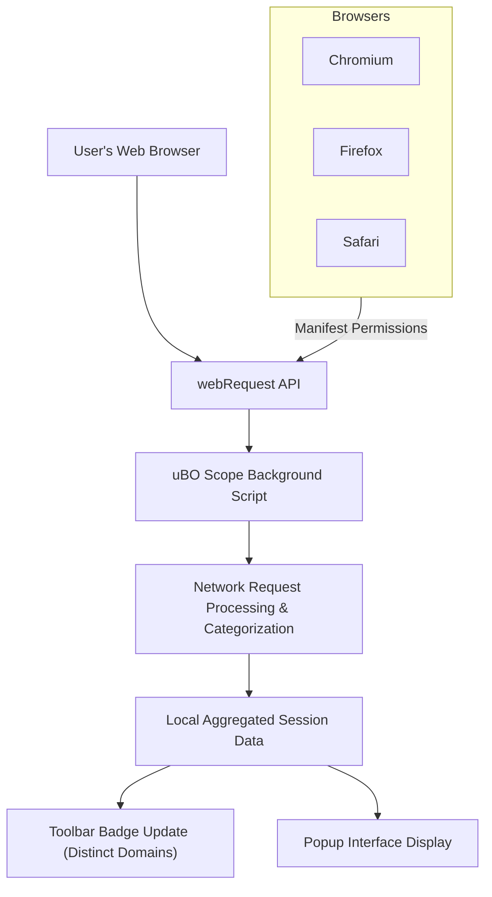

# Integration & Compatibility

## Seamless Browser Integration Through the webRequest API

uBO Scope is designed to function as a transparent observer of your browser's network activity. It integrates deeply with modern web browsers by leveraging the browser's native **webRequest API**. This API enables uBO Scope to listen for all network requests initiated by webpages, capturing crucial details about connections to remote servers.

By integrating through the webRequest API, uBO Scope operates independently of any content blockers or DNS filtering mechanisms you may have installed or configured. This independence guarantees an accurate and unbiased report of the network requests your browser makes, regardless of what is blocked or allowed by your other privacy tools.

## How uBO Scope Ensures Compatibility Across Browsers

uBO Scope supports the three major browser architectures—**Chromium**, **Firefox**, and **Safari**—each with its own implementation nuances and manifest requirements. The extension codebase uses feature detection and conditional integration techniques to support these differences seamlessly without compromising user experience.

### Chromium

- Uses a **service worker** as the background script (`background.service_worker`).
- Requires a minimum Chrome version 122 as per its manifest.
- Supports both HTTP and WebSocket (`ws://` and `wss://`) host permissions for broad network monitoring.

### Firefox

- Uses a **module type background script**.
- Runs on Firefox version 128 minimum (including Firefox for Android).
- Supports both HTTP, HTTPS, and WebSocket protocols with explicit host permissions.
- Has a unique extension ID defined in the manifest for compliance.

### Safari

- Utilizes a **module background script** with strict minimum version 18.5.
- Limited to HTTP and HTTPS protocols for host permissions.

> **Note:** All platform manifests define `webRequest` permissions explicitly, ensuring uBO Scope has the access it needs to monitor network traffic.

## Reporting Network Connections Independently of Content Blockers or DNS Filtering

Traditional network monitors or content blockers may only report what they intend to allow or block. uBO Scope, however, remains purely observational:

- **Monitors all outgoing network requests**, regardless of whether other filters block them.
- **Accurately categorizes network outcomes** as allowed, blocked, or stealth-blocked based on browser event callbacks.
- **Reports distinct remote server connections** by aggregating data per tab and per domain to give you an exact count of unique third-party connections.

### Why This Matters

Even if a content blocker claims to block many requests, it may still allow connections to more distinct third-party servers, which could impact your privacy. uBO Scope lays bare this reality by reporting actual connection outcomes, helping users and filter list maintainers make informed decisions.

## Requirements and Limitations

To ensure full functionality, keep these points in mind:

- **Browser Version**: Must meet the minimum browser version requirements per platform (Chromium 122+, Firefox 128+, Safari 18.5+).
- **webRequest API Support**: The browser must implement the `webRequest` API such that uBO Scope can observe network requests.
- **Network Request Coverage**: Requests originating completely outside the reach of the browser’s `webRequest` API cannot be seen by uBO Scope. For example, some DNS-based filtering or network requests made by other software outside the browser context are not captured.
- **Host Permissions**: The extension’s manifest grants access to all HTTP, HTTPS, and where applicable WebSocket endpoints under `host_permissions`.
- **Privacy by Design**: uBO Scope collects data only locally within the browser extension context. It neither modifies requests nor transmits collected data externally.

## Practical Example: How uBO Scope Listens and Reports

When you browse a webpage, uBO Scope’s background script registers listeners for network events such as:

- `onBeforeRedirect`
- `onErrorOccurred`
- `onResponseStarted`

Each event is queued and processed to update counts of allowed, blocked, or stealth-blocked connections per domain. This granular tracking is aggregated per tab to present you with a clear and actionable overview.

```javascript
// Example: Queuing network request outcomes
browser.webRequest.onResponseStarted.addListener(details => {
    queueNetworkRequest(details, 'success');
}, { urls: manifest.host_permissions });
```

The extension updates the toolbar badge with the number of distinct allowed third-party domains to give an at-a-glance insight.

## Summary Diagram of Integration Flow



## Best Practices

- Ensure you install uBO Scope from official browser stores or trusted sources mentioned in the documentation.
- Keep your browser updated to meet minimum version requirements for optimal compatibility.
- Understand that uBO Scope is not a content blocker itself; it complements your content blockers by revealing true network visibility.

## Troubleshooting Compatibility Issues

- If uBO Scope does not show data or update the badge:
  - Confirm your browser’s version meets minimum requirements.
  - Verify that the extension has `webRequest` permissions granted.
  - Check there are no conflicts or restrictions imposed by other installed extensions.
  - Review browser policies or settings that might restrict extension access to network request APIs.

- In Safari, ensure the browser’s version is at least 18.5 and that the extension is enabled properly in Safari Preferences.

---

## Next Steps

To get the most out of uBO Scope’s transparent network insights, explore these related guides:

- **[Understanding and Using the Toolbar Badge Count](/guides/core-workflows/understanding-the-badge-count)** to interpret what the badge number means
- **[Monitoring Domain Connections in Real Time](/guides/core-workflows/monitor-domain-connections)** for live activity tracking
- **[Interpreting Allowed, Blocked, and Stealth Outcomes](/guides/advanced-usage-patterns/interpreting-network-outcomes)** for comprehensive insight on network events

You can also review the **[Core Concepts & Terminology](/overview/architecture-concepts/core-concepts-terminology)** page for foundational knowledge.

---