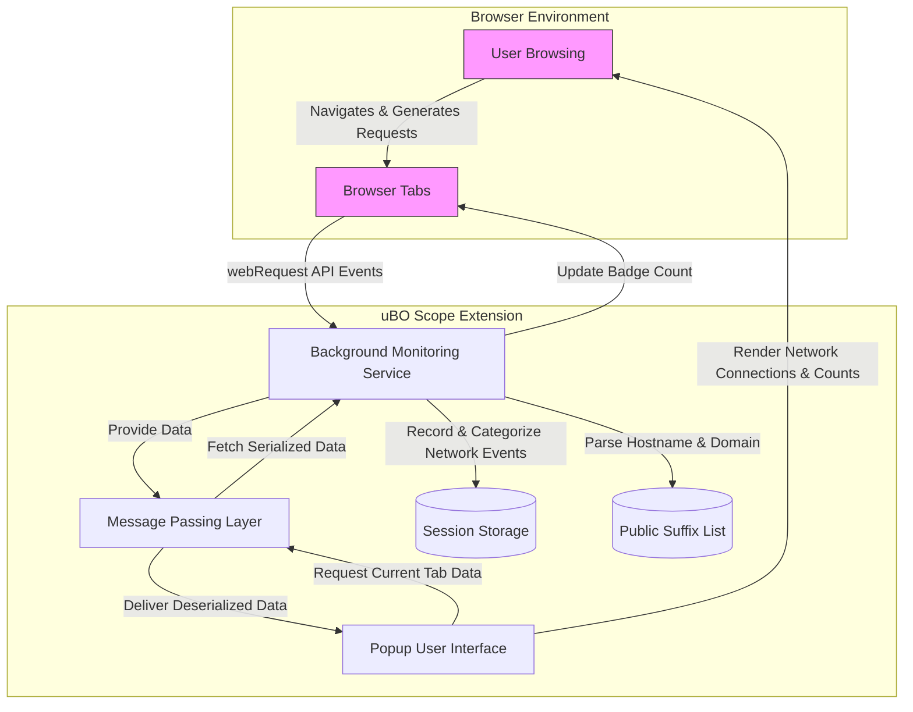

# How uBO Scope Works (Architecture Overview)

Discover how uBO Scope transforms raw network activity into clear, actionable insights about your browser's remote connections. This architecture overview breaks down the extension's core components, the flow of data they handle, and how browser APIs empower this analysis, culminating in the informative popup UI you interact with.

---

## Visualizing uBO Scope's Architecture

At its core, uBO Scope is composed of three integral parts working in concert:

- **Background Monitoring Service** – silently tracks and categorizes network requests.
- **Popup User Interface** – presents summarized insights to you when requested.
- **Communication Layer** – bridges the data collected with the UI you see.

This design ensures continuous, low-overhead monitoring while providing up-to-date, comprehensible reports on demand.

### The Journey of a Network Request

1. **Network activity occurs:** Your browser initiates network requests as you browse.
2. **Browser intercepts requests:** Using `webRequest` API listeners, uBO Scope catches each request event.
3. **Background tracks and categorizes requests:** For every request, uBO Scope:
   - Extracts the hostname and determines the domain via the Public Suffix List.
   - Classifies the request outcome as _allowed_, _stealth-blocked_, or _blocked_.
   - Records counts of unique hostnames and domains for each outcome category.
4. **Aggregated data is stored:** Tab-specific details are continuously aggregated and saved using session storage.
5. **User requests report:** When you open the browser action popup, a message triggers retrieval of this data.
6. **Popup renders data:** The UI displays connections grouped by their outcome, highlighting domain counts and details.

---

## Core Components Explained

### 1. Background Monitoring Service

- Runs as a service worker or background script depending on the browser.
- Listens to key webRequest events:
  - `onBeforeRedirect`
  - `onErrorOccurred`
  - `onResponseStarted`
- Creates a _journal_ of network request events, efficiently batching processing every second.
- Uses the [Public Suffix List](https://publicsuffix.org/) to correctly identify registrable domains for grouping.
- Categorizes requests based on event outcomes:
  - **Allowed:** Requests successfully connected.
  - **Stealth-blocked:** Redirects silently blocked.
  - **Blocked:** Requests failing due to errors.
- Maintains per-tab data structures that map unique hostnames and domains for accurate domain counts.
- Updates browser action badge with the current count of allowed distinct third-party domains.
- Handles tab lifecycle events to clean data when tabs close.
- Stores session data persistently to maintain state during the browsing session.

### 2. Popup User Interface

- Triggered when you click the uBO Scope toolbar icon.
- Requests current tab's network data via messages to the background service.
- Displays a clear summary:
  - Total distinct connected domains.
  - Domains grouped under **not blocked**, **stealth-blocked**, and **blocked** categories.
- Shows counts per domain to help identify frequent connections.
- Uses Unicode decoding for internationalized domain names ensuring readable domain display.
- Uses subtle styling to differentiate connection statuses at a glance.

### 3. Communication Layer

- Utilizes browser messaging APIs to asynchronously fetch and send data between background and popup scripts.
- Implements serialization/deserialization to efficiently transport complex tab data.
- Ensures UI updates only when data is fully ready, providing a responsive experience without freezing or lag.

---

## How the Browser APIs Empower This Architecture

- `webRequest` API is the foundation, reporting every network request's start, redirect, success, or failure.
- `storage.session` and `storage.local` APIs persist user session data, enabling restoration and smooth multi-tab handling.
- `runtime.sendMessage` allows the popup UI to query live data from background, ensuring up-to-date display.
- `tabs.query` assists in identifying the active tab context to scope data retrieval.
- `browser.action.setBadgeText` provides visual feedback on third-party connections directly on the toolbar icon.

---

## Practical Example: Tracking a Page Load

Imagine you navigate to `https://example.com`:

- The background service notes the main frame network request.
- The tab's details reset and store the hostname and domain for `example.com`.
- Each subsequent third-party connection (e.g., analytics.service.com, cdn.examplecdn.net) triggers events.
- uBO Scope classifies these requests based on outcome:
  - Allowed connections get added to the _allowed_ category.
  - Requests silently redirected (stealth) are tracked.
  - Blocked requests by content blockers are tracked separately.
- Over time, you accumulate a map of domains and hostnames with counts of how often resources load.
- Opening the popup, you see a detailed breakdown listing domains, their counts, and categorization.

This granular view helps you understand exactly which domains your browser communicates with and how effective your blocking strategy is.

---

## Tips, Best Practices, and Common Pitfalls

- **Focus on unique domains** rather than raw request counts to assess third-party connections meaningfully.
- **Remember stealth-blocked connections** may not be visible to the webpage but are captured by uBO Scope.
- **Some network requests may happen outside the scope** of browser's webRequest API and won't appear.
- **Use the badge count as a high-level indicator**: a lower count often suggests fewer third-party connections.
- **Opening the popup periodically** gives real-time visibility into network behavior during browsing sessions.
- **Close tabs to clear session data** and avoid stale information in reports.

---

## Architecture Diagram

---

## Getting Started with Architecture Understanding

- Familiarize yourself with how uBO Scope listens to and processes network requests in the background.
- Explore the [popup UI guide](https://github.com/gorhill/uBO-Scope/tree/main/guides/getting-started-essentials/understanding-the-popup-interface) to see how collected data is presented.
- Review the [Public Suffix List](https://publicsuffix.org/) concept as it is key to properly classifying domains.
- Observe badge count changes as a quick metric of distinct allowed third-party connections.

---

For deeper technical insights or contribution, visit the [official uBO-Scope GitHub repository](https://github.com/gorhill/uBO-Scope).

---