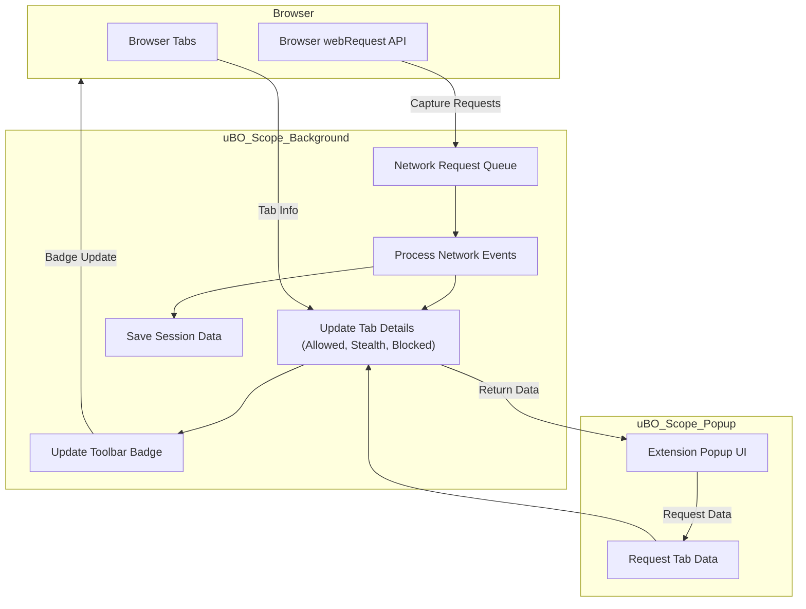

# System Architecture & Data Flow

Discover how uBO Scope seamlessly integrates with your browser to monitor, categorize, and present detailed network request information—all in real-time and with minimal user effort. This page guides you through a clear, user-focused view of how the extension operates behind the scenes and delivers actionable insights directly to your browser interface.

---

## How uBO Scope Works: An Overview

uBO Scope is designed to offer unparalleled transparency into all network requests initiated by webpages, regardless of which content blockers or filtering methods you use. It operates by hooking into the browser's native webRequest APIs to detect every remote connection attempt and then categorizes these requests into meaningful groups.

From capturing data to displaying insights, here’s the flow that turns raw network events into clear, usable information:

1. **Network Request Monitoring:**
   - uBO Scope listens to key browser events for network requests, including redirects, errors, and successful responses.
   - Every request URL is parsed to extract hostnames and domains.
   - Requests are categorized by outcome: **allowed**, **blocked**, or **stealth-blocked** (redirected).

2. **State Management & Data Aggregation:**
   - The extension maintains a session-based map of each open browser tab and tracks associated network request outcomes.
   - It uses a robust domain parsing library to uniformly identify and group domains, ensuring consistency even with complex domain structures.
   - Counts of unique domains and hostnames per category are maintained to give users an accurate picture.

3. **Badge & Popup Presentation:**
   - The extension’s toolbar icon dynamically shows a badge counting distinct allowed third-party domains, helping users gauge exposure at a glance.
   - Invoking the extension popup presents a grouped, detailed summary of all network connections per tab, segmented by allowed, stealth-blocked, and blocked domains.

4. **Data Persistence:**
   - Session data and public suffix lists are stored using the browser's session storage to maintain state and performance during an active browsing session.
   
---

## Key Components and Their Roles

### 1. Network Listeners (Background Service Worker / Script)
- Captures all relevant network events (`onBeforeRedirect`, `onErrorOccurred`, `onResponseStarted`).
- Queues and batches these events to ensure efficiency.
- Invokes logic to process each event, parsing URLs and categorizing outcomes.

### 2. Tab Tracking & Data Model
- Maintains a map of **tabId -> tabDetails**, where each `tabDetails` records domain-specific counts under categories: allowed, blocked, stealth-blocked.
- Utilizes the Public Suffix List (PSL) to extract registrable domains from hostnames, ensuring accurate domain grouping.

### 3. User Interface (Popup)
- Queries the background for data related to the active tab.
- Displays the hostname and domain of the active tab’s webpage.
- Shows separate sections listing all distinct domains connected under each outcome category, with counts.
- Provides a domain breakdown enabling users to understand third-party connections clearly.

---

## User-Centric Data Flow Illustration

---

## Step-by-Step User Flow

1. **User opens a webpage in a new browser tab.**
   - uBO Scope resets tracking for this tab and begins monitoring network requests.

2. **Webpage initiates network requests to multiple remote servers.**
   - Each request is captured by event listeners in the background script.

3. **Extension classifies each request:**
   - **Allowed:** Requests that successfully connected.
   - **Blocked:** Requests that failed or were blocked.
   - **Stealth-blocked:** Requests redirected stealthily, typical of some content blockers.

4. **Background updates request counts grouped by domains.**
   - This aggregated data is stored per tab in session storage.

5. **Toolbar badge updates with the count of unique allowed third-party domains.**
   - This badge count offers a quick privacy “exposure” metric.

6. **User clicks the extension icon to open the popup.**
   - The popup queries the background script for the current tab’s network request data.
   - It renders a clear list showing connected domains sorted into allowed, stealth-blocked, and blocked categories.

7. **User reviews detailed network request information.**
   - This insight helps users understand which third parties webpage content is communicating with.

---

## Practical Tips & Best Practices

- **Interpreting the badge count:** A lower count means fewer third-party connections that your browser allowed, generally indicating better privacy.

- **Understand stealth-blocked domains:** These are network connections that were redirected or altered in a way that content blockers often use to hide blocking activity; noticing them helps debunk false assumptions about blocking effectiveness.

- **Use the popup for fine-grained analysis:** The domain grouping helps identify unexpected or suspicious third-party connections from any webpage.

- **Consider session persistence:** Data resets when tabs close; this behavior ensures privacy and up-to-date monitoring for your active browsing session.

---

## Troubleshooting Common Issues

<AccordionGroup title="Troubleshooting Network Data Visibility">
<Accordion title="No data shown in popup">Ensure that the extension has necessary permissions such as access to 'webRequest' and 'activeTab'. Check if your browser supports these APIs, as uBO Scope relies on them.</Accordion>
<Accordion title="Badge count not updating">Reload the tab or revisit the webpage; some browsers throttle background scripts. Also confirm that network requests are captured by the extension’s listeners—not all protocols or contexts are monitorable.</Accordion>
<Accordion title="Domains appear incorrectly grouped">The extension relies on an up-to-date Public Suffix List. If domains seem off, restarting the browser session or updating the extension can help refresh data.</Accordion>
</AccordionGroup>

---

## Further Exploration

Once comfortable with how uBO Scope processes and presents network data, explore these pages for more insight:

- [What is uBO Scope?](/overview/introduction-value/what-is-ubo-scope) — Understand the product mission and unique value.
- [Who Should Use uBO Scope?](/overview/introduction-value/who-is-it-for) — Identify if this tool aligns with your needs.
- [Core Features at a Glance](/overview/introduction-value/core-features-overview) — See feature highlights that bolster your privacy analysis.

---

By understanding the underlying architecture and data flow of uBO Scope, you gain confidence in its reliability and the insightful privacy information it provides — empowering smarter browsing choices with clear, actionable network visibility.

---

##### Source and Background Implementation Details

This architecture is based on browser support for the `webRequest` API, with the core logic implemented in a background script that manages data collection, tab state, and user interface interaction. The extension popup dynamically queries the background to render per-tab connection details, making the complex invisible network chatter comprehensible at a glance.

