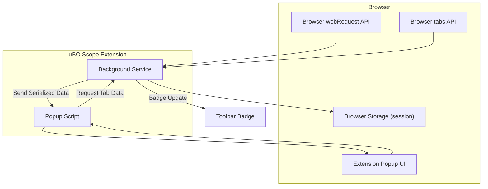

# System Architecture Overview

Get a clear, visual understanding of how uBO Scope’s major components interact and how data flows through the extension. This overview provides a high-level map of the extension’s architecture focusing on the popup user interface, the background service, and the integration with browser APIs. Learn precisely how information flows from the browser’s network events to the data displayed in the popup dashboard.

---

## Understanding uBO Scope’s Core Components

At its heart, uBO Scope is designed to report all remote server connections that a browser tab makes. To achieve this, it orchestrates three key components working together:

- **Background Service (background.js):** Runs continuously (or as a service worker) in the background, monitors network requests via browser APIs, processes request outcomes, records detailed data, and maintains session state.
- **Popup User Interface (popup.js + popup.html):** Displays the collected data in a user-friendly dashboard whenever you click the extension’s icon.
- **Browser APIs:** Provide hooks into network activity (`webRequest` APIs), tab lifecycle events, and persistent or session storage.

This architecture empowers uBO Scope to capture, categorize, and present comprehensive network connection data without interfering with browsing.

---

## High-Level Data Flow

1. **Monitoring Network Requests:**
   - The background script registers listeners to the browser’s `webRequest` API for network events: response starts (`success`), redirects, and errors.
   - Each event captures request details such as URL, tab ID, resource type, and frame context.

2. **Request Outcome Processing:**
   - Incoming requests are queued briefly to batch-process and efficiently update internal session state.
   - The extension categorizes requests as **allowed**, **stealth-blocked**, or **blocked** based on event type and response characteristics.
   - It tracks domains and hostnames contacted per tab, maintaining counts and connection outcomes.

3. **Session Data Management:**
   - Data is held in memory and synchronized with browser session storage.
   - The extension uses a public suffix list to correctly parse domains from hostnames, ensuring accurate per-domain reporting.

4. **Updating UI and Badge:**
   - For each tab, uBO Scope updates the browser action badge to show the count of distinct allowed third-party domains connected.
   - When the popup is opened, it queries the background service for the current tab’s data.

5. **Popup Rendering:**
   - The popup script receives serialized data from the background, deserializes it, and dynamically renders domain connection lists grouped by outcome category.
   - Users see counts of connected domains, organized for quick understanding of which connections were allowed or blocked.

---

## Component Responsibilities

| Component        | Responsibilities                                                                                                          |
|------------------|---------------------------------------------------------------------------------------------------------------------------|
| Background.js    | Listens to network and tab events, records outcomes, manages session data, updates badge count per tab, serves tab data on request |
| Popup.js         | Fetches tab-specific data from background, deserializes and renders data into the popup dashboard                          |
| Browser APIs     | Provides network request hooks, tab lifecycle events, storage mechanisms, and UI interactions                               |

---

## Visual Architecture Diagram

---

## Detailed User Flow Example

Imagine you open a webpage in a new tab:

1. **Loading the Page:**
   - The browser starts issuing network requests.
   - The background script listens to each request and queues them for processing.

2. **Classifying Requests:**
   - When a response starts, the event is logged as **success**.
   - If a request is redirected or blocked, it is categorized accordingly.
   - The extension aggregates domain counts under allowed, stealth, or blocked.

3. **Updating Badge:**
   - The badge on the extension’s icon updates to show the number of distinct allowed third-party domains.

4. **Viewing the Dashboard:**
   - Clicking the icon opens the popup.
   - The popup script sends a message requesting the tab’s current data.
   - Background responds with serialized tab data.
   - The popup renders the domain lists by status.

Through this seamless flow, you quickly gain visibility into the network connections your browser tab is making.

---

## Best Practices & Tips

- **Badge as a Quick Gauge:** The badge count shows how many distinct third-party domains had successful connections. Use it routinely to monitor the privacy surface of your current tab.

- **Use the Popup for Details:** For deeper insights, open the popup and review the categorized lists — which domains were allowed, stealth-blocked, or outright blocked.

- **Understand Domain Resolution:** The background component leverages the public suffix list to resolve domains accurately (e.g., differentiating subdomains vs. registered domains). This avoids inflated counts from minor domain variants.

- **Handling Tab Closures:** When you close a tab, the background service cleans up stored data to keep memory usage efficient.

- **Non-Invasive Monitoring:** uBO Scope does not block or interfere with requests; it purely observes and reports, ensuring no impact on your browsing behavior or page functionality.

---

## Troubleshooting & Common Scenarios

<AccordionGroup title="Common Questions and Solutions">
<Accordion title="Why isn’t the badge count updating?">
Make sure you have granted all necessary permissions and that the extension is enabled for the domain you are testing. The badge updates only when network requests occur and are successfully processed by the background service.
</Accordion>
<Accordion title="Popup shows no data for active tab">
This can happen if the active tab has no recorded network requests yet or if the tab is a special browser page that doesn’t expose network data. Reloading the tab or navigating to a standard webpage usually resolves this.
</Accordion>
<Accordion title="How does uBO Scope know which domains to count?">
uBO Scope analyzes URLs from network requests and extracts the registered domain using the public suffix list, accurately grouping subdomains under their root domain.
</Accordion>
</AccordionGroup>

---

## Next Steps

- Explore the [Popup Navigation Basics](/guides/getting-started/popup-navigation-basics) documentation to master interpreting the dashboard.
- Consult [Mythbusting Block Counts](/guides/best-practices-expert-tips/mythbusting-block-counts) to understand how to read the badge count correctly.
- Start monitoring your browsing sessions and use uBO Scope’s insights to refine privacy settings or evaluate filtering lists.

---

This architectural overview arms you with the foundational understanding needed to maximize uBO Scope’s value and confidently navigate its data flows.

---