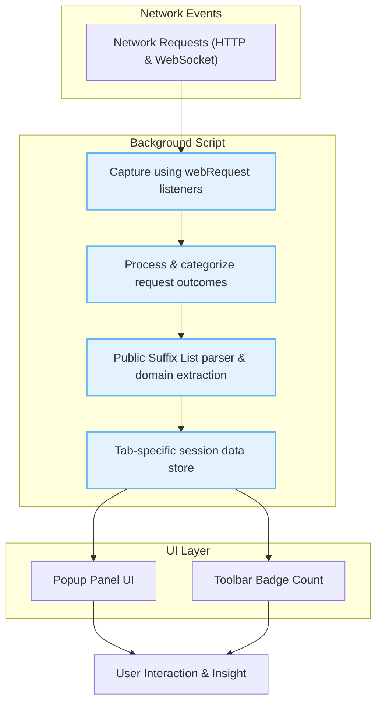

# System Overview & Data Flow

Explore the high-level interaction and data flow between uBO Scope's core components, illustrating how network requests are captured, processed, and presented to you in a streamlined, actionable way. This page connects the major technical touchpoints in your user journey — from the background monitoring of network events to the concise domain metrics displayed in the popup UI.

---

## Understanding the Flow: From Network Events to User Insights

When using uBO Scope, you want instant, reliable insights into the third-party network connections your browser attempts or successfully completes. This requires a carefully coordinated interaction of extension components working behind the scenes and on your screen. Here's how it all comes together:

1. **Network Request Capture in the Background**

   The extension listens for network requests through browser APIs (`webRequest`), detecting all outgoing HTTP and WebSocket requests initiated by pages you visit.

2. **Processing and Categorization**

   Captured requests are categorized in real-time by their outcome: **allowed**, **stealth-blocked**, or **blocked**. This classification enables clear visibility into which domains your browser truly communicates with.

3. **Data Aggregation, Tab-Scoped**

   All domain connection data is tracked per browser tab, preserving a clean, contextual view of your browsing session. This includes cumulative counts of distinct domains your browser contacts, helping distinguish between first-party and third-party interactions.

4. **Popup UI Presentation**

   When you click the extension icon, summary metrics and detailed domain lists are displayed in the popup panel, providing instant insight into the network footprint of the current tab.

---

## Key Components and Their Roles

| Component               | Role and Function                                                                                 |
|-------------------------|-------------------------------------------------------------------------------------------------|
| **Background Script**   | Runs persistently (or as a service worker), monitors and records all network requests using webRequest listeners. It also manages per-tab data storage and processing. |
| **Session Data Store**  | Keeps tab-specific domain connection details organized, ensuring accurate badge counts and popup data.                                   |
| **Public Suffix List**  | Helps parse and normalize hostnames to domains, improving aggregation and accurate domain counting.                                          |
| **Popup Interface**     | User-facing panel that displays domain metrics and categorized outcomes (allowed, stealth-blocked, blocked) for the active tab.              |

---

## Data Flow Diagram

---

## A User-Centric Journey Through the System

Imagine browsing a website with uBO Scope enabled:

- You start loading a page. Each network request your browser makes is invisibly captured and logged.
- The background script classifies each connection, immediately recognizing whether third-party domains are allowed or blocked.
- Behind the scenes, domains are normalized, so multiple hostnames under the same domain are grouped for meaningful counting.
- Instead of overwhelming you with individual requests, uBO Scope distills this data into concise domain metrics.
- Clicking the extension icon brings up a clear breakdown: how many domains connected, which ones were blocked or stealth-blocked, giving you an accurate snapshot.

This flow ensures you are never left guessing what your browser is doing on the network — you get transparent, per-tab insights with minimal effort.

---

## Practical Tips & Best Practices

- **Real-Time Feedback:** The background processing batches network events with minimal delay, typically within a second, so badge counts and popup data are current.
- **Accurate Domain Parsing:** Leveraging the Public Suffix List means that domains like `example.co.uk` are treated appropriately, avoiding confusing counts.
- **Session Persistence:** Data is stored in session storage so that closing and reopening tabs provides consistent historical insight into that tab's network activity.
- **Browser Compatibility:** Listeners and data flows conform to Manifest V3 standards across Chromium, Firefox, and Safari, preserving a consistent experience.

---

## Troubleshooting Common Issues

<AccordionGroup title="Troubleshooting Data Flow and UI Updates">
<Accordion title="Popup Shows 'NO DATA' or Empty Lists">
This typically means the background script has not yet recorded network activity for the current tab. Try refreshing the page or waiting a few seconds for data processing.
</Accordion>
<Accordion title="Badge Count Not Updating">
Ensure that the extension has permission to access webRequest APIs. In rare cases, browser restrictions or conflicts with other extensions may block event listening.
</Accordion>
<Accordion title="Discrepancies in Domain Counts">
The extension groups hostnames under domains using the Public Suffix List. Some complex domain structures may cause unexpected counts. This behavior ensures accurate summary but may differ from naive hostname counting.
</Accordion>
</AccordionGroup>

---

## Next Steps

- To dive deeper into interpreting the data you see, visit [Understanding the Popup Panel](/guides/getting-started/understanding-popup).
- Learn how the extension's key terms like "stealth-blocked" and "allowed" precisely relate to your browsing context on the [Key Terms and Domains Explained](/overview/architecture-concepts/core-concepts) page.
- Explore practical use cases in the [Analyzing Third-Party Connections](/guides/core-workflows/analyzing-connections) guide to derive maximum value.

---

## Summary

At its heart, this System Overview & Data Flow page provides you with the big picture: how uBO Scope efficiently tracks, categorizes, and displays the essential network connection data you need for privacy-aware browsing and troubleshooting.

Understanding this flow equips you to better interpret popup metrics and troubleshoot any discrepancies while appreciating how the extension respects your tab context and browser environment.

---

## References & Links

- [uBlock Origin Scope on GitHub](https://github.com/gorhill/uBO-Scope) - Explore source and contribute
- [Manifest for Chromium](https://github.com/gorhill/uBO-Scope/blob/main/platform/chromium/manifest.json) - Permissions and settings
- [Background Script Logic](https://github.com/gorhill/uBO-Scope/blob/main/js/background.js) - Core request monitoring
- [Popup UI Implementation](https://github.com/gorhill/uBO-Scope/blob/main/js/popup.js) - Rendering domain data
- [Public Suffix List Parsing](https://github.com/gorhill/uBO-Scope/blob/main/js/background.js#L54) - Domain normalization

---

See also related documentation:

- [What is uBO Scope?](/overview/intro-value/product-purpose)
- [Who Should Use It and Why?](/overview/intro-value/target-audience-usecases)
- [Key Terms and Domains Explained](/overview/architecture-concepts/core-concepts)
