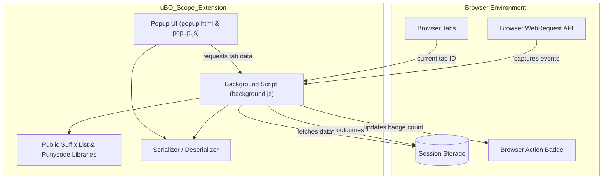

# System Architecture Overview

## Introduction

Understanding how uBO Scope operates behind the scenes empowers you to make the most out of its insights. This page details the internal structure and data flow of uBO Scope—from capturing network activity with background scripts to presenting connection details in the popup interface. By demystifying these relationships, you’ll grasp how the extension reliably reports third-party connections and why it can see what other tools might miss.

---

## Overview of uBO Scope Architecture

At its core, uBO Scope orchestrates a seamless collaboration between browser APIs, background scripts, persistent storage, and the user interface. Each component plays a distinct role in collecting, processing, and displaying real-time network request information.

### Key Components and Their Roles

- **Background Script (`background.js` or service worker):**
  - Acts as the central observer of all network requests.
  - Utilizes browser's `webRequest` API listeners to monitor requests’ outcomes — whether allowed, blocked, or redirected.
  - Maintains a session state that tracks connection details per browser tab.
  - Updates the toolbar badge dynamically to reflect the count of distinct third-party domains.
  - Persists session data and the public suffix list for accurate domain classification.

- **Popup UI (`popup.html` and `popup.js`):**
  - Fetches detailed data about the current active tab from the background.
  - Presents permitted, stealth-blocked, and blocked domains in clear sections.
  - Translates and displays internationalized domain names accurately.

- **Persistent Session Storage:**
  - Stores session information scoped per browser tab, ensuring data continuity while the browser is active.
  - Utilizes browser session storage APIs (`sessionRead` and `sessionWrite`) to efficiently serialize and deserialize data.

- **Utility Libraries:**
  - Public suffix list parsing and domain extraction to correctly group hostnames.
  - Punycode support for identifying internationalized domains.
  - Serializer utilities for compact representation of in-memory session state.

These components operate together within the boundaries and permissions set by the browser extension manifest, ensuring secure and performant measurements.

---

## How Data Flows in uBO Scope

The following workflow illustrates a typical user session from network request interception to UI display:

1. **Network Request Interception:**
   - Browser generates events for each network request happening inside a tab.
   - Background script listeners capture these events (`onBeforeRedirect`, `onErrorOccurred`, `onResponseStarted`).

2. **Processing Request Outcomes:**
   - Each event is queued and processed in batches to avoid performance bottlenecks.
   - Requests are analyzed for their type, status, and associated tab.
   - Outcomes are recorded into categorized maps (`allowed`, `blocked`, `stealth`) for domains and hostnames.

3. **Session State Update:**
   - Request outcomes update the session data structure keyed by tab ID.
   - Badge for the active tab is updated to show the number of distinct allowed third-party domains.
   - Session data is serialized and saved to persistent storage.

4. **Popup Data Retrieval:**
   - When the user opens the extension popup, the UI script requests the current tab’s recorded data.
   - Data is deserialized and rendered, grouping domain outcomes clearly.

5. **Domain Display & Metrics:**
   - Domains are shown in three distinct sections: not blocked (allowed), stealth-blocked (redirected), and blocked.
   - Counts per domain provide quick insight into connection frequency.

This flow ensures users have instant and trustworthy visibility into the remote server connections their active tabs attempt or complete.

---

## Manifest and Permissions: The Foundation 

uBO Scope declares necessary permissions to monitor web requests and manipulate UI elements:

- Access to all HTTP(s) URLs and WebSocket URLs (`host_permissions`) allows tracking a broad range of connections.
- Permissions like `webRequest` let the extension inspect and react to network events.
- Storage access ensures session persistence.
- The manifest declarations differ slightly per browser, accommodating platform specifics but consistently enabling core capabilities.

---

## Visualizing the Architecture

This diagram captures the distinct roles and data paths inside the extension, emphasizing tightly coordinated communication between components and browser APIs.

---

## Practical Tips for Users

- The toolbar badge always reflects how many distinct third-party domains your active tab successfully connected to. A lower number here generally indicates fewer third-party connections.
- Opening the popup reveals detailed domain outcome breakdowns, helping diagnose stealth or outright blocking by content blockers or network layers.
- The extension keeps data session-scoped by tab, so closing a tab removes its stored data and resets its badge count.

---

## Troubleshooting Common Questions

<AccordionGroup title="Troubleshooting and FAQs">
<Accordion title="Why don’t I see expected domains in the popup?">
- uBO Scope relies on the browser’s `webRequest` API, which excludes certain requests made outside its scope or before the extension loads.
- Ensure your browser supports and permits these APIs fully.
- Reload the page after installation to start fresh monitoring.
</Accordion>

<Accordion title="What does ‘stealth-blocked’ mean?">
- It indicates network requests that were redirected in ways that make them difficult for webpages to detect.
- This often results from stealthy content blockers or network filtering layers.
- These domains appear in the ‘stealth’ section to surface hidden activity.
</Accordion>

<Accordion title="Why is the badge count sometimes zero even though there are remote connections?">
- The badge counts distinct allowed third-party domains.
- If all connections are first-party or blocked, the count reflects that.
- Also, if the extension has newly started for a tab, it may take a moment to update.
</Accordion>
</AccordionGroup>

---

## Getting Started Preview

To dive deeper into how to install and interact with uBO Scope, consult these user-focused guides:

- [System Requirements](../../getting-started/setup-installation/requirements)
- [Installing uBO Scope](../../getting-started/setup-installation/installing)
- [Quick Walkthrough: Viewing Connections](../../getting-started/getting-using/quick-usage)

By understanding the architecture here, your exploration of usage flows and features will be grounded in why the extension functions reliably across tabs and network conditions.

---

By revealing the invisible — all remote server connections attempted or completed — uBO Scope relies on a purpose-built architecture designed for minimal impact and maximal insight. This page lays the groundwork for confident, informed use of its detailed connection reports and metrics.

---

_For source code reference, visit [uBO-Scope on GitHub](https://github.com/gorhill/uBO-Scope)_
