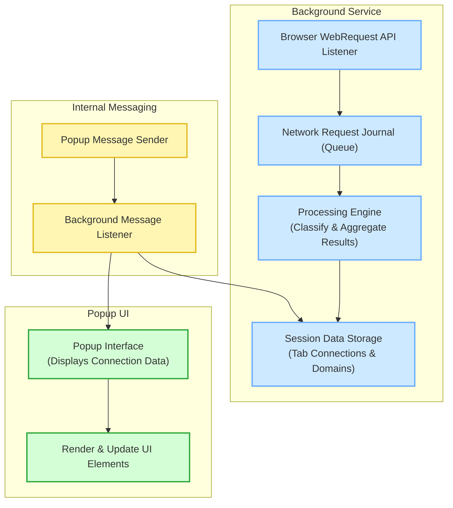

# System Architecture Overview

## Understanding How uBO Scope Monitors and Reports Network Activity

uBO Scope is designed to provide users with transparent, real-time visibility into their browser's network interactions. This page explains how the extension's system architecture works to monitor network requests, categorize connection outcomes, communicate data internally, and update the user interface dynamically.

---

## Core System Components

At a high level, uBO Scope consists of three main components, each fulfilling a critical role in the extension's workflow:

- **Background Monitoring Service**
- **User Interface Popup**
- **Internal Messaging and Data Serialization**

These components collaborate seamlessly to capture network request events, process them, and present meaningful insights to users.

---

## How uBO Scope Monitors Network Requests

The background service worker operates continuously behind the scenes, leveraging the browser's `webRequest` API to listen in on network activity relevant to web pages.

### Monitoring with WebRequest Listeners

- The extension subscribes to three types of network events:
  - **Redirections**(`onBeforeRedirect`)
  - **Errors**(`onErrorOccurred`)
  - **Successful responses**(`onResponseStarted`)

- All requests matched by manifest permissions (`https://*/*`, `http://*/*`, `wss://*/*`, `ws://*/*`) are observed.

### Capturing and Recording Connection Outcomes

Each network event is queued for processing in a journal to optimize performance and batch updates:

- A timer batches multiple events before processing, ensuring minimal impact on browser performance.
- Each event is classified as `allowed` (success), `blocked` (error), or `stealth` (redirect), then recorded by hostname and domain.

### Example Workflow

Suppose you navigate to a website:

1. The main page request triggers a reset of stored details for that tab.
2. Each subsequent resource request (images, scripts) is tracked.
3. Requests are classified based on their outcomes:
   - Successful resource loads are marked *allowed.*
   - Blocked resources due to content blocking or failures are marked *blocked.*
   - Redirected requests monitored under *stealth.*
4. Unique domains and hostnames per category are counted and stored.

---

## Categorizing and Aggregating Domain Data

The background process meticulously categorizes connections:

- **Allowed:** Domains from which resources successfully loaded.
- **Blocked:** Domains where network requests failed or were blocked.
- **Stealth:** Domains associated with redirects, indicating stealthy blocking or rerouting.

This classification aids users in understanding exactly which third-party domains are active or restricted.

The extension resolves raw hostnames to their *domain* using the public suffix list. This ensures proper grouping of related subdomains under a single recognizable domain entity, enhancing clarity.

---

## Real-Time Updates and User Interface Interaction

### The Popup View

When a user clicks the uBO Scope toolbar icon, the popup interface displays:

- The hostname and domain of the active browser tab.
- Counts of connected domains grouped by their respective outcome (allowed, blocked, stealth).
- Lists of domains with individual request counts for precise transparency.

### Communication Flow

- The popup requests tab-specific domain data by sending a message to the background service.
- The background service serializes the tab's domain information and returns it.
- The popup deserializes this information and renders it dynamically into the UI elements.

### User-Centric Benefits

This interaction design empowers users to:

- Instantly see how many and which domains their browser connected to per tab.
- Understand the effects of content blocking in real-time.
- Distinguish between domains that loaded content versus those blocked or stealthily redirected.

---

## System Architecture Diagram

---

## Technical Highlights

- **Efficient data management:** Network events are batched in a journal that produces regular snapshots for quick processing.
- **Accurate domain parsing:** Uses the Public Suffix List to derive effective domains from hostnames, avoiding misleading domain counts.
- **Robust storage:** Tab data is serialized and saved in session storage, persisting information across background service restarts.
- **Responsive UI:** Popup content updates reflect the latest network data per tab instantly on user demand.

---

## Practical Tips and Best Practices

- **Clearing data:** Closing a tab removes its connection data, keeping session data relevant and lightweight.
- **Understanding counts:** The badge count corresponds to unique allowed domains per active tab, highlighting real network reach.
- **Browser support:** The extension relies on browsers supporting the `webRequest` API, so some limited environments or browsers may not fully work.

---

## Troubleshooting Common Issues

<AccordionGroup title="Troubleshooting When Data Does Not Appear">  
<Accordion title="Popup Shows No Domain Data for Active Tab">You may experience the popup showing "NO DATA" if the background service has not yet received network events for the tab. Try reloading the tab to trigger new requests or verify that the extension has required permissions granted.</Accordion>  
<Accordion title="Badge Count Appears Stuck or Unchanged">Data aggregation happens asynchronously and is batched every second. Temporary delays can occur. If badge counts do not update, ensure the browser supports the `webRequest` API and there are no browser restrictions preventing event capture.</Accordion>  
<Accordion title="Incorrect Domain Grouping or Counts">The extension relies on an up-to-date Public Suffix List to derive domains from hostnames. Occasional mismatches can occur if the list isn't loaded correctly. Restarting the browser or the extension can reload the list properly.</Accordion>
</AccordionGroup>

---

## Summary

uBO Scope’s system architecture is built around continuous network request monitoring, efficient classification and aggregation of third-party domain interactions, and a responsive user interface. By combining the browser’s native `webRequest` API with structured background processing and instantaneous popup display, users gain unparalleled insight into how their browsing activity reaches remote servers, supporting better privacy awareness and control.

For comprehensive details on how to navigate and interpret the information presented, refer next to the [Popup Overview](../quickstart-feature-tour/popup-overview) and [Interpreting the Toolbar Badge Count](../quickstart-feature-tour/interpreting-badge-count) documentation pages.

---

## Related Internal Links

- [What is uBO Scope?](../introduction-product-value/what-is-ubo-scope)
- [Why Use uBO Scope?](../introduction-product-value/value-proposition)
- [Core Concepts and Terminology](../architecture-concepts/core-terminology)

---

## Source Code

The primary background monitoring logic can be explored in the [js/background.js](https://github.com/gorhill/uBO-Scope/blob/main/js/background.js) file, and the popup UI rendering logic lives in [js/popup.js](https://github.com/gorhill/uBO-Scope/blob/main/js/popup.js).

---

## Next Steps

- Install and enable uBO Scope in your browser if you haven’t already.
- Explore the popup interface to view real-time tab connection summaries.
- Dive into related documentation to understand badge counts and advanced usage.

---

_Take control of your browsing data visibility with uBO Scope’s transparent, real-time architecture._