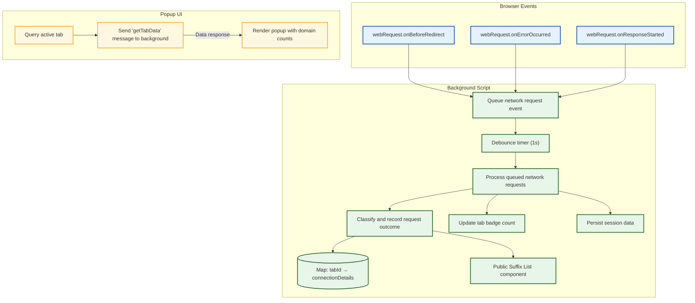

# System Architecture Overview

## Understand How uBO Scope Works Inside Your Browser

uBO Scope operates seamlessly behind the scenes in your browser, offering precise visibility into all remote server connections made by web pages you visit. This page demystifies the architecture, illustrating how network requests flow through webRequest listeners, how data is managed in the extension's background processes, and how this data is presented in real time through the popup UI. Gain clarity on each architectural component to appreciate how uBO Scope delivers accurate, actionable insights.

---

## Core Architecture and Workflow

At its heart, uBO Scope leverages the browser's `webRequest` API to monitor network activity as it happens. Here's the user-centric flow:

1. **Network Requests Intercepted:** The extension’s background script listens to network events such as redirects, errors, and successes for all HTTP, HTTPS, WS, and WSS requests matching your browser's permissions.

2. **Outcome Categorization:** Each request is analyzed and classified as **allowed (not blocked)**, **stealth-blocked (redirected subtly)**, or **blocked (failed requests)**. This classification is crucial to accurately reflect how many third-party domains your browser connects with.

3. **Per-Tab Data Aggregation:** Details are aggregated on a per-tab basis, tracking distinct hostnames and domains involved in network requests, grouped by their outcome category.

4. **Persistent Session Management:** The extension stores this aggregated data temporarily in the browser's session storage, ensuring information remains accurate during your browsing session and across tab reloads.

5. **Badge Update & Popup Display:** The count of distinct third-party domains connected to per tab is dynamically updated as a badge on the extension’s toolbar icon. When opened, the popup UI shows detailed breakdowns of allowed, stealth-blocked, and blocked domains associated with the active tab.

This architecture ensures users get timely and precise feedback about the remote connections their browser is making on a tab-by-tab basis.

---

## Key Components Explained

### 1. Background Script (Core Data Processor)
- Acts as the brain of uBO Scope.
- Listens for network events using `webRequest.onBeforeRedirect`, `onErrorOccurred`, and `onResponseStarted`.
- Maintains a session-wide map of tab IDs to detailed connection data.
- Aggregates hostnames and domains, tracking their occurrence counts in allowed, stealth, and blocked categories.
- Persists session data to browser storage, and loads it on startup.

### 2. Session Data Store
- Uses session storage via the browser API to save state between page loads.
- Stores a structured record of network outcomes per tab for quick retrieval and update.

### 3. Public Suffix List Integration
- Utilizes the [Public Suffix List](https://publicsuffix.org/) through a bundled library to accurately extract registered domains from hostnames.
- This precision helps avoid inflating connection counts caused by subdomain variations.

### 4. Popup UI
- When you click the extension icon, the popup communicates with the background script to fetch the current tab’s data.
- Displays a curated, categorized list of domains along with connection counts.
- Utilizes domain name decoding for internationalized domain names for clarity.

### 5. Browser API Permissions
- Requires permissions like `webRequest`, `storage`, and `activeTab` which enable it to monitor traffic and maintain state.

---

## Processing Workflow Illustrated

---

## Practical Story: How uBO Scope Tracks a Network Request

Imagine you open a news website in a new browser tab.

- As the page loads, your browser starts several network requests — loading images, scripts, and stylesheets.
- uBO Scope listens to each request's life cycle:
  - When a request redirects, uBO Scope notes it as a stealth connection.
  - If a request fails (blocked), it records it appropriately.
  - If a request succeeds, it adds the connected domain to the "allowed" collection.

All this data is stored in the background linked to the tab. The toolbar badge instantly updates to show how many distinct third-party domains were contacted successfully. Click the extension icon, and the popup breaks down each domain by category — allowing you to precisely understand your network exposure on that tab.

---

## Tips & Best Practices

- **Browser Compatibility:** uBO Scope is designed for Chromium, Firefox, and Safari, each using tailored manifests and background scripts to maximize compatibility.
- **Domain Aggregation:** The use of the Public Suffix List means domains like `cdn.example.co.uk` are correctly counted as a single domain (`example.co.uk`), preventing misleading duplicate counts due to subdomains.
- **Performance:** Network events are batched and processed every second to reduce performance overhead.
- **Persistence:** Data persists for your current session but resets when you close the browser — ensuring relevant, fresh data without clutter.

---

## Troubleshooting Common Issues

<AccordionGroup title="Handling Common Problems with uBO Scope's Architecture">
<Accordion title="Network Events Not Appearing in Popup">
Ensure the browser gives uBO Scope sufficient permissions (`webRequest`, `activeTab`, `storage`). Without these, the extension cannot monitor traffic or fetch data for the popup.
</Accordion>
<Accordion title="Badge Counts Not Updating in Real-Time">
Badge updates occur after a brief debounce timer (1 second) to batch requests efficiently. If counts lag, confirm your browser version supports the required APIs fully.
</Accordion>
<Accordion title="Inaccurate Domain Counts or Missing Domains">
The Public Suffix List may fail to load on rare occasions; the extension retries loading it on startup. Ensure network connectivity to fetch this list. Additionally, if network requests occur outside the coverage of the `webRequest` API (like some browser-internal requests), they may not be reported.
</Accordion>
</AccordionGroup>

---

## Next Steps

- Explore the [Core Concepts & Terminology](/overview/architecture-concepts/core-terminology-concepts) page to deepen your understanding of how uBO Scope labels and processes network events.
- Start with [Installation Instructions](/getting-started/installation-and-setup/installation-instructions) to add uBO Scope to your browser.
- Refer to the [Popup UI Guide](/overview/feature-glance-integration) for maximizing your daily use of uBO Scope insights.

---

## Further Reading
- uBO Scope GitHub Repository: [https://github.com/gorhill/uBO-Scope](https://github.com/gorhill/uBO-Scope)
- Public Suffix List: [https://publicsuffix.org/](https://publicsuffix.org/)

---

This overview clarifies the structural flow within uBO Scope, emphasizing user outcomes by visualizing how browsing network requests are intercepted, analyzed, stored, and conveyed with clarity.

---