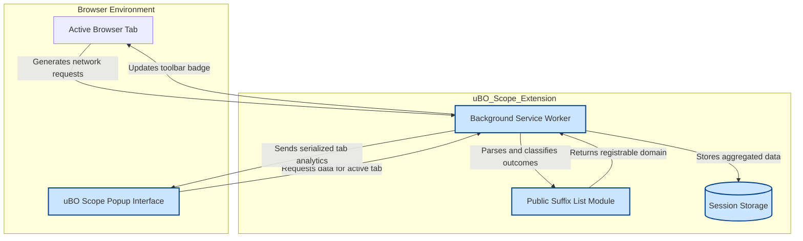

# How uBO Scope Works (System Architecture)

Unlocking full transparency into your browser’s network activity starts with understanding how uBO Scope tracks, processes, and presents data. This page guides you through the architecture that powers uBO Scope — from behind-the-scenes monitoring of network requests using the browser's webRequest API to the real-time analytics delivered interactively in the popup interface.

---

## At a Glance: What uBO Scope Monitors and How

uBO Scope centers on capturing **all remote server connection attempts** initiated by your active browser tab. These connections fall into three outcome categories:

- **Allowed:** Connections successfully made to third-party servers.
- **Stealth-blocked:** Requests redirected or stealthily blocked by content blockers.
- **Blocked:** Requests explicitly denied or failed.

Using the browser's `webRequest` API, uBO Scope listens to the lifecycle events of each network request, identifies its outcome, and organizes this telemetry on a per-tab basis. This approach ensures **unbiased, comprehensive visibility** that transcends the limitations of any single content blocker.

---

## Core Components and Data Flow

### 1. Background Service Worker

The engine of uBO Scope is its background service worker script, which:

- Registers listeners to browser network events including redirects, errors, and response starts.
- Processes incoming network request details in batches to optimize performance.
- Maintains up-to-date mappings of network outcomes keyed by active tab identifiers.
- Persists session data (using browser's `storage.session`) for reliability across tab reloads.
- Updates the toolbar icon badge dynamically to reflect the current count of distinct third-party domains allowed.

### 2. Public Suffix List Integration

Determining user-relevant domain groups requires accurately extracting **registrable domains** from full hostnames. uBO Scope leverages a high-performance JavaScript implementation of Mozilla’s Public Suffix List:

- This component identifies the "public suffix" (e.g., `.com`, `.co.uk`) of each hostname.
- The remaining domain portion extracted guides aggregation of allowed, stealth, and blocked domains.
- Domain grouping helps users understand the bigger picture by consolidating granular hostname details.

### 3. Popup Interface

The popup serves as a live dashboard delivering:

- A clear summary of connected domains grouped by outcome (allowed, stealth, blocked).
- Counts and domain names rendered in easy-to-scan lists.
- Interactive experience powered by popup JavaScript which requests and decodes session data from the background.

This UI enables users to instantly comprehend the scope of third-party connections affecting their current browsing context.

### 4. Communication Between Popup and Background

The popup and background communicate over runtime messaging:

- Popup requests aggregated connection data for the currently active tab.
- Background retrieves, serializes, and returns the latest tab-specific network analytics.
- Popup processes this data to render the domain lists and summary.

---

## Detailed Data Flow (Step-by-Step)

<Steps>
<Step title="Network Requests Start">
The background service worker listens to the following webRequest events across all active tabs:
- `onBeforeRedirect`
- `onErrorOccurred`
- `onResponseStarted`

Each event provides the raw HTTP request details and outcome indicators.
</Step>
<Step title="Queue Network Events">
Upon capturing an event, it is queued in an internal journal. This batching approach avoids excessive processing and optimizes extension responsiveness.
A 1-second timer groups multiple requests together before processing.
</Step>
<Step title="Process Network Journal">
When timer elapses, the journaled events are processed:
- Requests are analyzed to classify the outcome (allowed, stealth, blocked).
- Hostnames are parsed, and domains are extracted using the public suffix list.
- The session data per tab is updated with cumulative counts of distinct hostnames and domains per outcome.
</Step>
<Step title="Update UI Badge">
The count of distinct allowed third-party domains for each tab is reflected on the toolbar icon's badge.
This provides an immediate visual indicator of third-party exposure during browsing.
</Step>
<Step title="Persist Session Data">
Session data containing tab-specific network activity is serialized and stored in session storage to survive tab reloads and browser restarts.
</Step>
<Step title="Popup Requests Tab Data">
When the user opens the popup, it sends a runtime message requesting the latest tab analytics.

The background responds with serialized session data for that tab.
</Step>
<Step title="Popup Renders Analytics">
The popup’s JavaScript decodes this data and organizes it into:
- Allowed domains with connection counts.
- Stealth-blocked domains with counts.
- Blocked domains with counts.

This structured view equips the user with a transparent understanding of all network activity.
</Step>
</Steps>

---

## Engineering Insights: Why This Architecture Matters

- **Comprehensive Coverage:** By hooking into the `webRequest` API, uBO Scope captures requests irrespective of the active content blocker or DNS filtering, ensuring transparency.

- **Per-Tab Scoping:** Grouping data by tab reflects the user experience accurately, avoiding confusion across different browsing contexts.

- **Optimized Performance:** Batching network events and session persistence ensure smooth operation despite potentially high request volumes.

- **Domain Grouping with Public Suffix List:** Accurately aggregates hostnames to meaningful domain units, simplifying threat surface analysis.

- **Asynchronous Messaging Pattern:** Decouples background processing from UI rendering for responsiveness and reliability.

---

## Visualizing uBO Scope's Architecture

Here is a Mermaid.js flowchart presenting the main components and data flow:

---

## Practical Tips

- The badge count reflects the number of **distinct allowed third-party domains**, making a lower number generally preferable.
- Not all third parties are bad; content delivery networks (CDNs) typically register as legitimate and common domains.
- Because uBO Scope monitors all network activity regardless of blocking method, it debunks myths about block counts and ad blocker tests.
- Closing a tab cleans up its stored session data automatically, ensuring memory efficiency.

---

## Troubleshooting Common Issues

<AccordionGroup title="Common Troubleshooting Tips">
<Accordion title="Why is the count on the badge different from my content blocker's block count?">
The badge counts **distinct 3rd-party domains actually connected to**, not just the number of blocked requests. High block counts can coexist with high allowed domain counts because blockers can behave stealthily or differently. Use uBO Scope’s full data to get objective insights.
</Accordion>
<Accordion title="What happens if a network request isn't reported?">
Requests made outside the browser's `webRequest` API scope (e.g., low-level browser components) cannot be detected by uBO Scope. This is a technical browser limitation.
</Accordion>
<Accordion title="Why sometimes domains appear under 'stealth-blocked'?">
These denote requests that were redirected or blocked stealthily by existing content blockers, unseen by usual detection methods. This classification helps reveal hidden blocking.
</Accordion>
</AccordionGroup>

---

## Next Steps

Explore related documentation to deepen your understanding and leverage the full potential of uBO Scope:

- [What is uBO Scope?](../introduction-value/product-intro) — understand the product’s core benefits and user scenarios.
- [Why Use uBO Scope?](../introduction-value/value-proposition) — dive into the value it brings above other tools.
- [Quick Feature Overview](../feature-usecases/feature-overview) — discover features available to you.

For hands-on usage, proceed to installation guides and quick launch tutorials in the Getting Started section.

---

## Additional Resources

- GitHub repository: [https://github.com/gorhill/uBO-Scope](https://github.com/gorhill/uBO-Scope)
- Browser Install Links:
  - Chrome: [Chrome Web Store](https://chromewebstore.google.com/detail/ubo-scope/bbdpgcaljkaaigfcomhidmneffjjjfgp)
  - Firefox: [Firefox Add-ons](https://addons.mozilla.org/firefox/addon/ubo-scope/)

---

This architectural walkthrough empowers you to not just use uBO Scope, but truly understand how it provides unparallelled network transparency inside your browser.