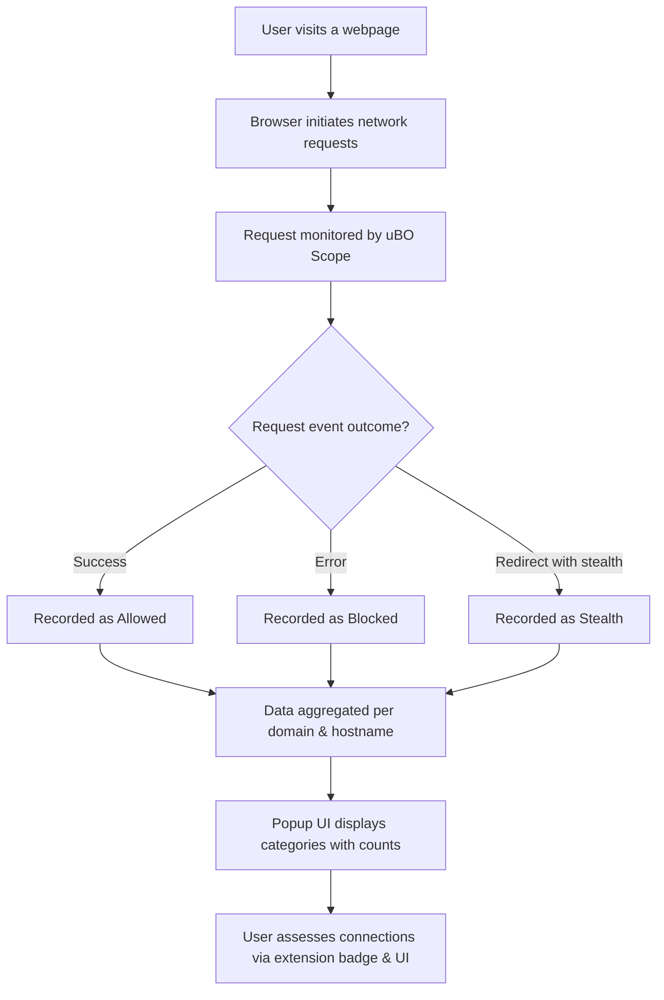

# Core Concepts & Terminology

Get acquainted with the essential language of uBO Scope to develop confidence and precision when using this extension. This page explains what third-party remote servers are, what the terms **allowed**, **blocked**, and **stealth** outcomes mean in the context of connection reporting, and how uBO Scope categorizes and visualizes connection data. Understanding these core concepts empowers you to interpret the extension's reports and make informed decisions about your browsing privacy.

---

## Understanding Third-Party Remote Servers

When you visit a webpage, your browser often reaches out to various remote servers to fetch content. These servers can be grouped into:

- **First-party servers:** The main domain related directly to the website you are visiting.
- **Third-party remote servers:** Domains not controlled by the website you are browsing but used to deliver additional resources such as advertisements, trackers, social media widgets, or content delivery networks (CDNs).

uBO Scope focuses primarily on monitoring these **third-party remote servers** — revealing all their attempted or successful connections regardless of content-blocker settings.

> **Why third parties matter:** Connections to third-party servers can impact your privacy and security. uBO Scope helps you see which third parties your browser interacts with, enabling you to better understand how your data flows across the web.

---

## What Do "Allowed", "Blocked", and "Stealth" Outcomes Mean?

uBO Scope tracks the fate of every network request initiated by the webpages you visit and categorizes them into three clear outcomes:

### Allowed (not blocked)

Network requests that were permitted and completed successfully—these are connections your browser made to remote servers and received responses.

- Represents domains from which resources were fetched.
- The badge count for uBO Scope shows the total number of *distinct* third-party domains allowed.

### Blocked

Requests that were prevented from reaching remote servers. A request is marked as blocked when it encounters an error indicative of content blocking.

- These include cases where your content blocker or DNS-based blocking stopped the request.
- They signify an attempted connection that did not proceed.

### Stealth

Requests redirected or handled so they appear invisible to the original page's scripts, often part of stealthy blocking techniques.

- These connections are neither outright allowed nor simply blocked; instead, they are hidden in a way that webpages cannot easily detect the block.
- Stealth blocking is essential for avoiding page breakage or detection by anti-adblock mechanisms.

> Unlike typical blocker counters, uBO Scope discloses these three outcome categories for every connection attempt — independently of any content blocker’s internal count.

---

## How uBO Scope Categorizes and Visualizes Connection Data

uBO Scope organizes connection details by:

- **Domain:** The base domain of the remote server (e.g., `example.com`), grouping all related hostnames.
- **Hostname:** The full hostname of the server (e.g., `cdn.images.example.com`).

This allows you to see both the breadth and depth of third-party connections.

### Data Presentation in the Popup UI

The UI divides connection data into three sections based on outcome:

- **Not blocked (Allowed):** Lists all domains with allowed connection counts.
- **Stealth-blocked:** Lists domains with stealth blocking counts.
- **Blocked:** Lists domains with blocked connection counts.

Each domain entry shows the count of connections during the page visit, offering a detailed view over mere totals.

### Example Scenario

Imagine visiting a news site:

- uBO Scope shows `cdn.examplecdn.com` listed under Allowed with a count of 5, meaning 5 connections were made to this third-party CDN.
- `ads.adserver.com` appears under Blocked with a count of 3, indicating 3 ad calls were blocked.
- `tracker.hiddentech.net` shows in Stealth with 2 stealth connections, revealing hidden attempts the page concealed.

The total count of distinct third-party domains connected (allowed) is shown on the extension badge, helping you quickly assess your exposure.

---

## Essential Terms and Flow of Connection Outcomes

Here is a simplified user-centric flow of how connection data is recorded and categorized:

1. A network request is initiated by a webpage or script.
2. uBO Scope monitors this request via browser network APIs.
3. The request culminates in one of these events:
   - **Success:** Request successfully connected (`Allowed`).
   - **Error:** Request was blocked or failed (`Blocked`).
   - **Redirect to a stealth-blocked URL:** Request is considered stealth-blocked (`Stealth`).
4. The request's domain and hostname are recorded along with the outcome.
5. The popup UI aggregates this data per tab, showing domains and connection counts under each outcome.

This process ensures a comprehensive and user-focused picture of which third-party servers your browser interacts with, regardless of content blockers or DNS filters.

---

## Practical Tips for Interpreting uBO Scope Data

- **Lower allowed domains count means fewer third-party connections were successfully made, reflecting stricter or more effective blocking.**
- **A high block count alone is not enough to conclude better blocking; focus on the allowed domain count to gauge exposure.**
- **Stealth outcome presence indicates advanced blocking techniques to hide from webpages, which may help avoid detection or breakage.**
- **Not all third-party servers are harmful; some are essential infrastructure like CDNs. Use your judgment to assess which domains are trustworthy.**

---

## Troubleshooting and Common Questions

<AccordionGroup title="Common Questions About Outcomes and Terminology">
<Accordion title="Why does the number on the badge not match the number of blocked requests?">
The badge count reflects the number of distinct third-party domains that were connected successfully (Allowed), not the number of blocked requests. A high block count can coexist with a high or low allowed domain count. Focus on allowed domains to understand your real exposure.
</Accordion>

<Accordion title="What does stealth blocking mean and is it common?">
Stealth blocking ensures that blocked requests appear invisible to webpage scripts, helping prevent anti-adblock detection and page breakage. uBO Scope explicitly tracks these and separates them from classic blocked outcomes to provide a full picture.
</Accordion>

<Accordion title="How does uBO Scope determine the domain of a hostname?">
uBO Scope uses a public suffix list to correctly identify the base domain from any hostname, so counting is accurate and consistent.
</Accordion>

<Accordion title="Why might some network requests not appear in uBO Scope?">
uBO Scope relies on the browser's webRequest API. Requests made outside this API’s scope, such as some types of WebSocket traffic or browser internal network calls, may not be captured.
</Accordion>

</AccordionGroup>

---

## Related Concepts and Next Steps

After mastering these fundamental concepts and terminology, explore these adjacent documentation pages to deepen your practical understanding:

- [System Architecture](/overview/architecture-core-concepts/system-architecture) — Understand how uBO Scope components work together.
- [Feature Overview & Quickstart](/overview/architecture-core-concepts/feature-overview) — See how these concepts appear in real usage.
- [Interpreting Allowed, Blocked, and Stealth Outcomes](/guides-main/everyday-use-patterns/interpreting-request-outcomes) — Learn how to practically use outcome data.


## Summary
This page equips you with crucial language and concepts to interpret uBO Scope’s network connection reports accurately. By understanding third-party servers and the distinctions between allowed, blocked, and stealth outcomes, you can confidently leverage uBO Scope to enhance your browser privacy awareness and content blocking validation.

---

## Visual Diagram: Connection Outcome Flow



---

## Code Snippet: Simplified Outcome Recording Logic

```javascript
function recordOutcome(tabId, request) {
  const { url, event } = request;
  const hostname = getHostnameFromUrl(url);
  switch (event) {
    case 'success':
      addToAllowed(tabId, hostname);
      break;
    case 'error':
      addToBlocked(tabId, hostname);
      break;
    case 'redirect':
      addToStealth(tabId, hostname);
      break;
  }
  updateBadgeCount(tabId);
}
```

This pseudocode illustrates how uBO Scope classifies each request outcome by domain and updates the UI badge accordingly.

---