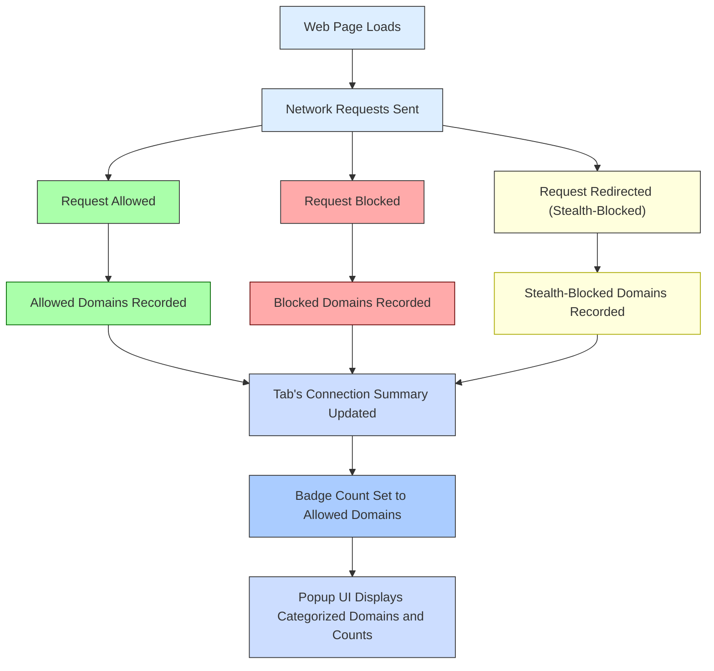

# Core Features & Key Terminology

Understanding the core features and key terminology of uBO Scope is essential to unlocking the full value of this privacy-focused extension. This page demystifies the main concepts such as domains, the distinctions between allowed, blocked, and stealth-blocked connections, the badge count displayed on your browser toolbar, and the network request outcomes that power the extension’s insights. All these terms are directly linked to user-facing features you will interact with.

---

## What You Need to Know About Domains and Hostnames

At the heart of uBO Scope’s reporting are two fundamental identifiers:

- **Hostname**: The full internet address of a server, such as `images.example.com`. This is taken directly from the URL of network requests.

- **Domain**: The registered or registrable domain derived from the hostname, for example, `example.com`. This is a higher-level entity that groups related hostnames under a single recognizable entity.

uBO Scope intelligently derives domains from hostnames using the Public Suffix List, ensuring accurate grouping of network requests. This distinction helps users understand whether multiple hostnames belong to the same third party or different entities.

<Tip>
Knowing the difference between hostname and domain empowers you to interpret the extension’s data correctly. The badge count reflects unique domains connected, not individual hostnames.
</Tip>

## Allowed, Blocked, and Stealth-Blocked Connections

uBO Scope categorizes network connections into three user-centric outcomes:

- **Allowed**: These network requests successfully connected to remote third-party servers without being blocked.

- **Blocked**: These requests were explicitly blocked by the content blocker or other network policies.

- **Stealth-Blocked**: These represent requests that were redirected or silently blocked in a way that avoids detection by the website. This stealth blocking helps maintain privacy without breaking site functionality but is still reported by uBO Scope.

Each category provides users with transparent visibility into their browsing exposure to third-party servers.

<AccordionGroup title="Detailed Terminology">
<Accordion title="Allowed Connections">
Allowed connections are those successfully established with third parties. These are the connections that actually delivered resources to the browser.

For example, when loading a website that uses a CDN like `cdn.example.com` to serve images, these connections will be listed as allowed.
</Accordion>
<Accordion title="Blocked Connections">
Blocked connections are stopped by your content blocking settings or browser security policies. These prevent resource loading from specified third-party domains.

For example, popup ads or tracking scripts hosted on known advertising domains may be blocked.
</Accordion>
<Accordion title="Stealth-Blocked Connections">
Stealth-blocked connections are silently redirected or blocked to prevent the site from detecting the block. This technique enhances privacy while minimizing site breakage.

For example, certain tracking requests may fall under this category when the blocker uses stealth techniques to avoid detection.
</Accordion>
</AccordionGroup>

## Badge Count: What Does It Represent?

The numeric badge on the browser toolbar icon shows the **number of distinct third-party domains for which connections were allowed** during browsing. This count is a direct indicator of your exposure to external servers.

- A lower badge count means fewer third parties are connected, typically implying better privacy.
- A high count indicates many third-party domains are contacted, which might raise privacy concerns.

<Warning>
The badge count does **not** reflect the number of blocked requests. It tracks the allowed domains only. Use this count as a privacy metric rather than a block reliability indicator.
</Warning>

## Network Request Outcomes Explained

uBO Scope listens to network request lifecycle events via the browser's `webRequest` API and classifies requests into three main outcomes:

| Outcome    | Description |
| ---------- | ----------- |
| **Success** | The network request was completed successfully, and the resource was loaded. Counts toward allowed connections. |
| **Redirect** | The request was redirected to another URL. These often count as stealth-blocked connections since the redirection can be used to neutralize tracking attempts. |
| **Error** | The request failed to complete, typically due to blocking by content blockers or network errors. Counts as blocked connection. |

These outcomes directly update the categorized connection lists and affect the data shown in the popup panel.

## How These Concepts Reflect in the User Interface

When you open uBO Scope's popup panel, you will see sections corresponding to these outcomes:

- **Not Blocked**: Shows domains with allowed connections counted.
- **Stealth-Blocked**: Displays domains for which requests were silently redirected or stealth-blocked.
- **Blocked**: Contains the domains where requests were actively blocked.

Each section breaks down by domain name along with a count of connection occurrences.

<Steps>
<Step title="Open uBO Scope Popup">
Click the extension icon in your browser toolbar to open the popup.
</Step>
<Step title="Understand Summary">
See the total number of connected domains indicated in the summary at the top.
</Step>
<Step title="Review Sectioned Lists">
Browse through 'not blocked', 'stealth-blocked', and 'blocked' domains with counts.
</Step>
</Steps>

## Best Practices and Common Pitfalls

- **Focus on Domains, Not URLs**: Since many hostnames can exist for a single domain, focusing on unique domains provides clearer insight into third-party exposure.

- **Interpret Stealth-Blocked Carefully**: Because stealth blocking avoids site breakage, these won’t appear as traditional blocked requests but still represent privacy protection.

- **Badge Count as Privacy Gauge**: Use the badge count as your primary privacy indicator rather than simply block counts or errors.

- **Page Reloads Update Data**: The data you see reflects current page connections; navigating or refreshing updates the counts and domains.

<Info>
Regularly review your popup data to stay aware of evolving third-party connections as you browse different sites.
</Info>

## Summary Diagram: Data Flow and User Connection Categorization

## Troubleshooting Common Questions

<AccordionGroup title="FAQs on Core Terminology">
<Accordion title="Why does the badge count only include allowed domains?">
The purpose is to show how many third-party servers your browser actually connected to, which directly impacts privacy exposure. Blocked domains are useful to know but do not represent your real data flow.
</Accordion>
<Accordion title="What is a stealth-blocked connection, and how is it different from blocked?">
Stealth-blocked connections are those silently neutralized (usually via redirection) so websites do not detect the blocking. This avoids breaking websites but still protects your privacy.
</Accordion>
<Accordion title="How is the domain extracted from a hostname?">
The extension uses the Public Suffix List to accurately determine the registered domain from any hostname (e.g., subdomains are grouped under the main domain).
</Accordion>
<Accordion title="Can I trust these connection counts if I use different blockers?">
Yes. uBO Scope relies on the browser's `webRequest` API, so it reports network outcomes regardless of which content blockers you use or if blocking happens via DNS or other methods.
</Accordion>
</AccordionGroup>

## Next Steps

To see these concepts in action and understand how to use the popup panel effectively, refer to the guide on [Understanding the Popup Panel](/guides/core-workflows/understanding-the-popup). For more technical insight into how these features operate behind the scenes, explore the [System Architecture & Data Flow](/overview/architecture-core-concepts/system-architecture-overview).

---

##### Additional Resources
- [What is uBO Scope?](/overview/introduction-core-value/what-is-ubo-scope)
- [System Architecture & Data Flow](/overview/architecture-core-concepts/system-architecture-overview)
- [Understanding the Popup Panel](/guides/core-workflows/understanding-the-popup)

---