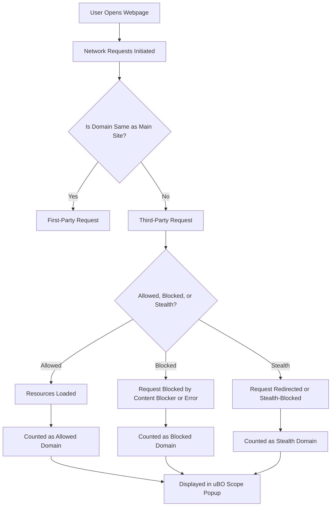

# Core Concepts & Terminology

Welcome to the foundational guide for understanding the essential concepts and vocabulary powering uBO Scope. This page equips you with the key terms and ideas you must grasp to effectively interpret the extension's reporting and analysis.

---

## What Is a Distinct Third-Party Remote Server?

At the heart of uBO Scope's reporting lies the concept of a _distinct third-party remote server_. When you visit a website, your browser fetches content not only from the site's primary domain but also from other servers—these are third-party remote servers.

- **Third-Party Remote Server**: Any server with a domain different from the one you're visiting hosting content or services your browser requests.
- **Distinct**: uBO Scope counts each unique third-party domain only once, helping you see the breadth of different external connections rather than the total number of requests.

The badge count you see on the uBO Scope icon reflects the number of these unique third-party domains contacted. A lower count signals fewer external connections, often indicating tighter privacy and security.

## Network Requests: Tracking Every Connection

uBO Scope listens to network activity through the browser's native `webRequest` API. It captures every network request a page tries to make, recording the full set of interactions your browser attempts with remote servers, including:

- Requests that _succeed_ and load content.
- Requests that are _blocked_ or _failed_.
- Requests that are _redirected_, potentially obscuring their final destination.

This extensive visibility means uBO Scope sees the actual outcome of network traffic regardless of whether you have a content blocker active or whether blocking happens at the DNS level. However, it only observes requests reported by the browser’s `webRequest` API—requests made outside this scope are invisible to the extension.

## Allowed vs. Blocked Domains

uBO Scope categorizes observed third-party connections into three outcome buckets:

1. **Allowed** (`not blocked`): Domains for which network requests successfully fetched resources.
2. **Blocked**: Domains where requests were prevented from completing, either by your content blocker or by network errors.
3. **Stealth-Blocked**: Domains involved in redirections or subtle blocking techniques designed to avoid user-facing block notifications but registered by uBO Scope.

These distinctions help you understand not just if a connection exists but also the degree to which connections are managed or hidden by blocking tools.

## What Are Stealth Requests?

Some content blockers implement stealth techniques to block resources without fully aborting the network request in a way detectable by webpages. These stealth approaches aim to minimize webpage breakage and avoid detection by scripts.

uBO Scope detects these by observing network redirections or abnormalities flagged in the request lifecycle, labeling these attempts as `stealth` in the extension UI and reports.

## The Role of the Browser's webRequest API

The `webRequest` API is the critical browser interface uBO Scope uses to observe and analyze network traffic:

- It intercepts lifecycle events like request initiation, redirects, errors, and completion.
- uBO Scope attaches listeners to these events to track each request's outcome per browser tab.
- Because this API is fundamental, your browser and its version affect what uBO Scope can report.

All network observations reported by uBO Scope are grounded in data gathered from this API, providing authoritative insight into network activity.

---

## How These Concepts Shape Your Experience

Imagine you're browsing `example.com`:

- Your browser may request content from `example.com` itself and additional resources from `cdn.example.net`, `analytics.tracker.org`, and `ads.adserver.com`.
- uBO Scope counts these as _distinct third-party remote servers_ if their domains differ from `example.com`.
- If `ads.adserver.com` is blocked by your content blocker, uBO Scope categorizes it under _blocked_.
- If `analytics.tracker.org` employs stealth blocking, that domain appears under _stealth-blocked_.
- Domains delivering essential content like `cdn.example.net` show under _not blocked_.

This transparent categorization allows you to gauge tracking exposure, filtering effectiveness, and real third-party loads.

## Practical Tips

- **Keep an eye on badge counts:** A sudden increase may signal new trackers or unexpected third-party services.
- **Review stealth-blocked domains:** They might indicate hidden tracking attempts or subtle background connections.
- **Understand legitimate third parties:** Not all external connections are harmful; CDNs and essential services often use third-party servers.
- **Use uBO Scope alongside your blocker:** It provides an independent measure of what connections truly occur beyond blocker statistics.

## Common Pitfalls to Avoid

- Do _not_ rely on block count metrics alone to judge privacy; a high block count can coexist with a higher number of distinct third-party servers.
- Avoid trusting ad blocker test sites as they use contrived requests that don't reflect real-world traffic and stealth techniques.
- Remember uBO Scope reports only on the `webRequest` API events; some requests made outside this scope may not appear.

---

## Summary Diagram: Understanding Connection Outcomes

---

Explore these core concepts to effectively interpret every detail uBO Scope offers about your browsing privacy and security. From first-party to stealth requests, this terminology forms the lens through which all reports are viewed.

---

For practical usage and deeper insight, see the related documentation:

- [What is uBO Scope?](../introduction-value/product-overview)
- [Understanding Domain Connectivity and Badge Counts](../../guides/interpreting-results/understanding-results)
- [Using uBO Scope for Privacy and Filter Evaluation](../../guides/interpreting-results/privacy-assessment)

Visit the [System Architecture](../architecture-core-concepts/system-architecture) page to understand how these concepts map to the underlying extension components.

Access the extension's source and implementation details on [GitHub](https://github.com/gorhill/uBO-Scope).
