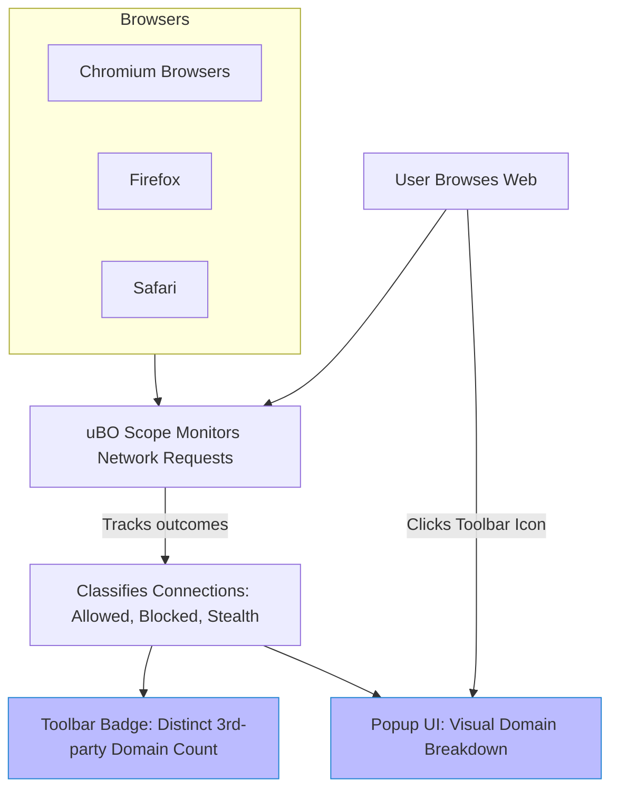

# Features at a Glance

Discover the core capabilities of **uBO Scope**, designed to give you instant, clear insights into your browser’s third-party network connections. This page previews the extension's main features—each crafted to enhance your understanding and control over what connects behind the scenes during your web browsing sessions.

---

## Instant Third-Party Server Reporting

uBO Scope continuously monitors network activity and immediately reports on all third-party servers your browser interacts with. Rather than waiting or manually digging through network logs, you see a real-time snapshot of which remote servers have established connections, helping you uncover tracking and other hidden network calls instantly.

**How it works for you:**
- No setup or configuration is needed to start seeing server connection details.
- All connection outcomes—allowed, blocked, or stealth-blocked—are carefully tracked and displayed.
- Supports accurate detection even when content blockers use stealth techniques.

## Toolbar Badge Count Summary

Right on your browser’s toolbar, uBO Scope communicates the number of distinct third-party domains connected for the active tab. This badge count gives you a quick privacy health check at a glance.

**Benefits:**
- Quickly evaluate how “heavy” your page is with third-party connections.
- Use the count to compare the effectiveness of different content blockers or privacy settings.
- A lower badge count directly relates to improved privacy and less exposure.

## Visual Domain Breakdown in Popup

Clicking the toolbar icon opens a clean, intuitive popup breaking down third-party connections by outcome category:

- **Not Blocked:** Domains successfully connected.
- **Stealth-Blocked:** Connections that were blocked in ways hidden from most detection methods.
- **Blocked:** Domains explicitly blocked by browser or extensions.

For each domain listed, you see how many connections occurred, making spotting problem areas or unexpected connections straightforward.

### Example Scenario
Imagine visiting a news website. Instantly:
- The badge shows `7`, indicating seven distinct third-party domains loaded.
- Opening the popup reveals three allowed CDNs under "not blocked," two stealth-blocked third-party ad trackers, and two explicitly blocked analytics domains.

This instant, transparent feedback empowers you to tune your content blockers or investigate suspicious connections efficiently.

## Support for Multiple Browsers

uBO Scope is built to integrate seamlessly across popular browsers:

- Chromium-based browsers (like Google Chrome, Microsoft Edge)
- Mozilla Firefox
- Apple Safari

This ensures consistent functionality and user experience regardless of the browser you prefer, leveraging each platform's capabilities to monitor network requests.

---

## Why These Features Matter

Together, these capabilities address a fundamental need for transparency:

- Break the opacity around what your browser communicates with online servers.
- Provide tangible metrics and visuals rather than vague, misleading block counts.
- Help privacy-conscious users verify how well their filters or blockers are working.
- Give filter list maintainers actionable insights with precise domain-level connection data.

## Practical Tips & Best Practices

- Use the badge count to quickly assess if a site is loading unexpected third parties.
- Regularly review the popup's domain breakdown to familiarize yourself with typical allowed vs. blocked domains.
- Combine insights from uBO Scope with your content blocking tools to optimize your protection strategy.

## Common Pitfalls to Avoid

- Don’t confuse high block counts in other tools with better protection; uBO Scope focuses on distinct connected domains, which is a better privacy metric.
- Remember the badge shows only distinct third-party domains, not total network requests.
- Some legitimate domains (e.g., CDNs) typically appear in "not blocked" — not all third parties are privacy threats.

---

## Getting Started Preview

To experience these features right away:

1. Install uBO Scope on your browser from its official store page.
2. Visit any website and observe the toolbar badge reflecting third-party connections.
3. Click the badge to open the popup and review detailed domain connection outcomes.

For detailed setup instructions, visit the [Installation and Setup](../../getting-started/installation-and-setup/installation) page.

---

For the full picture of uBO Scope’s monitoring system and how to interpret connection outcomes, consult the [How uBO Scope Works: System Overview](../architecture-core-concepts/system-overview-architecture) and [Essential Concepts & Terminology](../architecture-core-concepts/core-concepts-terminology) pages.

---

## Visual Summary of Features

This flow captures the user-centric flow that connects live session monitoring with intuitive, privacy-focused outputs.

---

Explore the power of instant, clear third-party network insights today with uBO Scope.

---

##### Related Documentation:
- [What is uBO Scope?](../product-intro-value/what-is-ubo-scope) — Understand core concepts.
- [How uBO Scope Works: System Overview](../architecture-core-concepts/system-overview-architecture) — Dive into the monitoring workflow.
- [Your First Session: Checking Connections](../../getting-started/first-use-and-validation/first-use) — Start analyzing your network connections.

---