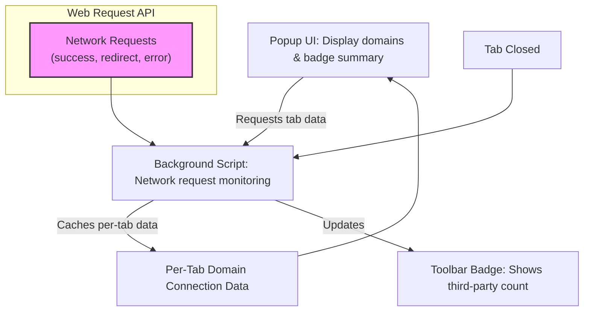

# Quick Feature Overview

Get a rapid, focused walkthrough of the essential user-facing components and technical workings of uBO Scope. This guide shines a light on how you interact with the extension’s popup UI, how per-tab reporting is maintained in the background, the signature badge counts on the toolbar icon, and its seamless compatibility across all major browsers.

---

## Interface at a Glance: Popup & Badge Summary

### Popup UI — Your Window Into Domain Connectivity

The popup is the core interactive experience in uBO Scope, providing a live view of how the active browser tab connects to third-party domains. When you click the toolbar icon, it opens a dialog that shows:

- **Tab Hostname Display:** The exact domain name of the current tab, broken down to easily identify subdomains and the main domain.
- **Summary Section:** Number of distinct third-party domains connected to during this tab’s browsing session.
- **Connection Outcomes Overview:** Three visually distinct sections detail domains categorized by connection results:
  - **Not Blocked (Allowed):** Domains successfully connected to without interference.
  - **Stealth-Blocked (Stealth):** Domains where connection attempts were redirected invisibly.
  - **Blocked:** Domains whose connection attempts were actively blocked.

This grouping helps you instantly assess the transparency of network requests made as you browse.

### Badge Counts — Instant Awareness at a Glance

Placed on the browser toolbar icon, the badge dynamically updates in real-time with the count of distinct third-party domains connected to on the active tab. The goal:

- **Lower badge counts mean fewer third parties connected**, reflecting tighter privacy and less potential tracking.
- The badge is blank if no third-party connections were detected.

Watch this counter as you move between tabs to get immediate insight into network exposure per page.

---

## Behind the Scenes: Per-Tab Reporting & Data Management

### Background Script — The Data Hub

uBO Scope's background script is the engine that tracks all network request activity. It:

- Listens actively through browser **webRequest APIs** for all relevant network events: redirects, errors, and successful responses.
- Associates incoming requests with the correct browser tab by tab ID.
- Categorizes each third-party domain connection attempt as **allowed**, **stealth**, or **blocked** based on request outcomes.
- Maintains a structured, in-memory map per tab to track these domains and their counts.
- Saves session details on demand to persist data across page reloads or browser restarts.

This architecture guarantees precise, up-to-date reporting for each browser tab.

### Tab-Specific Data Freshness

- When you navigate or reload a tab, the background script **resets** tracking data for that tab to represent new navigation activity.
- On tab closure, corresponding data is cleaned up automatically to conserve resources.

---

## Compatibility: Extending Across All Major Browsers

The extension supports Chromium-based browsers (Chrome, Edge, Opera), Firefox, and Safari, with tailored manifest setups per platform.

- Common permissions include `webRequest`, `storage`, and access to active tabs.
- Background processing runs as service workers or background scripts adaptable per browser.
- The popup UI is a simple HTML page responsive and consistent across browsers.

This ensures you benefit from the same robust functionality regardless of your browsing platform.

---

## How It All Fits Together

This diagram illustrates the user flow and data lifecycle:

1. The extension monitors network requests via the browser's `webRequest` API.
2. Each request is tracked, categorized, and stored per tab.
3. The background script updates the toolbar badge and responds to popup UI requests.
4. The popup presents a clear live report of the active tab’s third-party connections.

---

## Practical Tips for Using the Features

- **Checking Badge Counts Across Tabs:** Switch tabs to observe how third-party exposure varies per page — lower is always better.
- **Using the Popup to Investigate:** Open the popup after navigating a page to inspect which domains your browser contacted.
- **Understanding Connection Outcomes:** Remember that “stealth-blocked” domains might indicate redirects or manipulations invisible to the site.

---

## Troubleshooting Common Scenarios

- **Popup Shows "NO DATA" or Empty Sections:** This usually means no connections were detected yet, or the tab just loaded — reload or wait a few seconds.
- **Badge Not Updating:** A browser restart or reinstallation may be necessary if you suspect the service worker background script was evicted and failed to restart.
- **Unexpected High Counts:** This could be due to complex pages with many third-party trackers or async network calls — use popup details to identify unusual domains.

---

By mastering this quick feature overview, you gain immediate control and insight into uBO Scope’s core capabilities—empowering you to maintain transparency and privacy in your browsing.

For deeper understanding and advanced workflows, explore the [System Architecture](./system-architecture) and [Core Terminology](./core-terminology) pages.

---