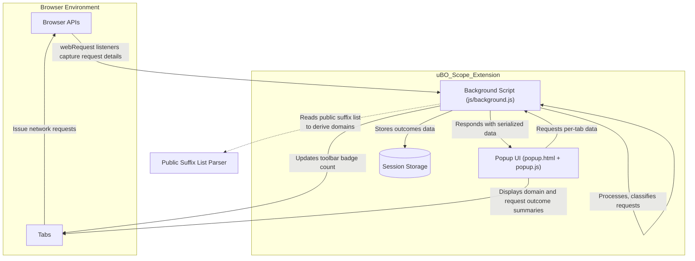

# How uBO Scope Works (Architecture Diagram)

## Visualizing uBO Scope's Core Architecture

Understanding uBO Scope's internal workings is essential for grasping how it effectively tracks, categorizes, and reports network connections on a per-tab basis. This page illustrates the primary system components and their interactions through a clear, mermaid.js diagram to demystify the extension's operation for users of all technical levels.

---

## Introduction: System Overview at a Glance

At its core, uBO Scope is a browser extension designed to monitor all network requests initiated by webpages, categorizing them based on outcomes such as allowed, blocked, or stealth-blocked. It comprises three principal components:

- **Background Script**: The central engine that listens to network events, records request outcomes, and manages session data.
- **Popup UI**: A user interface surfaced upon clicking the extension icon, summarizing domain connection data.
- **Browser API**: The browser's native interfaces that facilitate communication with tabs, network interception, and storage.

These components collaborate seamlessly to provide real-time insights while minimizing overhead.

---

## Architecture Diagram

---

## Component Details & User Workflows

### Background Script (js/background.js)

This is the heart of uBO Scope, running persistently in the browser's background context. Its responsibilities include:

- **Network Request Listening:** Hooks into `webRequest` browser API events (`onBeforeRedirect`, `onErrorOccurred`, `onResponseStarted`).
- **Request Outcome Classification:** Each network request is categorized as *allowed*, *stealth-blocked*, or *blocked* based on the event received and request details.
- **Tab-Based Tracking:** Maintains a mapping of active browser tabs to their network activity details including counts of distinct domains contacted.
- **Session Persistence:** Stores and retrieves network data in session storage ensuring continuity between page reloads or tab changes.
- **Badge Updating:** Updates the toolbar icon badge to display the count of distinct third-party domains connected per tab.

#### User Scenario

When you navigate to a webpage, the background script listens to its network requests and records outcomes automatically—no user action required. This enables the badge count to update dynamically as connections are made.

### Popup UI (popup.html & js/popup.js)

Accessible by clicking the extension icon, the popup provides an at-a-glance summary:

- **Domain Display:** Shows the current tab's main domain and related subdomains.
- **Request Outcomes:** Separates connections into three categories — allowed (not blocked), stealth-blocked, and blocked — listing the distinct domains with counts.
- **Real-Time Refresh:** Upon opening, requests fresh tab data from the background script and updates the display accordingly.

#### User Scenario

You click the extension icon while browsing any page. Instantly, the popup reflects all network connections initiated, allowing you to assess third-party reach and effectiveness of content blocking.

### Browser APIs

The extension leverages:

- **`webRequest` API:** To intercept outgoing network requests and their outcomes.
- **`storage.session` API:** To store per-tab connection data efficiently.
- **Toolbar Action API:** To update the badge count and display the popup interface.
- **Messaging API:** To communicate between the popup UI and the background script for data retrieval.

These APIs form the backbone that enables uBO Scope to function within browser security boundaries.

---

## Tracking Network Requests: Flow Summary

1. When any tab issues a network request, the browser's `webRequest` event listeners in the background script are triggered.
2. Each request event is queued with an assigned outcome: `success` (allowed), `redirect` (stealth), or `error` (blocked).
3. A timer batches these requests; after 1 second, the batch is processed.
4. The background script updates the tab-specific details, incrementing counts for the corresponding domain outcomes.
5. The toolbar icon badge is updated to reflect the number of distinct allowed third-party domains.
6. When the popup requests data, the background script sends serialized, up-to-date tab details.

---

## Practical Tips & Best Practices

- **Badge Implications:** A *lower* badge number indicates fewer distinct third-party connections, generally enhancing privacy.
- **Session Continuity:** Data persists only for the session; closing tabs clears associated tracking data.
- **Network Scope:** The extension monitors HTTP, HTTPS, WS, and WSS protocols where applicable per browser.
- **Cross-Browser Consistency:** Manifest files indicate support across Chromium, Firefox, and Safari with permission alignment to ensure network API access.

---

## Troubleshooting Common Issues

- **No Badge Count Displayed:** Ensure the extension has the required permissions (`webRequest`, `storage`, `activeTab`) and that the background script is running.
- **Popup Shows No Data:** This can occur if the tab has not issued any network connections or if the data has been reset due to tab closure.
- **Delayed Updates:** Network request processing batches requests every second; immediate badge or popup updates after rapid navigation may be delayed slightly.

---

## Getting Started Preview

To begin monitoring network connections:

1. Install uBO Scope for your browser (Chrome, Firefox, Safari).
2. Open any tab and navigate to a website.
3. Observe the badge count on the toolbar icon representing distinct third-party servers connected.
4. Click the icon to open the popup panel and explore detailed domain-wise request outcomes.

For setup instructions and deeper insights, visit the [Getting Started](../../getting-started/basics-installation/prerequisites-requirements) guides.

---

## Additional Resources

- [What is uBO Scope?](../introduction-core-value/what-is-ubo-scope) — Introduction to the extension’s purpose and value.
- [Monitoring Network Connections Per Tab](../../guides/workflows/monitor-network) — Guide for effectively using the popup and badge to monitor connections.
- [Interpreting the Toolbar Badge & Popup Panel](../../guides/workflows/interpreting-badge-data) — Understanding the displayed data and its privacy implications.

---