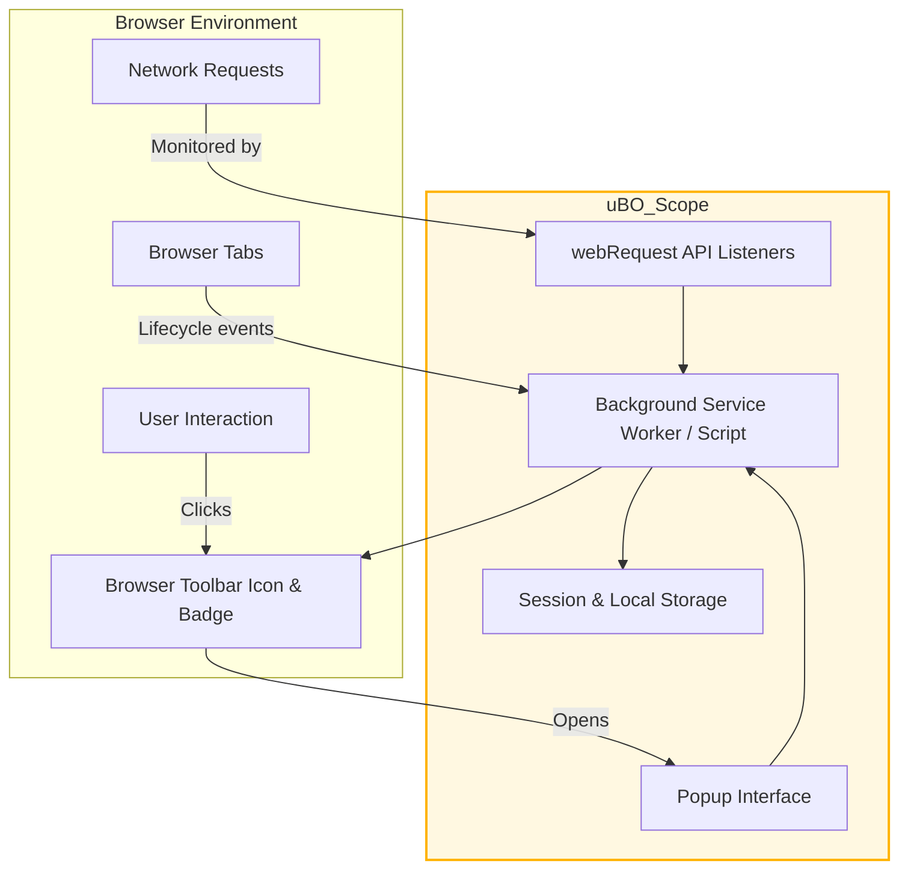

# Browser Compatibility & Integration Points

## Overview

uBO Scope is designed as a lightweight browser extension that provides transparent visibility into third-party remote server connections initiated during web browsing. This page explains which browsers uBO Scope supports, how it leverages browser APIs to monitor network requests, and the key integration points within browser systems. This information helps you understand compatibility considerations and how the extension fits into various browser environments.

## Supported Browsers

uBO Scope supports the major modern browsers based on their extension frameworks:

- **Chromium-based Browsers** (e.g., Google Chrome, Microsoft Edge, Brave)
- **Mozilla Firefox**
- **Apple Safari** (version 18.5 and above)

The extension utilizes browser APIs common to these platforms, adapted where necessary to ensure consistent functionality.

### Specifics for each browser

| Browser       | Installation Source                                              | Minimum Version       |
|---------------|------------------------------------------------------------------|----------------------|
| Chromium      | [Chrome Web Store](https://chromewebstore.google.com/detail/ubo-scope/bbdpgcaljkaaigfcomhidmneffjjjfgp) | 122.0 (minimum Chrome) |
| Firefox       | [Firefox Add-ons](https://addons.mozilla.org/firefox/addon/ubo-scope/) | 128.0 (minimum Firefox) |
| Safari        | Distributed as a Safari Web Extension, requires macOS with Safari 18.5+ | 18.5 |

<Note>
Installation must be done through official or trusted browser stores or provider portals to ensure extension authenticity and compatibility.
</Note>

## Leveraging Browser APIs

uBO Scope depends on standardized browser extension APIs for its core functionality:

- **`webRequest` API**: The cornerstone of uBO Scope’s capability to observe network activity. It listens to events such as requests starting, redirects, errors, and responses to capture detailed data about every network request initiated by the browser.
- **`storage` API**: Used for efficient session and persistent data management, including caching domain data and the public suffix list for domain parsing.
- **`tabs` API**: Tracks tab lifecycle events like creation and removal to maintain accurate session state.
- **`action` API** (browser toolbar integration): Displays the toolbar badge reflecting the number of distinct third-party domains connected, and provides a popup UI.

These APIs are accessed via the `browser` or `chrome` namespace, abstracted in the extension's code to support different browser implementations seamlessly.

## How uBO Scope Integrates With Browser Systems

### Background Processing

- In **Chromium**, uBO Scope runs as a **service worker** (`background.service_worker`) per Manifest V3 specifications. This allows it to efficiently manage resource usage while listening to `webRequest` events.
- In **Firefox** and **Safari**, it uses a **background script/module**, maintaining persistent state to track browsing sessions and network requests.

### Network Monitoring

- Listeners are registered to `webRequest` events such as `onBeforeRedirect`, `onErrorOccurred`, and `onResponseStarted` with host permissions on URLs (`http://*/*`, `https://*/*`, and WebSocket protocols where supported). This comprehensive permission set ensures all relevant network requests can be measured.

### User Interface Integration

- The extension adds a toolbar icon with a dynamic badge to report real-time counts of distinct third-party connections per tab, providing instant privacy insight without intrusive UI elements.
- Clicking the toolbar icon opens a popup panel (`popup.html`) that elaborates detailed domain information about allowed, blocked, and stealth-blocked connections per active tab.

<Info>
Browser badge counts reflect successful connections to third-party domains, a unique measure differing from generic block counts used by typical content blockers.
</Info>

## Practical Notes for Users on Installation and Compatibility

- Before installation, ensure your browser version meets the minimum required version listed above for consistent operation.
- The extension requires permissions to monitor web requests and access tab information; these are core to its functionality.
- On browsers like Safari, ensure you enable the extension from System Preferences or Safari Extension settings after installation.
- uBO Scope relies on the browser’s correct reporting of network requests; requests outside `webRequest` API visibility (e.g., some fetch/XHR or DNS blocking outside browser context) will not be reflected.

<Warning>
Content blocking that occurs outside the scope of the browser's `webRequest` API can cause discrepancies in connection reporting. This is not a fault of uBO Scope but a limitation of browser API accessibility.
</Warning>

## Summary of Integration Architecture

## Troubleshooting Compatibility

<Accordion title="Common Compatibility Issues">
**1. Older browser versions:**

- Upgrade browser to supported minimum versions.

**2. Extension not appearing after install:**

- Verify extension is enabled in the browser extension manager.
- On Safari, enable in System Extensions pane.

**3. Missing network data:**

- Ensure permissions were granted during install.
- Check no unusual policies/blockers interfere with `webRequest` API.

**4. Badge count not updating:**

- Refresh active tabs or restart browser.
- Clear session data if persistent storage corrupted.
</Accordion>

## Next Steps

To move forward with uBO Scope:

- Visit the [Installation Instructions](https://github.com/gorhill/uBO-Scope) page for detailed steps per browser.
- Explore the [System Architecture & Data Flow](../architecture-core-concepts/system-architecture-overview) documentation for deeper understanding.
- Learn to use the popup interface in the [Understanding the Popup Panel](../guides/core-workflows/understanding-the-popup) guide.

---

For full source code and issue tracking, visit the official GitHub repository: [https://github.com/gorhill/uBO-Scope](https://github.com/gorhill/uBO-Scope)

 

---