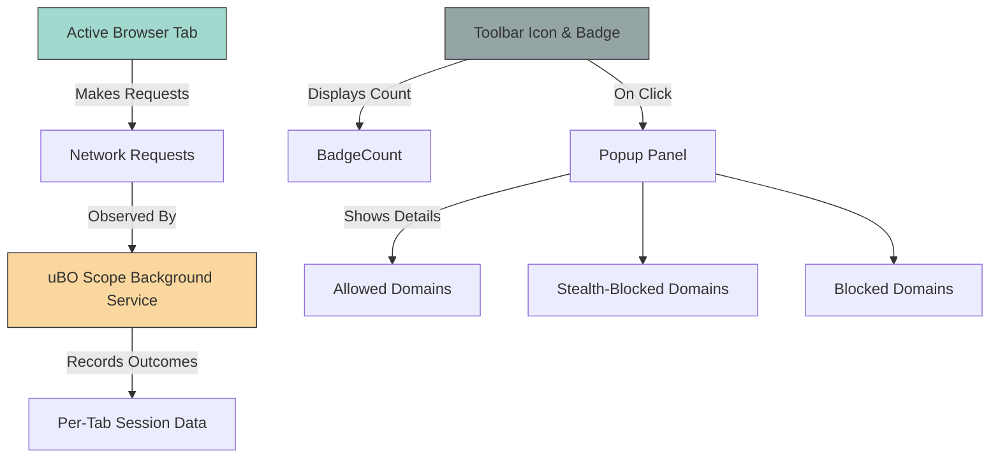

# Feature at a Glance

## See Your Browser's Connections at a Glance

uBO Scope delivers immediate, clear visibility into all remote server connections your browser attempts or completes. With minimal fuss and zero complex configuration, it empowers you to understand network activity from each browser tab — a vital insight for privacy-conscious users, developers, and filter list maintainers alike.

### What You’ll See

- **Badge Counts:** The toolbar icon displays a concise number representing distinct third-party domains your current active tab has contacted without being blocked. Lower counts reflect fewer third-party connections, helping you quickly assess exposure.

- **Popup Panel Summary:** Clicking the icon opens a straightforward panel broken down into three sections:
  - **Not Blocked:** Domains where connections were successfully made.
  - **Stealth-Blocked:** Connections that were stealthily blocked, invisible to webpages but detected by uBO Scope.
  - **Blocked:** Domains explicitly blocked by your browser or content blockers.

- **Per-Tab Reporting:** Each browser tab maintains its own connection report, so you can inspect network activity specific to your current browsing session.

### Why This Matters

Unlike complex filtering tools, uBO Scope focuses only on visibility—not on blocking or configuration. It shows the real-world outcomes of network requests regardless of what content blockers are running, enabling you to get an unfiltered look at:

- How many third-party remote servers are actually contacted for a given site
- Which connections succeed, fail, or are stealth-blocked
- Whether your existing blocker setup is effectively limiting third-party connections


## Core Interface Components

### 1. Badge Count on Toolbar Icon

This dynamic count represents the number of *distinct* third-party remote server domains allowed by the browser for the current tab. The count updates in near real-time as you navigate.

> **Tip:** Interpreting the badge count properly is crucial; a lower number generally means fewer third-party exposures and better privacy.

### 2. Popup Panel Breakdown

The popup panel organizes domains into three outcome categories:

- **Not Blocked:** Lists domains with connections that successfully reached the server.
- **Stealth-Blocked:** Captures stealth-blocked connections missed by webpage detection but reported by the underlying browser APIs.
- **Blocked:** Shows domains explicitly blocked, enhancing your understanding of what your content blocker catches.

Each domain entry includes the count of connection attempts. Domains are displayed using their Unicode (human-readable) form to aid recognition.

### 3. Tab-Specific Data Tracking

uBO Scope maintains a unique data set per browser tab. Upon switching tabs or opening new ones, the badge and popup reflect the connections from that tab's web requests, giving you granular insight into your browsing footprint.


## User Experience Flow

1. **Install** the extension from your preferred browser store.
2. **Browse websites normally.** uBO Scope unobtrusively monitors network requests.
3. **Observe the badge** for quick insight into third-party domains communicating with the current tab.
4. **Click the badge** to reveal detailed categories of connections in the popup panel.
5. **Use this information** to assess privacy exposure, validate content blocker effectiveness, or investigate network activity.


## Practical Tips to Get the Most Out of uBO Scope

- **Watch the badge as you visit different sites:** Quick shifts in counts reveal varying third-party loads.
- **Use the popup to investigate unexpected connections:** Is a stealth-blocked domain worth your attention or legitimate?
- **Combine with other privacy tools:** Leverage uBO Scope data to verify that other blockers are doing their job.


## Common Pitfalls & How to Avoid Them

- **Misinterpreting badge counts:** Not all third-party domains are harmful; some (like CDNs) are necessary. Focus on unexpected spikes.
- **Assuming stealth-blocked means fully blocked:** Stealth-block represents nuanced blocking strategies but may still allow some activity.
- **Expecting filtering controls:** uBO Scope reports only; it does not block or filter.


## Summary

The **Feature at a Glance** page equips you with a clear understanding of what to expect from uBO Scope's core interface: simple, accurate reporting of per-tab remote server connections via the badge and popup panel, without overwhelming complexity.

---

## Related Documentation & Next Steps

- [What is uBO Scope?](../introduction-value/product-overview) — Learn about the extension's overall purpose and real-world benefits.
- [Understanding Badge Counts and Reports](../../getting-started/introduction-overview/understanding-badge-and-reports) — Dive deeper into interpreting the badge and popup outputs.
- [Who Should Use This Extension?](../introduction-value/audience-usecases) — Identify if uBO Scope matches your needs.
- [Integration with Content Blockers & Browsers](../integration-context/ecosystem-integration) — See how uBO Scope fits in your privacy toolkit.

---

For detailed usage, troubleshooting, and advanced scenarios, refer to the relevant Getting Started and Guides sections in the documentation.


---

## Code Example: How Data Gets Displayed in the Popup

Here’s a simplified illustration of how the popup panel organizes connection data:

```javascript
// Assume incoming data for the current tab
const data = {
  hostname: 'example.com',
  domain: 'example.com',
  allowed: { domains: new Map([['cdn.example.net', 5], ['api.example.com', 2]]) },
  stealth: { domains: new Map([['tracker.stealthy.io', 1]]) },
  blocked: { domains: new Map([['ads.blocked.com', 3]]) },
};

// Render each section
renderPanel(data);
```

This data drives the popup UI, enabling users to quickly see which domains have connected and how often, bucketed by outcome.


---

## Visual Diagram: Interaction Flow



This illustrates the flow from network requests triggered in a browser tab through detection, session data management, and user-facing presentation.
