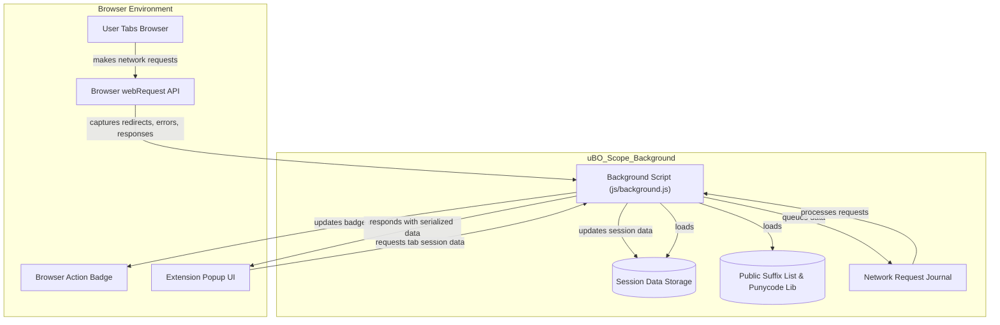

# System Architecture & Data Flow

Understanding how uBO Scope operates under the hood empowers users to appreciate its precision and efficiency in revealing network requests during web browsing. This documentation provides a clear visualization of the core workflow—from capturing network requests seamlessly within the browser, to session tracking, badge updates, and finally rendering the data in the popup UI.

---

## How uBO Scope Works: A High-Level View

uBO Scope is designed to measure distinct third-party remote server connections by tapping directly into the browser's `webRequest` API. Here's the flow from the user's browsing action to the visual feedback in the extension popup:

1. **Network Request Monitoring**: The extension listens to network events such as redirects, errors, and successful responses for pages the user visits.
2. **Session Data Aggregation**: It maintains an in-memory session cache, associating each browser tab with detailed data about domains and hostnames connected to.
3. **Badge Indicator Updates**: uBO Scope updates the browser action badge to show the current count of allowed third-party domains per tab, instantly signaling connection exposure.
4. **Popup UI Rendering**: When users open the popup, this session data is fetched, deserialized, and presented in a user-friendly format highlighting allowed, stealth-blocked, and blocked domains.

Each step focuses on user-centric outcomes, ensuring transparency without overwhelming users with technical complexity.

---

## Key Components and Data Movement

Below is a simplified flow diagram capturing the crucial components and data flow that enable uBO Scope's functionality.

---

## Component Roles Explained

- **Browser webRequest API**: The primary source of network information, supplying live events related to navigation, resource loading, redirects, and failures.

- **Background Script (`js/background.js`)**: The core engine that listens to webRequest events, queues them for batch processing, records per-tab domain connection outcomes into structured session data, and manages badge text updates.

- **Session Storage**: Persists current browsing session data including detailed domain and hostname connection counts, ensuring data durability across runtime reloads.

- **Public Suffix List & Punycode Library**: Provide utilities to normalize and extract domain information accurately from URLs, essential to correctly aggregating connection counts.

- **Network Request Journal**: A temporary queue that batches network events before processing to optimize performance and avoid thrashing badge or UI updates.

- **Browser Action Badge**: Visually informs users of the number of distinct allowed third-party domains connected by the active tab, reinforcing privacy awareness.

- **Popup UI (`js/popup.js`)**: Offers an interactive, user-friendly summary of per-tab network outcomes segregated into categories such as not blocked, stealth-blocked, and blocked.

---

## Detailed Data Flow Explanation

### 1. Capturing Network Requests

The browser's `webRequest` listeners for `onBeforeRedirect`, `onErrorOccurred`, and `onResponseStarted` gather comprehensive data about every network request a page issues. Each event tagged with the `tabId` and the event outcome (`redirect`, `error`, or `success`) is queued in the Network Request Journal.

### 2. Processing the Network Request Journal

The background script processes these queued events after short delays to balance performance. For each network request:

- It updates the tab's details, distinguishing the network resource domain and hostname.
- Resets tab data when a main frame navigation occurs.
- Categorizes outcomes into `allowed`, `stealth`, or `blocked` with fine granularity.

### 3. Session State Management

All tab-specific details are maintained within a Map inside the session state. The background script serializes and persists this session state in browser session storage to maintain continuity even if the extension reloads.

### 4. Updating the Browser Badge

Whenever the session data for a tab updates, particularly when allowed domains count changes, the badge text reflects the current number of distinct allowed third-party domains.

### 5. Rendering Popup UI

When the user activates the popup, a message is sent to the background script requesting serialized session data for the current tab. The popup script deserializes this data and displays it, breaking domains down by outcome, providing counts, and showing hostname/domain details for clarity.

---

## Tips for Users and Developers

- **Performance Optimization**: The use of a journal and timed batch processing of network events ensures that uBO Scope remains responsive without redundant state updates.
- **Domain Normalization**: Leveraging the Public Suffix List avoids miscounting subdomains as separate entities, ensuring the badge count is accurate and meaningful.
- **Session Continuity**: Saving session state to storage means users can trust the data persists across browser sessions and is accurate per active browsing tab.
- **Debugging**: If the badge does not update as expected, ensure the extension has appropriate permissions and that browser updates have not altered webRequest behavior.

---

## Next Steps

Now that you understand how uBO Scope functions at a system level, explore the following guides to put this knowledge into practical use:

- [Understanding the Popup Panel](/guides/core-workflows/understanding-the-popup) — Learn how to interpret the UI and domain categorizations.
- [Monitoring Third-party Connections: A Practical Guide](/guides/core-workflows/monitoring-connections) — Apply uBO Scope insights to assess browsing privacy.

---

For details on installation prerequisites, supported browsers, and privacy considerations, refer to the [Prerequisites & System Requirements](/getting-started/quick-setup/prerequisites-requirements) documentation.

<Source url="https://github.com/gorhill/uBO-Scope" branch="main" paths={[{"path": "js/background.js", "range": "1-184"}]} />