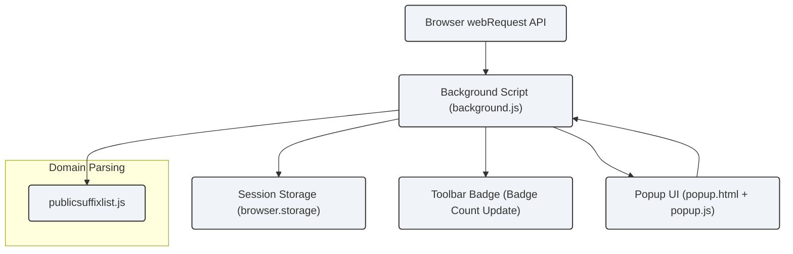

# System Architecture & Data Flow

## How uBO Scope Works Under The Hood

Understanding how uBO Scope operates internally reveals why it delivers reliable, independent insight into your browser’s remote server connections. This page breaks down the key components and workflows—from the moment your browser initiates network requests, through how uBO Scope monitors and processes these requests in the background, to how it finally presents the aggregated data in the popup UI.

---

### The User Journey: From Network Request to Report

1. **Browser Issues a Network Request**
   - When you visit any webpage, your browser attempts to connect to various servers to load resources.
   - These connections include first-party and third-party domains, and can be successful, blocked, or redirected.

2. **uBO Scope Monitors Network Activity**
   - uBO Scope uses browser APIs, specifically the `webRequest` listener, to observe each network request in real time.
   - This monitoring is independent of any content blockers, capturing the true status of requests as reported by the browser.

3. **Background Processing & Categorization**
   - The background script (`background.js`) collects details about each request: URL, request type, and outcome (allowed, stealth-blocked, or blocked).
   - Hostnames and domains are extracted and normalized using efficient domain parsing (
     `publicsuffixlist.js`), ensuring accurate grouping by registrable domain.
   - Data is stored and updated in session memory, tracking counts per category for the active tabs.

4. **Data Persistence and Updates**
   - The extension persists session data periodically to browser storage to maintain state across reloads.
   - The background script updates the toolbar badge to reflect the number of distinct allowed third-party domains for the active tab.

5. **Popup UI Presentation**
   - When you click the uBO Scope toolbar icon, the popup (`popup.html` and `popup.js`) requests the current tab’s network summary from the background.
   - The UI displays categorized lists of connected domains: allowed, stealth-blocked, and blocked, along with counts.
   - Domains are shown in a clear, concise format with counts so you can quickly assess your browser’s network activity.

---

## Core Components and Their Roles

| Component           | Role                                                                                     |
|---------------------|------------------------------------------------------------------------------------------|
| **Browser webRequest API** | Captures all network requests and their outcomes reported by the browser — the raw input for uBO Scope.     |
| **Background Script (`background.js`)** | Collects, processes, categorizes, and stores network request data asynchronously. Also manages state and badge updates. |
| **Domain Parsing (`publicsuffixlist.js`)** | Efficiently extracts registrable domains and public suffixes to group hostnames accurately.                      |
| **Popup UI (`popup.html` + `popup.js`)** | Requests summarized data from the background and renders the user-facing panel with domain counts and categories. |

---

## Visualizing the Data Flow

This diagram outlines the core interaction:

- The **browser's webRequest API** relays request events to the **background script**.
- The background script uses **publicsuffixlist.js** for domain extraction to categorize requests.
- It updates the **toolbar badge** to show the number of distinct allowed domains.
- When the popup is opened, the **popup UI** requests the summarized data from the background script.
- Data is persisted reliably using the browser's **storage API**.

---

## Practical Insights & Best Practices

- **Rapid, Real-Time Updates:** The background script batches network event processing to maintain performance and reduce UI jitter.
- **Accurate Domain Grouping:** By relying on the public suffix list, uBO Scope avoids counting trivial subdomains separately and groups hostnames reliably.
- **Independent of Content Blockers:** Since uBO Scope listens directly to browser network events, it reports all activity unaffected by any adblocker or content blocker in place.
- **Responsive Popup UI:** The UI is lightweight; it requests just necessary data for the current tab and renders neatly categorized results.

---

## Troubleshooting Common Issues

<AccordionGroup title="Troubleshooting System Architecture & Data Flow">
<Accordion title="Why don’t I see any data in the popup?">
Possible reasons include network requests not being captured yet (try reloading the page), or the tab ID not being recognized by the background script. Closing and reopening the popup or refreshing the page often resolves this.
</Accordion>
<Accordion title="Toolbar badge does not update correctly.">
Badge updates depend on the background processing network events and tab activity. If you notice inconsistencies, try switching tabs or reloading the page to prompt an update.
</Accordion>
<Accordion title="Are all network requests monitored?">
uBO Scope relies on the browser’s webRequest API, which handles most HTTP, HTTPS, and WebSocket connections. Requests made outside this scope or by other browser components may not be captured.
</Accordion>
</AccordionGroup>

---

## Next Steps

To see uBO Scope in action, install the extension and observe the badge counts as you browse. Click the toolbar icon to open the popup UI and view domain summaries. For deeper understanding of terms and use cases, visit the [Core Concepts & Terminology](/overview/architecture-core-concepts/core-terminology) page.

Explore related documentation to learn how to interpret badge numbers and domain lists accurately and leverage uBO Scope for advanced diagnostics.

---

## Source Code References

- Background processing and session management: [js/background.js](https://github.com/gorhill/uBO-Scope/blob/main/js/background.js)
- Popup UI rendering: [popup.html](https://github.com/gorhill/uBO-Scope/blob/main/popup.html), [js/popup.js](https://github.com/gorhill/uBO-Scope/blob/main/js/popup.js)
- Domain parsing: [js/lib/publicsuffixlist.js](https://github.com/gorhill/uBO-Scope/blob/main/js/lib/publicsuffixlist.js)

---

By understanding this architecture and flow, users gain confidence in the accuracy and transparency of the information uBO Scope provides, empowering better privacy and network awareness decisions.