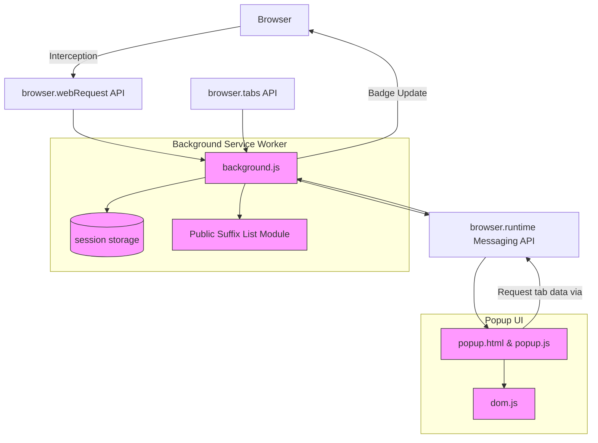

# System Architecture

## Unlocking the Inner Workings of uBO Scope

Understanding how uBO Scope operates at a system level empowers you to grasp how it reliably captures and reports all remote server connections your browser encounters. This page reveals the architectural blueprint behind the extension, giving you insight into how its components collaborate to deliver real-time, accurate visibility into network requests.

### High-Level Overview

At its core, uBO Scope harnesses browser APIs, notably the powerful `webRequest` interface, combined with its background service worker script to monitor network activity per browser tab. It keeps detailed session data that tracks all domains contacted by the currently viewed pages. The popup UI then visualizes this data instantaneously when you interact with the extension.

By mapping network requests and tracking their outcomes (allowed, blocked, stealth-blocked), uBO Scope provides a comprehensive, tab-specific picture of remote connections.

---

## Core Components and Data Flow

### 1. Background Script (`background.js`)

- **Role:** Acts as the extension’s engine room.
- **Responsibilities:**
  - Listens to all network events via the browser's `webRequest` API (`onBeforeRedirect`, `onErrorOccurred`, `onResponseStarted`).
  - Categorizes requests by outcome: allowed, stealth-blocked (redirects to non-networked hosts), or blocked (errors).
  - Maintains session state associating each network request with its corresponding browser tab.
  - Updates the browser action badge to reflect the count of distinct allowed third-party domains per tab.
  - Saves and retrieves session data using browser storage session APIs.
  - Loads and leverages the public suffix list (`psl`) to accurately map hostnames to registered domains.

### 2. Browser APIs

- **`webRequest` API:** The backbone for capturing real-time details of network requests including their success, failure, or redirection.
- **`storage.session`:** Persists temporary session data about tab activity, ensuring continuity during the browser runtime.
- **`tabs` API:** Notifies the extension when tabs are removed to clean up associated session data.
- **`runtime` API:** Facilitates messaging between the popup UI and the background script, enabling interactive data retrieval.

### 3. Popup UI (`popup.html`, `popup.js`)

- **Role:** Displays detailed per-tab data on domains connected during browsing.
- **Function:** Queries the background script for the current tab’s connection details, deserializes the data, and dynamically populates the UI sections.
- **Outcome Presentation:** Groups connected domains into three categories: allowed (not blocked), stealth-blocked, and blocked, showing domain counts for each.

### 4. Supporting Modules

- `dom.js`: Utilities for DOM manipulation in the popup.
- `ext.js`: A wrapper around browser extension APIs to abstract differences between browsers.
- `s14e-serializer.js`: Handles serialization/deserialization of complex session objects.
- `publicsuffixlist.js` & `punycode.js`: Handle domain normalization and accurate domain extraction from hostnames.

---

## Architectural Workflow: From Network Event to UI Visualization

1. **Network Request Captured:** When any network request originates from a tab, the background script intercepts it via `webRequest` listeners.

2. **Outcome Categorization:** The event is classified based on its outcome - success (allowed), error (blocked), or redirect (stealth).

3. **Session Data Updated:** The corresponding tab's session data updates maps counting hostnames and domains contacted, organized under allowed, stealth, or blocked.

4. **Badge Update:** The browser action badge number reflects the count of distinct allowed third-party domains for the active tab, providing instant feedback.

5. **Popup Data Refresh:** When users open the popup UI, it sends a message to the background script to fetch the current tab’s session data.

6. **Data Rendering:** The popup deserializes and renders distinct domain statistics categorized by connection outcome.

---

## Mermaid Diagram: System Architecture Overview

---

## Tips for Users and Developers

- **For Users:** Understanding this architecture clarifies why the badge count realtime updates as you navigate tabs and why the popup UI categorizes domains clearly.

- **For Developers:** The modular structure using importable JS modules and clean separation between background logic and UI code allows straightforward maintenance and adaptation for new browser APIs or features.

- **Troubleshooting:** If the extension’s badge does not update, ensure your browser supports the `webRequest` API fully. Some browsers restrict these APIs, limiting data capture fidelity.

- **Performance Consideration:** The background script batches network events and processes them asynchronously every second, balancing responsiveness with low resource usage.

---

## Getting Started

- To explore the system in action, start by installing uBO Scope and observing how the badge updates as you visit different sites.
- Open the popup UI to dive deeper into which domains are contacted and their outcome per tab.
- For development or troubleshooting, examine the background script (`js/background.js`) for the central logic and how it communicates with the popup.

## See Also
- [What is uBO Scope?](overview/introduction-value/product-overview) — Understand the product mission and value
- [Core Concepts & Terminology](overview/architecture-core-concepts/core-terminology) — Learn foundational terms uBO Scope relies on
- [Understanding Domain Connectivity and Badge Counts](guides/interpreting-results/understanding-results) — Learn to interpret UI elements based on architecture

---

Exploring the System Architecture gives you deep insight into how uBO Scope seamlessly integrates into your browsing experience, enabling transparency into web connections with precision and efficiency.