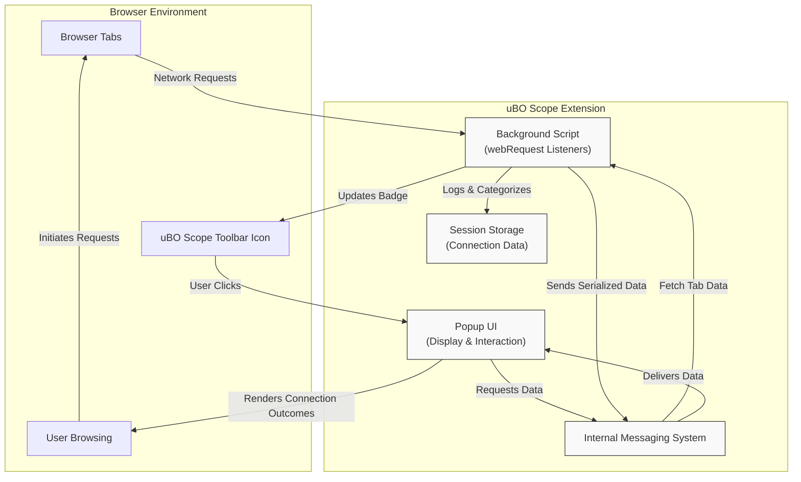

# System Architecture

Understand the inner workings of uBO Scope through a clear, high-level overview of its architecture. This page illustrates how the extension’s core components communicate and collaborate to monitor, record, and display browser network connections in real time—turning complex browser interactions into actionable insights.

---

## How uBO Scope Monitors Network Connections

At the heart of uBO Scope's operation is the **background script**, a persistent module running behind the scenes in the browser. This component listens to browser network activity using the `webRequest` API, intercepting all network requests initiated by web pages.

The background script categorizes each request outcome as either **allowed**, **blocked**, or **stealth-blocked**. These distinctions give users transparent visibility into which third-party servers their browser contacts and whether content blockers or other mechanisms intervene.

## Core Components and Their Roles

- **Background Script**: Acts as the central observer, tracking every network request event (`onBeforeRedirect`, `onErrorOccurred`, and `onResponseStarted`) across all open browser tabs. It maintains detailed records of connection outcomes per tab.

- **Popup UI**: The user-facing interface activated when clicking the toolbar icon. It requests data from the background script to display aggregated connection details, organized by outcome and domain.

- **Messaging System**: Enables real-time communication between the Popup UI and Background Script. Messages request and deliver structured data about network connections.

- **Browser APIs**: Powers the extension’s capabilities, providing event listeners for network requests, tab management, and storage.

## User Flow: From Browsing to Data Display

1. **Browsing Activity**: When you visit or interact with a webpage, your browser initiates numerous network requests as it fetches content.

2. **Request Interception**: The background script captures these requests via the `webRequest` API as they start, succeed, fail, or redirect.

3. **Outcome Categorization**: Each request is assessed and logged with regard to the outcome:
    - **Allowed**: Request completed successfully.
    - **Blocked**: Request failed due to blocking rules.
    - **Stealth-blocked**: Requests redirected or hidden from the page.

4. **Data Aggregation**: Outcomes are aggregated by domain and tab, maintaining an internal session store for ongoing tracking.

5. **Badge Update**: The toolbar icon badge updates with the count of distinct allowed third-party domains per tab, providing an at-a-glance summary.

6. **Popup Display**: When you open the extension popup, it sends a message to the background script requesting the latest connection data for the active tab.

7. **Rendering Results**: The popup receives serialized data, deserializes it, and renders the connection outcomes into neatly organized sections for your review.

## Visual Architecture Overview

## Detailed Component Responsibilities

### Background Script

- Listens to all network request lifecycle events allowed by the `webRequest` API.
- Uses a **Public Suffix List** to accurately derive domain and hostname from URLs.
- Maintains a map keyed by tab ID storing detailed connection info:
  - Domains and hostnames grouped by outcome (allowed, blocked, stealth).
- Aggregates counts per domain for display and badge purposes.
- Handles tab removal events to clean up stored session data.
- Processes requests asynchronously in short batches to optimize performance.
- Serializes and persists session data via browser session storage to maintain state.

### Popup UI

- Activated by user interaction (click) on toolbar icon.
- Requests current tab's connection data by sending a message to the background script.
- Receives serialized data, deserializes it, and populates the UI with:
  - Tab hostname and domain summary.
  - Lists of domains grouped by connection outcome.
  - Counts next to each domain indicating number of requests.
- Uses the `punycode` library to correctly display internationalized domain names.
- Ensures a responsive and readable layout adapting to available viewport size.

### Messaging System

- Acts as the communication bridge between UI and background script.
- Facilitates request-response message pattern for fetching tab-specific connection states.
- Includes retry mechanisms to handle transient service worker inactivity.

### Browser APIs

- `webRequest`: Captures network events essential for data gathering.
- `tabs`: Accesses current active tab information.
- `storage.session`: Stores and retrieves session connection data.
- `action`: Updates toolbar badge text and controls popup display.

## Why This Architecture Matters

This design allows uBO Scope to operate unobtrusively in the background without interrupting browsing, while providing near real-time insights into network connections.

The separation of concerns:

- Keeps data gathering reliable and consistent through the background script.
- Delivers timely, user-friendly reports through the popup UI.

Together, these components empower users to understand and verify their browser’s real network activity, regardless of blockers or DNS-level filters.

## Best Practices & Tips

- **Keep the extension active**: Closing all browser tabs or restarting the browser may reset session data.
- **Understand badge counts**: A lower number is generally better, indicating fewer distinct third-party connections.
- **Use alongside blockers**: uBO Scope complements blocking tools by showing actual outcomes, not just block counts.
- **Review stealth-blocked requests**: These show network requests hidden from the page, useful for assessing stealth blocking techniques.

## Troubleshooting Common Issues

<AccordionGroup title="Common Troubleshooting Tips">  
  <Accordion title="No connection data in popup">  
If the popup UI shows 'NO DATA', ensure you have an active tab loaded with a webpage. Network data will only appear after page loads and requests occur.  
  </Accordion>  
  <Accordion title="Badge count not updating">  
Browser restrictions or permissions may affect real-time badge updates. Try refreshing the page or restarting the browser if counts seem stale.  
  </Accordion>  
  <Accordion title="Requests not captured">  
Network requests made by non-browser processes or outside `webRequest` API scope cannot be captured. Some browser sandboxes or features may limit monitoring.  
  </Accordion>
</AccordionGroup>

## Next Steps

To put this architecture into practice, visit the [Feature Overview & Quickstart](/overview/architecture-core-concepts/feature-overview) page to explore core capabilities. For hands-on onboarding, check the [Installation on Supported Browsers](/getting-started/onboarding/install-browsers) and [Launching uBO Scope for the First Time](/getting-started/onboarding/first-launch) guides.

---