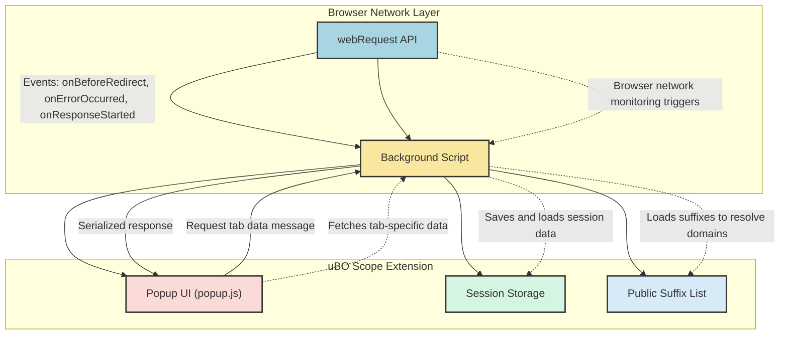

# How uBO Scope Works: System Overview

uBO Scope leverages browser `webRequest` APIs to comprehensively monitor and classify all network requests initiated by webpages. This page provides a detailed system overview, illustrating the data flow and how results—such as allowed, blocked, or stealth-blocked requests—are collected and presented to users. Whether you're seeking to understand the architecture behind uBO Scope or how it reports network connections in real time, this guide gives practical insights into its operation.

---

## Understanding uBO Scope's Monitoring Workflow

At its core, uBO Scope operates by listening to network events across all browser tabs, capturing detailed outcomes for each network request made by webpages. It records whether connections were allowed, blocked explicitly, or stealth-blocked (a form of blocking less visible to the webpage).

### Step-By-Step User Flow

1. **Intercepting Network Requests**
   - As you browse, the extension hooks into the browser’s `webRequest` API, capturing requests to remote servers.
   - This includes main document loads, images, scripts, and WebSocket connections.

2. **Classifying Request Outcomes**
   - Requests are classified into three categories:
     - **Allowed:** Requests that completed successfully.
     - **Blocked:** Requests that were explicitly blocked (e.g., by a content blocker).
     - **Stealth:** Requests intercepted in a stealthy manner (e.g., silently redirected or hidden from detection).

3. **Aggregating Results per Tab**
   - Each browser tab maintains a detailed record of hostnames and domains contacted, categorized by outcome.
   - Requests are tracked at both hostname (precise server names) and domain (higher-level grouping) granularity.

4. **Persisting and Updating the Data**
   - Outcomes are temporarily queued and processed in batches to optimize performance.
   - State information is saved during the session and restored on reloads to maintain continuity.

5. **Visual Reporting in the Popup UI**
   - When you open uBO Scope's popup, it dynamically displays a summary:
     - The current page’s hostname and domain.
     - Counts and lists of domains contacted, grouped by Outcome (Allowed, Stealth, Blocked).
   - A badge on the toolbar icon reflects the count of distinct third-party domains contacted.

<Callout>
Tip: This real-time feedback helps you instantly understand the network connections a page attempts to make, providing transparency into your browsing privacy.
</Callout>

---

## Key Components in the Data Flow

Below is an overview of the principal components involved in uBO Scope’s system, illustrating their responsibilities and interactions.



---

## How Requests Are Processed and Classified

uBO Scope uses a carefully designed logic within the background script to interpret each network event and update the respective tab’s connection summary.

### Handling Main Frame Loads

- When the main frame of a tab navigates (e.g., loading a new page), all previous connection data for that tab is reset.
- The main URL’s hostname and domain are recorded as the tab’s top-level context.
- This prevents mixing connections from different pages.

### Tracking Network Requests

- For each network request within a tab, the extension:
  - Extracts the hostname from the URL.
  - Determines the domain using the public suffix list (e.g., to group subdomains).
  - Depending on event type:
    - `redirect` events mark stealth-blocked connections.
    - `error` events mark blocked connections.
    - `success` events mark allowed connections.

### Domain and Hostname Counts

- The extension tracks counts of requests per hostname and aggregates them per domain.
- This granular counting helps identify which servers receive connections and how frequent these requests are.

<Tip>
Understanding domains vs. hostnames is crucial: a domain covers broad ownership (e.g., example.com) while hostnames specify precise servers (e.g., ads.example.com). This helps distinguish between first-party and third-party requests.
</Tip>

---

## User-Facing Summary in the Popup UI

When you open the uBO Scope popup, it reconstructs and displays the network connections for the active tab with clarity and focus:

- **Headline Display:** Shows the current tab’s hostname and domain in a clear, Unicode-friendly format.
- **Domains Connected Summary:** Highlights the total number of unique domains contacted.
- **Categorized Sections:** Splits connections into three areas:
  - **Not Blocked:** Domains from which network resources loaded successfully.
  - **Stealth-Blocked:** Domains silently redirected or blocked.
  - **Blocked:** Domains with failed or explicitly blocked requests.

This layout provides a direct, actionable insight into a page’s network behavior.

### Example UI Flow

1. uBO Scope’s popup asks the background for data of the current tab.
2. The background returns serialized connection details.
3. The popup.js script renders a list showing domains and counts per outcome.
4. The badge count on the browser toolbar reflects the number of distinct allowed third-party domains.

Below is a simplified example of how data is rendered in the popup:

```javascript
// Simplified rendering snippet from popup.js
function renderPanel(data) {
  if (!data.hostname) return;

  // Display tab hostname and domain
  displayHostnameAndDomain(data.hostname, data.domain);

  // Render each outcome's domain list
  ['allowed', 'stealth', 'blocked'].forEach(outcome => {
    const section = document.querySelector(`.outcome.${outcome} .domains`);
    data[outcome].domains.forEach((count, domain) => {
      addDomainRow(section, domain, count);
    });
  });

  // Update summary with counted domains
  updateSummaryCount(data.allowed.domains.size);
}
```

---

## Architectural Highlights

- The **background script** acts as the system’s brain, continuously recording outcomes from millions of network requests.
- The **popup UI** presents a clean, digestible snapshot when requested.
- The **session storage** preserves ongoing session data, ensuring continuity even when switching tabs or reloading.
- The **public suffix list** enables precise identification of root domains for grouping.

This layered architecture ensures efficient real-time monitoring with minimal impact on browsing performance.

---

## Practical Tips and Best Practices

- **Open the popup often** during browsing to stay aware of third-party connections on your current page.
- **Use the badge number** as a quick gauge of third-party network activity; fewer distinct domains often imply less tracking surface.
- **Understand stealth-blocking:** Some blocked requests are hidden from typical detection to maintain page stability; uBO Scope reveals these.
- **Combine with content blockers:** uBO Scope complements blockers like uBlock Origin by providing objective network visibility.

---

## Troubleshooting Common Scenarios

<AccordionGroup title="Troubleshooting Common Issues">
<Accordion title="Popup Shows No Data or 'NO DATA'">
This usually means the tab does not have any recorded network activity yet or the extension is still initializing. Try reloading the page or opening the popup after some browsing activity.
</Accordion>
<Accordion title="Badge Count Does Not Update Immediately">
The extension batches network events to optimize performance; updates happen every second or so. If the count lags, wait briefly or reload the tab.
</Accordion>
<Accordion title="Unexpected Domains Showing as Allowed">
Some legitimate CDNs or services may appear as allowed. This is expected; not all third-party connections are harmful.
</Accordion>
</AccordionGroup>

---

## Summary

uBO Scope masterfully translates browser network events into transparent, categorized outcomes per tab, empowering users to see exactly which third-party domains their browser connects to. The combination of background processing, session persistence, and a dynamic, user-friendly popup offers unmatched clarity into browsing connections.

For a clear understanding of uBO Scope’s deeper architecture, see the **Essential Concepts & Terminology** page. To explore practical usage, consult the **What is uBO Scope?** and **Your First Session** guides.

---

<Info>
For developers or curious users interested in the codebase, the background script (`js/background.js`) handles core network event processing, while the popup script (`js/popup.js`) manages data rendering.
</Info>

---

## Next Steps

- Visit the [Essential Concepts & Terminology](../core-concepts-terminology) page to deepen your understanding of core ideas.
- Explore [Features at a Glance](../feature-glance) to learn about uBO Scope’s capabilities.
- Start your own analysis session following [Your First Session: Checking Connections](../../getting-started/first-use-and-validation/first-use) for a guided walkthrough.

---

## Additional Resources

- Official uBO Scope Repository: [https://github.com/gorhill/uBO-Scope](https://github.com/gorhill/uBO-Scope)
- Browser Compatibility:
  - Chromium-based browsers (Chrome, Edge, etc.)
  - Firefox
  - Safari


---

_Last updated on branch: `main`_
