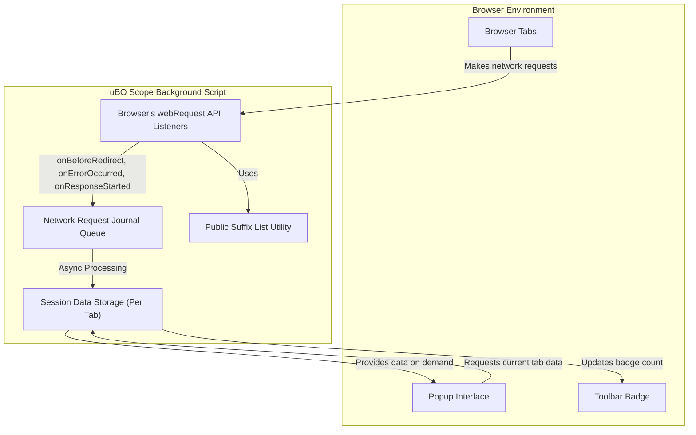

# System Overview: Components & Data Flow

## Visualizing How uBO Scope Works Behind the Scenes

Understanding how the main components of uBO Scope interact will help you appreciate how network connections are observed, recorded, and presented — enabling you to quickly grasp what the extension does and why it matters.

This page outlines the core system architecture, focusing on how uBO Scope intercepts network requests, processes data silently in the background, and presents curated connection summaries in the popup interface you interact with.

---

## Why This Matters: From Silent Network Monitoring to Your Popup

When you browse, dozens of network requests happen behind the scenes, many to third-party servers. uBO Scope’s primary value is revealing these connections transparently, helping you understand which remote servers your browser talks to — even if those requests are blocked or stealthy.

This transparency depends on a smooth collaboration between its components:

- **Background script:** Runs silently, intercepting and classifying every relevant network request using the browser’s `webRequest` API.
- **Data storage:** Keeps a live session record of network outcomes per browser tab, including requests allowed, blocked, or stealth-blocked.
- **Popup interface:** Displays the summarized connection data per tab, giving you instant visibility into your browsing exposure.

By walking through each of these components, you will see how they fit together to deliver this lightweight but powerful insight.

---

## Core Components & Their Roles

### 1. Background Script — Your Request Sentinel

The background script (`background.js`) is the heart of uBO Scope’s data gathering. It listens for network changes via several key event hooks:

- `onBeforeRedirect` — Tracks redirections that can obscure request outcomes.
- `onErrorOccurred` — Catches requests that fail.
- `onResponseStarted` — Detects successful network requests.

Each intercepted request is queued for efficient batch processing. The script then categorizes outcomes into:

- **Allowed:** Requests that completed successfully.
- **Blocked:** Requests that failed or were blocked outright.
- **Stealth-blocked:** Redirected or modified requests designed to be stealthily blocked.

The background script maintains detailed, per-tab records describing:

- Original page domain and hostname.
- Distinct third-party domains classified by their connection outcome.
- Counts of requests resolved per domain to power badge counts and popup displays.

It uses specialized utilities like the Public Suffix List (via `publicsuffixlist.js`) to accurately identify base domains from hostnames — essential for grouping connections meaningfully.

Periodic saving and loading of session data ensure consistent state, even after browser restarts.

### 2. Data Flow — From Request to Session Summary

Requests intercepted are first placed into a journal and processed asynchronously to avoid impacting browser responsiveness.

Each processed request updates the session’s tab-specific data structure, tracking count and classifying each host and domain per category.

After processing:

- The toolbar badge is updated to show the count of *distinct allowed third-party domains* for each active tab.
- Session data is saved to browser session storage for persistence.

This flow guarantees that connection data is accurate, up-to-date, and efficiently handled, providing a seamless user experience.

### 3. Popup Interface — Your Clear Window Into Connections

When you click uBO Scope’s toolbar icon, the popup loads (`popup.html` + `popup.js`):

- It queries the background script for the current tab’s aggregated connection data.
- It displays the tab’s main domain and hostname (with human-readable Unicode handling for international domains).
- It presents connection outcomes grouped into three sections:
  - **Not blocked (allowed)** — domains you connected to freely.
  - **Stealth-blocked** — domains masked by redirection or stealth.
  - **Blocked** — domains where connection was denied.

Each domain row displays the number of requests observed, giving a detailed, yet straightforward view.

The interface is designed to be responsive and adapts to viewport size, prioritizing clarity and usability.

---

## Data Flow Diagram - Components Collaboration

---

## Practical Tips for Understanding and Using This Page

- This overview focuses exclusively on the core components and their data flow, not on user-facing features or installation.
- When troubleshooting networking visibility issues, the background script’s interception of requests is the primary area to verify.
- The badge count you see on the toolbar is directly linked to the session data maintained here — a count of distinct allowed third-party domains.
- Popup interface relies on this precise and efficient background script data aggregation to keep your view responsive and accurate.

---

## Common Pitfalls and How to Avoid Them

- **Missing network permissions:** uBO Scope requires permissions to listen to network requests (`webRequest`, host permissions). Without these, the background script cannot intercept requests.
- **Data inconsistency:** If the browser loses session or storage data unexpectedly, the badge count and popup may temporarily show stale or empty information.
- **Stealth-blocked terminology confusion:** Stealth-blocked means requests that were redirected or subtly blocked, not outright denials — understanding these categories clarifies the popup data.

If you encounter issues, reviewing background script processes or consulting the troubleshooting page is recommended.

---

## Next Steps

Now that you understand how the core components collaborate to collect, process, and display connection data, you can:

- Explore [What is uBO Scope?](../product-intro/what-is-ubo-scope) for the product’s goals and value.
- Dive into [How Does uBO Scope Work? (Intuitive Explanation)](../product-intro/how-it-works-intuitively) for a user-friendly explanation of its operations.
- Consult the [Getting Started Guides](../../getting-started/) to begin using the extension effectively.

---

This overview equips you with a foundational understanding of uBO Scope’s inner workings — helpfully supporting your journey from first launch to mastery of its privacy insights.
