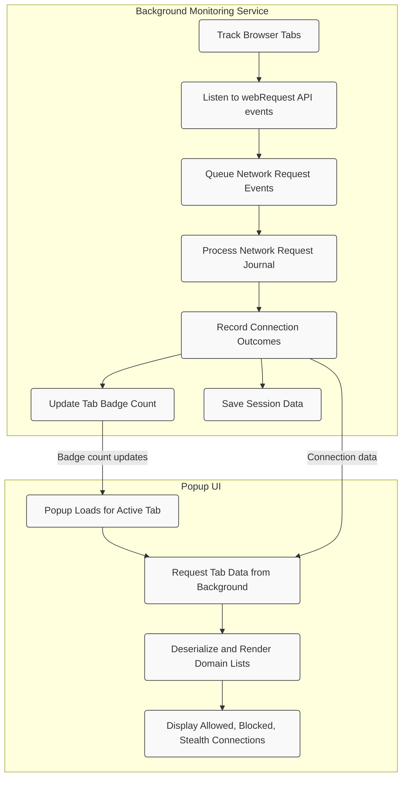

# System Architecture Overview

uBO Scope operates as a lightweight browser extension designed to provide clear insights into your browser's network activity. This overview unpacks how the extension internally monitors browser tabs, captures network requests via the webRequest API, and reports the connection outcomes to the popup user interface.

## High-Level Workflow

At its core, uBO Scope divides responsibilities between two main components:

- **Background Monitoring Service:** This runs persistently in the background, tracking browser tabs and intercepting network requests.
- **Popup UI:** A user-facing interface that dynamically displays current connection data when activated.

This separation ensures clean, efficient monitoring and an easy-to-understand user experience.

## How uBO Scope Monitors Connections

1. **Browser Tab Activity Tracking:**
   - The background service maintains an internal mapping of active tabs.
   - On navigation events, it resets connection data for the tab to provide fresh monitoring.

2. **Capturing Network Requests:**
   - Using the browser's `webRequest` API, uBO Scope listens for key events:
     - **onBeforeRedirect**: Detects request redirects.
     - **onErrorOccurred**: Flags failed or blocked requests.
     - **onResponseStarted**: Marks successful responses.
   - Each event is queued for batch processing to efficiently update results.

3. **Determining Connection Outcomes:**
   - Requests are categorized into one of three outcomes:
     - **Allowed** (successful connections)
     - **Blocked** (failed or explicitly blocked connections)
     - **Stealth** (redirected links that are hidden or obfuscated)
   - Outcomes are recorded and associated with their respective domains and hostnames.

4. **Tab Badge Updates:**
   - The extension updates the toolbar icon's badge to reflect the count of distinct allowed third-party domains per tab.
   - This visual indicator keeps users informed at a glance.

5. **Popup UI Data Rendering:**
   - When the user opens the popup, background scripts supply the current tab's data.
   - The popup displays domains, grouped by outcome (Allowed, Blocked, Stealth), along with request counts.

## Architecture Components and Flow



### Explanation:

- The **background service** continuously tracks tab navigations and network requests.
- Network requests are collected and processed asynchronously to optimize performance.
- Results of requests are categorized and aggregated by tab.
- The **popup UI** queries this aggregated data on demand and presents it clearly.

## Key Design Elements

- **Use of webRequest API:** Enables capturing of detailed network events, regardless of content blockers in place.
- **Domain and Hostname Mapping:** Uses public suffix lists and URL parsing to associate requests accurately with domains, not merely URLs.
- **Outcome Categorization:** Differentiates between allowed, blocked, and stealth-blocked requests to provide nuanced insights.
- **Persistent Session Data:** Utilizes browser session storage to maintain connection data even as tabs are opened and closed.

## Why This Architecture Matters

Users benefit from a transparent, timely view of the actual network connections initiated by webpages. Unlike relying solely on block counts or webpage reports, uBO Scope's architecture ensures you see distinct third-party domains contacted, allowing for informed decisions on privacy and security.

## Practical Tips for Users

- **Badge Count Insight:** Remember, a *lower* badge count indicates fewer distinct third-party connections — a sign of better content blocking.
- **Check All Outcomes:** Use the popup to review stealth-blocked and blocked domains to validate your privacy setup.
- **Session Persistence:** Connection data persists during your browsing session; closing tabs removes their data to keep info current.

## Troubleshooting Common Scenarios

<AccordionGroup title="Troubleshooting Common Issues">
<Accordion title="Why is the Badge Count Blank or Missing?">

- The current tab might not have recorded any allowed third-party connections yet.
- The background service may still be processing queued events; wait a moment and refresh the popup.
- Ensure your browser supports the `webRequest` API fully; some browsers or modes may limit functionality.

</Accordion>
<Accordion title="Popup Shows 'NO DATA'"> 
- Refresh the browser tab and reopen the popup to force data retrieval.
- Confirm that the extension has proper host permissions for the sites you visit.

</Accordion>
<Accordion title="Unexpected Connections Appear in the List">

- Some third-party servers, like CDNs, are commonly legitimate and expected.
- Review domain names carefully before deciding on any blocking or filtering steps.

</Accordion>
</AccordionGroup>

---

For a deeper dive, visit the [Product Introduction & Value](../product-intro/about-ubo-scope) and [Key Concepts & Terminology](../architecture-core/core-concepts) pages.

---

```json
{
  "component": "background monitoring service",
  "api_listeners": ["onBeforeRedirect", "onErrorOccurred", "onResponseStarted"],
  "popup_interaction": "request tab data via runtime message and render domains",
  "storage": "session storage for tab-specific domain outcomes",
  "badge": "displays number of distinct allowed third-party domains per tab"
}
```

<br/>
---

[Source code on GitHub](https://github.com/gorhill/uBO-Scope/tree/main/js/background.js) provides detailed insight into this workflow.

---