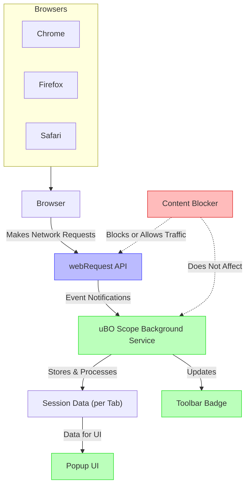

# Integration & Compatibility

uBO Scope is designed as a lightweight companion extension to uBlock Origin, focusing on transparently revealing the browser's remote server connection activities. This page clarifies how uBO Scope integrates with different browsers, harmonizes with various content blockers, and explains critical technical boundaries tied to browser APIs. It also provides installation pointers for multiple platforms, helping users leverage uBO Scope seamlessly across their preferred environments.

---

## How uBO Scope Integrates with Your Browser

At its core, uBO Scope hooks into your browser’s network request lifecycle via the standard `webRequest` API. This integration enables the extension to listen for all network requests initiated by web pages and categorize them based on their outcome:

- **Allowed:** Requests that successfully reach their remote server.
- **Blocked:** Requests that visibly fail to reach the remote server.
- **Stealth-Blocked:** Cases where a request is redirected or otherwise suppressed invisibly.

This categorization is essential because uBO Scope exposes a more nuanced and accurate view of network interactions than simple block counts available from typical content blockers.

### Key Points:

- Integration relies on the browser providing a `webRequest` API.
- uBO Scope acts independently of any particular content blocker; it reports all network connections regardless of which blocker is active.
- The extension’s main interface — the popup and toolbar badge — dynamically reflect real-time network request data per browser tab.

<Tip>
Understanding that uBO Scope does *not* block or modify network traffic itself is crucial. Its role is purely observational and reporting, empowering you with clearer insight.
</Tip>

## Compatibility with Different Content Blockers

uBO Scope coexists respectfully with other content blockers, including uBlock Origin and third-party extensions. Since it monitors network events at the API level exposed by the browser, it can observe the net effect of any blocking — whether performed by the extension, DNS-level blockers, or native browser protections.

### What This Means for You:

- You can run uBO Scope alongside other blockers without interference.
- The reported counts correspond to actual network connections, not just filter hits.
- Discrepancies between block counts and number of connections are expected and informative — revealing real privacy exposure.

<Note>
If a content blocker operates outside the scope of the browser’s `webRequest` API (e.g., OS-level VPN filtering), uBO Scope will only observe requests as they appear to the browser, not lower-level blocks.
</Note>

## Limitations Tied to Browser API Coverage

While uBO Scope taps into network request events via the robust `webRequest` API, there are inherent limitations based on what this API exposes.

### What uBO Scope Cannot See:

- Requests originating outside the browser or not routed through the webRequest API (e.g., some WebSocket connections or certain proprietary protocols).
- Network activity masked by browser or OS features that obscure visibility.

### Important Considerations:

- uBO Scope’s data depends heavily on the completeness and reliability of the browser API.
- Some browsers or versions may impose restrictions; for example, certain mobile browsers expose a limited or no webRequest API.
- Content blockers using stealth or obfuscation techniques may be detected indirectly but not circumvented by uBO Scope.

<Tip>
For the most comprehensive insight, ensure you use uBO Scope with browsers that fully support webRequest API events.
</Tip>

## Multi-Browser Support

uBO Scope is available and tested for major browsers including Chromium-based browsers (Chrome, Edge), Firefox, and Safari. Each platform uses appropriate manifest configurations and background script models compatible with its extension ecosystem:

| Browser      | Minimum Version         | Installation Link                                   |
|--------------|------------------------|---------------------------------------------------|
| Chrome       | 122.0+                 | [Chrome Web Store](https://chromewebstore.google.com/detail/ubo-scope/bbdpgcaljkaaigfcomhidmneffjjjfgp) |
| Firefox      | 128.0+                 | [Firefox Add-ons](https://addons.mozilla.org/firefox/addon/ubo-scope/)                                  |
| Safari       | 18.5+                  | Manual install or from Safari Extensions Gallery                                        |

<Info>
Manifest files for each browser define permissions such as `webRequest`, `activeTab`, and host access, ensuring consistent functionality across supported platforms. For Safari, note that background scripts run as modules aligned with Safari’s extension model.
</Info>

## Installation Across Platforms

To get started with uBO Scope, install the extension from the official stores linked above according to your browser. The popup interface, accessible by clicking the extension icon, provides immediate insight into current tab network connections.

### Best Practices:

- Ensure your browser is updated to a version supporting the required permission model and APIs.
- After installation, verify permissions are granted, especially for network access.
- Use alongside your preferred content blocker to gain precise visibility into network behaviors.

<Steps>
<Step title="Install the Extension">
Visit your browser's extension store and install uBO Scope using the provided official links.
</Step>
<Step title="Grant Required Permissions">
During installation, allow permissions for access to webRequest, tabs, and storage to enable full functionality.
</Step>
<Step title="Access the Popup">
Click the uBO Scope toolbar button to open the popup showing real-time remote server connections per tab.
</Step>
</Steps>

## Troubleshooting & Support

Because uBO Scope relies on browser-provided APIs, if you encounter missing data or abnormal behavior:

- Confirm that no conflicting extensions block webRequest access.
- Verify browser compatibility and update to a supported version.
- Review permissions granted to the extension.

For advanced troubleshooting, see documentation pages on [Troubleshooting Common Setup Issues](/getting-started/first-run-usage/troubleshooting) and [Validating Extension Functionality](/getting-started/first-run-usage/validate-functionality).

---

## Summary Diagram: Integration Flow

---